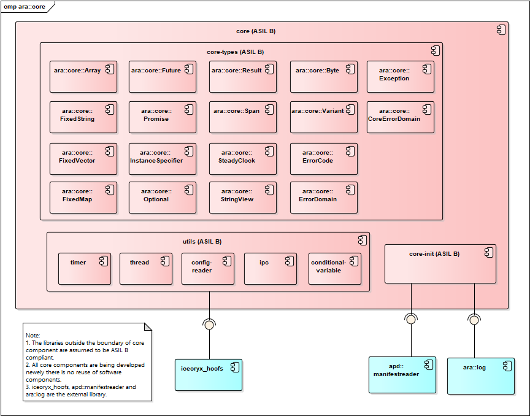

# Adaptive-Core (Ara-Core)
[](https://knode.avinsystems.com/jenkins/view/a00056/job/a00056_ap_core_Status/)

## Introduction
<p>
Adaptive-Core specification specifies the basic requirements that apply to all Functional Clusters of the Adaptive Platform,it also defines functionality that applies to the entire framework, including a set of common data types used by multiple Functional Clusters as part of their public interfaces.
</p>

## Architecture Overview

### Component Diagram


## Installation Guide
Refer: [Installation Guide](install.md)

## Folder Structure

The folder structure is:
```shell

├───doc
│   ├───alm_artifacts
│   │   └───codebeamer_export
│   ├───code_analysis_reports
│   │   └───module
│   │       └───static
│   │           └───Static_Analysis_Result
│   ├───code_documentation
│   │   └───module
│   ├───code_trace
│   └───design
├───misc
├───source
│   ├───core
│   │   ├───files
│   │   │   ├───cmake
│   │   │   └───pkgconfig
│   │   ├───inc
│   │   │   ├───private
│   │   │   │   └───ara
│   │   │   │       └───core
│   │   │   └───public
│   │   │       └───ara
│   │   │           └───core
│   │   └───src
│   │       └───test
│   ├───core-types
│   │   ├───files
│   │   │   ├───cmake
│   │   │   └───pkgconfig
│   │   ├───inc
│   │   │   └───public
│   │   │       └───ara
│   │   │           └───core
│   │   │               └───internal
│   │   └───test
│   ├───iceoryx_hoofs
│   │   ├───cmake
│   │   ├───include
│   │   │   └───iceoryx_hoofs
│   │   │       ├───concurrent
│   │   │       ├───cxx
│   │   │       ├───design_pattern
│   │   │       ├───error_handling
│   │   │       ├───internal
│   │   │       │   ├───concurrent
│   │   │       │   │   └───lockfree_queue
│   │   │       │   ├───cxx
│   │   │       │   │   └───newtype
│   │   │       │   ├───design_pattern
│   │   │       │   ├───error_handling
│   │   │       │   ├───file_reader
│   │   │       │   ├───graphs
│   │   │       │   ├───log
│   │   │       │   ├───objectpool
│   │   │       │   ├───posix_wrapper
│   │   │       │   │   └───shared_memory_object
│   │   │       │   ├───relocatable_pointer
│   │   │       │   └───units
│   │   │       ├───log
│   │   │       └───posix_wrapper
│   │   ├───platform
│   │   │   ├───linux
│   │   │   │   ├───include
│   │   │   │   │   └───iceoryx_hoofs
│   │   │   │   │       └───platform
│   │   │   │   └───source
│   │   │   ├───mac
│   │   │   │   ├───include
│   │   │   │   │   └───iceoryx_hoofs
│   │   │   │   │       └───platform
│   │   │   │   └───source
│   │   │   ├───qnx
│   │   │   │   ├───include
│   │   │   │   │   └───iceoryx_hoofs
│   │   │   │   │       └───platform
│   │   │   │   └───source
│   │   │   ├───unix
│   │   │   │   ├───include
│   │   │   │   │   └───iceoryx_hoofs
│   │   │   │   │       └───platform
│   │   │   │   └───source
│   │   │   └───win
│   │   │       ├───include
│   │   │       │   └───iceoryx_hoofs
│   │   │       │       └───platform
│   │   │       └───source
│   │   └───source
│   │       ├───concurrent
│   │       ├───cxx
│   │       ├───error_handling
│   │       ├───file_reader
│   │       ├───log
│   │       ├───posix_wrapper
│   │       │   └───shared_memory_object
│   │       ├───relocatable_pointer
│   │       └───units
│   ├───iceoryx_posh
│   │   ├───cmake
│   │   │   └───cpptoml
│   │   ├───doc
│   │   │   └───3rd_party_licenses
│   │   │       └───cpptoml
│   │   ├───etc
│   │   │   └───iceoryx
│   │   ├───include
│   │   │   └───iceoryx_posh
│   │   │       ├───capro
│   │   │       ├───error_handling
│   │   │       ├───gateway
│   │   │       ├───internal
│   │   │       │   ├───capro
│   │   │       │   ├───gateway
│   │   │       │   ├───log
│   │   │       │   ├───mepoo
│   │   │       │   ├───popo
│   │   │       │   │   ├───building_blocks
│   │   │       │   │   └───ports
│   │   │       │   ├───roudi
│   │   │       │   │   ├───introspection
│   │   │       │   │   └───memory
│   │   │       │   └───runtime
│   │   │       ├───mepoo
│   │   │       ├───popo
│   │   │       ├───roudi
│   │   │       │   └───memory
│   │   │       ├───runtime
│   │   │       └───version
│   │   └───source
│   │       ├───capro
│   │       ├───error_handling
│   │       ├───gateway
│   │       ├───log
│   │       ├───mepoo
│   │       ├───popo
│   │       │   ├───building_blocks
│   │       │   └───ports
│   │       ├───roudi
│   │       │   ├───application
│   │       │   └───memory
│   │       ├───runtime
│   │       └───version
│   └───utils
│       ├───cond-var
│       │   ├───files
│       │   │   ├───cmake
│       │   │   └───pkgconfig
│       │   ├───inc
│       │   └───src
│       │       └───test
│       │           └───mock
│       │               ├───inc
│       │               └───src
│       ├───config-reader
│       │   ├───files
│       │   │   ├───cmake
│       │   │   └───pkgconfig
│       │   ├───inc
│       │   │   └───public
│       │   │       └───ara
│       │   │           └───core
│       │   │               └───configreader
│       │   └───src
│       │       └───test
│       ├───ipc
│       │   ├───files
│       │   │   ├───cmake
│       │   │   └───pkgconfig
│       │   ├───inc
│       │   └───src
│       │       └───test
│       ├───thread
│       │   ├───files
│       │   │   ├───cmake
│       │   │   └───pkgconfig
│       │   ├───inc
│       │   │   └───public
│       │   │       └───ara
│       │   │           └───core
│       │   │               └───thread
│       │   └───src
│       │       └───test
│       └───timer
│           ├───files
│           │   ├───cmake
│           │   └───pkgconfig
│           ├───inc
│           │   └───public
│           │       └───ara
│           │           └───core
│           │               └───timer
│           └───src
│               └───test
├───test_scripts
│   ├───it
│   │   └───module
│   │       ├───reports
│   │       └───scripts
│   │           ├───Core_app
│   │           │   ├───inc
│   │           │   ├───manifest
│   │           │   ├───src
│   │           │   └───utils
│   │           │       ├───inc
│   │           │       │   └───public
│   │           │       │       └───config
│   │           │       └───src
│   │           │           └───test
│   │           │               └───mock
│   │           └───Core_app2
│   │               ├───inc
│   │               ├───manifest
│   │               └───src
│   └───ut
│       └───module
│           ├───reports
│           │   └───unit_test_report_core
│           └───scripts
└───tools
    └───axivion
        └───conf
		
```
*  Folder `doc/alm_artifacts/codebeamer_export` contains the artefacts from code beamer such as SRS, SAD, SUD, UTS and ITS along with the traceability.
*  Folder `doc/code_analysis_report` contains the static analysis reports.
*  Folder `doc/code_documentation` contains the documentation scripts for doxygen.
*  Folder `source/core` contains source code for ara-core library.
*  Folder `source/core-types` contains source code for basic data type implementation.
*  Folder `source/utils/timer` contains source code for apd_timer library.
*  Folder `source/utils/config-reader` contains source code for config_reader library.
*  Folder `test_scripts/ut/module/reports` contains unit test coverage report.
*  Folder `test_scripts/ut/module/scripts` contains the script file for unit testing.
*  Folder `test_scripts/ut/` contains unit test report.
*  Folder `test_scripts/it/` contains integration test report.

## MR1_Safety_Intermediate 2
Release Date: 31-Mar-2023 <br>
Embedded Version: 1.0.0<br>

### Implemented Features
Developement of ASPICE artifacts - SRS, SAD, SUD, UTS, ITS, UTR and ITR.

### Issues Resolved
NA

### Known Limitations 
1. Safety User Manual is not developed as a part of this release.
2. Unit tesing for Fixed-Map datatype is not performed as a part of this release, hence SUD to UT traceability is not 100%.
3. Resource consumptions are not measured as a part of this release.

Note: Safety artifacts are not handled as a part of this release.

## PPMS3_1
Release Date: 30-Dec-2022<br>
Embedded Version: 1.1.0<br>

### Implemented Features
  1. Updated the SRS to SUD traceability.

### Issues Resolved
NA

### Known Limitations
  1. Updated Unit test code coverage report will be provided in next phase.
  2. Static Analysis violations in source code are partially fixed.
  3. Integration testing is performed in Yocto environment only.
  4. Embedded code Unit Test coverage for line and function is not 100%(currently above 90%).
  5. Traceability between SUD and UTS is not 100% because V-cycle is not considered for the iceoryx_hoofs and  iceoryx_posh library.
  

## PPMS3
Release Date: 16-Dec-2022<br>
Embedded Version: 1.0.0<br>

### Implemented Features
  1. Development of Ara-Core with following features:
    - Implementation of advanced data types.
    - Implementation of apd_timer library.
    - Implementation of config_reader library.
  2. Development of ASPICE artefacts - SRS, SUD, UTS.	

### Issues Resolved
NA

### Known Limitations
  1. Updated Unit test code coverage report will be provided in next phase.
  2. Static Analysis violations in source code are partially fixed.
  3. Integration testing is performed in Yocto environment only.
  4. Embedded code Unit Test coverage for line and function is not 100%(currently above 90%).
  5. Traceability between SUD and UTS is not 100%.
  6. V-cycle is not considered for the iceoryx_hoofs and iceoryx_posh library.
