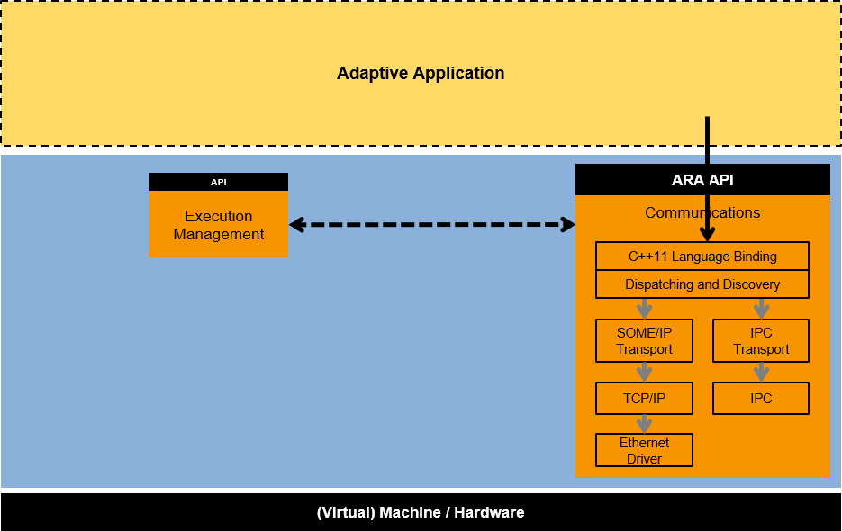
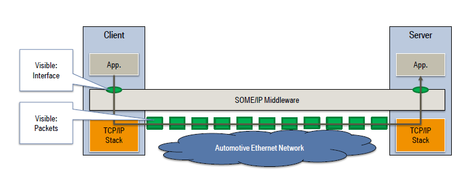
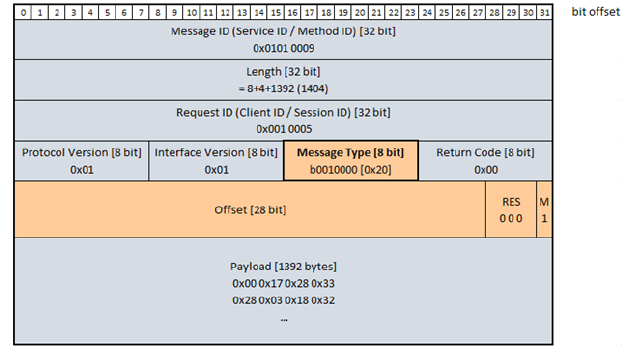
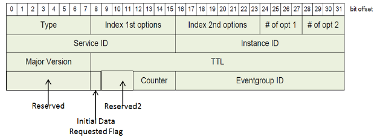
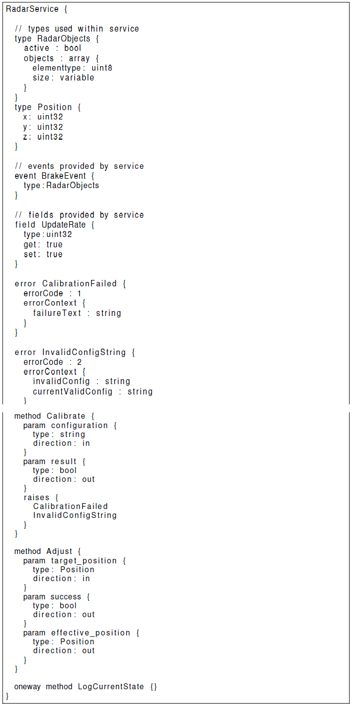
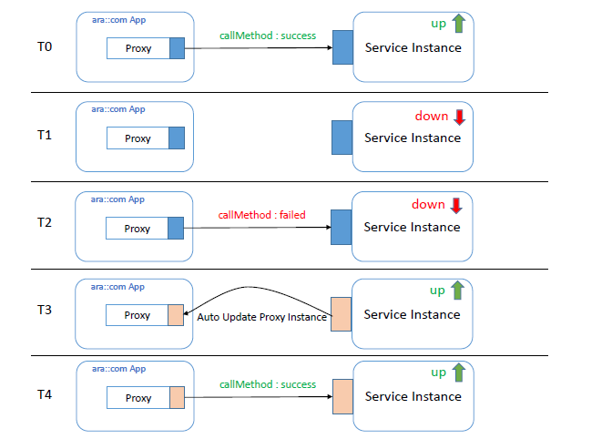
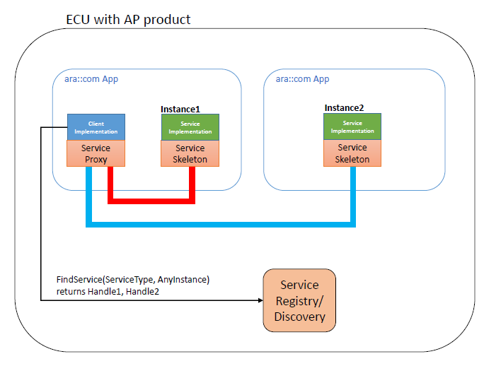
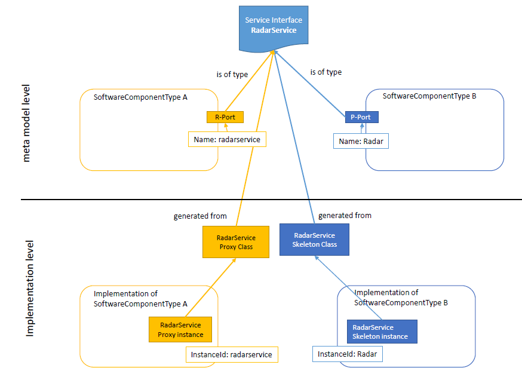
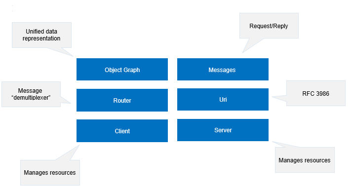

**Communication Management**
=============================

Introduction
###############

The AUTOSAR Adaptive architecture organizes the software of the AUTOSAR Adaptive foundation as functional clusters. These clusters offer common functionality as services to the applications. The Communication Management (CM) for AUTOSAR Adaptive is such a functional cluster and also part of "AUTOSAR Runtime for Adaptive Applications" - ARA. It is responsible for the construction and supervision of communication paths between applications, both local and remote. The CM provides the infrastructure that enables communication between Adaptive AUTOSAR Applications within one machine and with software entities on other machines, e.g. other Adaptive AUTOSAR applications or Classic AUTOSAR SWCs. All communication paths can be established at design- , start-up- or run-time.

   **Communication Management Functional Cluster**

Architectural concepts
---------------------------

The Communication management of AUTOSAR Adaptive can be logically divided into the following sub-parts:

    - Language binding
    - End-to-end communication protection
    - Communication / Network binding
    - Communication Management software

Design of the ARA API
---------------------------

The (service) proxy is the representative of the possibly remote (i.e. other process, other core, other node) service. It is an instance of a C++ class local to the application/client, which uses the service.

The (service) skeleton is the connection of the user provided service implementation to the middleware transport infrastructure. Service implementation is sub-classing the (service) skeleton.

Beside proxies/skeletons, there might exist a so-called "Runtime" (singleton) class to provide some essentials to manage proxies and skeletons.

Client/Server Communication uses concepts introduced by C++11 language, e.g. std::future, std::promise, to fully support method calls between different contexts. Future and Promise are the two separate sides of an asynchronous operation.

    - std::promise is used by the "producer/writer" of the asynchronous operation.

    - std::future is used by the "consumer/reader" of the asynchronous operation.

    - The reason it is separated into these two separate "interfaces" is to hide the "write/set" functionality from the "consumer/reader"

Communication paradigms
^^^^^^^^^^^^^^^^^^^^^^^^^^^^

Service-Oriented Communication (SoC) is the main communication pattern for Adaptive AUTOSAR Applications. It allows establishing communication paths both at design- and run-time, so it can be used to build up both static communication with known numbers of participants and dynamic communication with unknown number of participants.

.. figure:: resources/Service_Oriented_Communication.png
   :class: with-border
   :align: center

   **Service-Oriented Communication**

Service Discovery decides whether external and/or internal service-oriented communication is established. The discovery strategy allows either returning a specific service instance or all available instances providing the requested service at the time of the request, no matter if they are available locally or remote.

SOME/IP(Scalable service-Oriented MiddlewarE over IP)
##########################################################

SOME/IP is an abbreviation for "Scalable service-Oriented MiddlewarE over IP". This middleware was designed for typical automotive use cases and for being compatible with AUTOSAR. SOME/IP is an automotive/embedded communication protocol which supports remote procedure calls, event notifications and the underlying serialization/wire format.

**Glossary of Terms**

+-----------+------------------------------------------------------------------------------------+
| **Term**  | **Description**                                                                    |
+-----------+------------------------------------------------------------------------------------+
| Method    | A method, procedure, function, or subroutine that is called/invoked.               | 
+-----------+------------------------------------------------------------------------------------+
| Parameters| input, output, or input/output arguments of a method or an event                   |
+-----------+------------------------------------------------------------------------------------+
| Remote    |                                                                                    |
| Procedure | A method call from one ECU to another that is transmitted using messages           |
| Call (RPC)|                                                                                    |
+-----------+------------------------------------------------------------------------------------+
| Request   | a message of the client to the server invoking a method                            |
+-----------+------------------------------------------------------------------------------------+
| Response  | a message of the server to the client transporting results of a method invocation  |
+-----------+------------------------------------------------------------------------------------+
| Request/  |                                                                                    |
| Response  |                                                                                    |
| communica |                                                                                    |
| -tion     | a RPC that consists of request and response                                        |
+-----------+------------------------------------------------------------------------------------+
| Event     | A uni-directional data transmission that is only invoked on changes or cyclically  |
|           | and is sent from the producer of data to the consumers.                            |   
+-----------+------------------------------------------------------------------------------------+
| Field     | A field does represent a status and thus has an valid value at all times           | 
|           | on which getter, setter and notifier act upon                                      |
+-----------+------------------------------------------------------------------------------------+
|Notificati-|                                                                                    |
|on Event   | An event message of the notifier of a field.                                       | 
+-----------+------------------------------------------------------------------------------------+
| Getter    | A Request/Response call that allows read access to a field.                        |
+-----------+------------------------------------------------------------------------------------+
| Setter    | A Request/Response call that allows write access to a field.                       |
+-----------+------------------------------------------------------------------------------------+
| Notifier  | Sends out event message with a new value on change of the value of the field.      |
+-----------+------------------------------------------------------------------------------------+
| Service   | A logical combination of zero or more methods, zero or more events, and zero or    |
|           | more fields.                                                                       |
+-----------+------------------------------------------------------------------------------------+
| Service   |                                                                                    |
| Interface | the formal specification of the service including its methods, events, and fields. |
+-----------+------------------------------------------------------------------------------------+
| Eventgroup| A logical grouping of events and notification events of fields inside a service in |
|           | order to allow subscription                                                        |
+-----------+------------------------------------------------------------------------------------+
| Service   | Implementation of a service, which can exist more than once in the vehicle and     |
| Instance  | more than once on an ECU.                                                          |
+-----------+------------------------------------------------------------------------------------+
| Server    | The ECU offering a service instance is called server in the context of this        |
|           | service instance.                                                                  |
+-----------+------------------------------------------------------------------------------------+
| Client    | The ECU using the service instance of a server is called client in the context of  |
|           | this service instance.                                                             |
+-----------+------------------------------------------------------------------------------------+
| Fire and  | Requests without response message are called fire&forget.                          |
| Forget    |                                                                                    |
+-----------+------------------------------------------------------------------------------------+
| Union     | A data structure that dynamically assumes different data types.                    |
+-----------+------------------------------------------------------------------------------------+

The three main parts of the SOME/IP specification is as follows:

    - **On-wire format**
    - **Protocol**
    - **Service Discovery(SOME/IP-SD)**

On-wire format
#################

   **SOME/IP On wire format**

- SOME/IP allows applications to communicate.
- Packet formats are automatically determined by the specification of the Service.
- Server offers a Service Instance that implements the Service Interface.
- Client uses the Service Instance using SOME/IP.

**Protocol**
-------------

**SOME/IP Header Format**
^^^^^^^^^^^^^^^^^^^^^^^^^^^^

.. figure:: resources/SOMEIP_Header_Format.png
   :class: with-border
   :align: center
   
   **SOME/IP Header Format**

**Message ID [32 Bit]**
""""""""""""""""""""""""

    - The Message ID is a 32 Bit identifier that is used to identify the RPC call to a method of an application or to identify an event.
    - Message IDs of method calls will be structured in the ID with 2^16 services with 2^15 methods as shown below.

.. figure:: resources/Structure_Of_Message_ID.png
   :class: with-border
   :align: center
   
   **Structure of Message ID**

**Length [32 Bit]**
"""""""""""""""""""""

    - Length field contains the length in Byte starting from Request ID/Client ID until the end of the SOME/IP message.

**Request ID [32 Bit]**
"""""""""""""""""""""""""

    - The Request ID allows a provider and subscriber to differentiate multiple parallel uses of the same method, event, getter or setter.
    - The Request ID is unique for a provider- and subscriber-combination only.
    - When generating a response message, the provider copies the Request ID from the request to the response message.
    - Request ID constructed of the Client ID and Session ID as shown below.

.. figure:: resources/Structure_Of_Request_ID.png
   :class: with-border
   :align: center

   **Structure of Request ID**

- The Client ID is the unique identifier for the calling client inside the ECU. The Client ID allows an ECU to differentiate calls from multiple clients to the same method.
- The Session ID is a unique identifier that allows to distinguish sequential messages. It also allows to distinguish requests originating from the same sender from each other.
- The Client ID supports being unique in the overall vehicle by having a configurable prefix or fixed value (e.g. the most significant byte of Client ID being the diagnostics address or a configured Client ID for a given application/SW-C).

   **Structure of Client ID**

- Request/Response methods use session handling with Session IDs. Session ID should be incremented after each call.
- When the Session ID reaches 0xFFFF, it wraps around and starts again with 0x01.
- For request/response methods, a subscriber has to ignore a response if the Session ID of the response does not match the Session ID of the request.
- For notification messages, a receiver ignores the Session ID in case Session Handling is not active.
- For notification messages, a receiver treats the Session ID according to the respective use case.

**Protocol Version [8 Bit]**
"""""""""""""""""""""""""""""""

The Protocol Version set to 1.

**Interface Version [8 Bit]**
"""""""""""""""""""""""""""""""""

Interface Version contains the Major Version of the Service Interface.

**Message Type [8 Bit]**
"""""""""""""""""""""""""

The Message Type field is used to differentiate different types of messages and contains the following values as shown in Table.

+-----------+-------------+------------------------------------------------------------------------------------+
| **Number**| **Value**   | **Description**                                                                    |
+-----------+-------------+------------------------------------------------------------------------------------+
| 0x00      | REQUEST     | A request expecting a response (even void)                                         |
+-----------+-------------+------------------------------------------------------------------------------------+
| 0x01      | REQUEST_NO  | A fire&forget request                                                              |
|           | _RETURN     |                                                                                    |
+-----------+-------------+------------------------------------------------------------------------------------+
| 0x02      | NOTIFICATION| A request of a notification/event callback expecting response                      | 
+-----------+-------------+------------------------------------------------------------------------------------+
| 0x80      | RESPONSE    | The response message                                                               |
+-----------+-------------+------------------------------------------------------------------------------------+
| 0x81      | ERROR       | The response containing an error                                                   |
+-----------+-------------+------------------------------------------------------------------------------------+
| 0x20      | TP_REQUEST  | A Transport Protocol request expecting a response (even void)                      |
+-----------+-------------+------------------------------------------------------------------------------------+
| 0x21      | TP_REQUEST  | A Transport Protocol fire&forget request                                           |
|           | _NO_RETURN  |                                                                                    |
+-----------+-------------+------------------------------------------------------------------------------------+
| 0x22      | TP_NOTIFICA | A Transport Protocol request of a notification/event callback expecting no response| 
|           | TION        |                                                                                    |
+-----------+-------------+------------------------------------------------------------------------------------+
| 0x23      | TP_RESPONSE | The Transport Protocol response message                                            | 
+-----------+-------------+------------------------------------------------------------------------------------+
| 0x24      | TP_ERROR    | The Transport Protocol response containing an error                                |
+-----------+-------------+------------------------------------------------------------------------------------+

    - The 3rd highest bit of the Message Type (=0x20) is called as TP-Flag and will be set to 1 to signal that the current SOME/IP message is a segment. The other bits of the Message Type are set as specified in this Section.

**Return Code [8 Bit]**
"""""""""""""""""""""""""

The Return Code is used to signal whether a request was successfully processed. For simplification of the header layout, every message transports the field Return Code. The allowed Return Codes for specific message types are shown in Table.

+------------------+------------------------------+
| **Message Type** | **ERROR**                    |
+------------------+------------------------------+
| REQUEST          | N/A set to 0x00 (E_OK)       | 
+------------------+------------------------------+
|REQUEST_NO_RETURN | N/A set to 0x00 (E_OK)       |
+------------------+------------------------------+
|NOTIFICATION      | N/A set to 0x00 (E_OK)       |
+------------------+------------------------------+
|RESPONSE          |Please refer 2.2.6.1 section  |
+------------------+------------------------------+
|ERROR             | Please refer 2.2.6.1 section |
+------------------+------------------------------+

**Payload [variable size]**
"""""""""""""""""""""""""""""

    - In the payload field the parameters are carried. The serialization of the parameters will be specified in the following section.

    - The size of the SOME/IP payload field depends on the transport protocol used.

    - The UDP binding of SOME/IP can only transport SOME/IP messages that fit directly into an IP packet. Use TCP only if very large chunks of data need to be transported (> 1400 Bytes) and no hard latency requirements in the case of errors exists

**Event, Field and Eventgroup**
""""""""""""""""""""""""""""""""

    - Eventgroup is a logical grouping of events and notification events of fields inside a service in order to allow subscription.

    - Events and notifications are transported using RPC. Events will be structured as shown in Table

   **Structuure of event ID**

**Endianess**
""""""""""""""""

- SOME/IP Header will be encoded in network byte order (big endian).
- The byte order of the parameters inside the payload is defined by configuration.

**Serialization of Data Structures**
-------------------------------------

    - The serialization is based on the parameter list defined by the interface specification. The interface specification defines the exact position of all data structures in the PDU and has to consider the memory alignment.

    - Alignment is used to align the beginning of data by inserting padding elements after the data in order to ensure that the aligned data starts at certain memory addresses

**SOME/IP Protocol specification**
------------------------------------

This section describes the Remote Procedure Call(RPC), Event Notifications and Error Handling of SOME/IP.

**Transport Protocol Bindings**
^^^^^^^^^^^^^^^^^^^^^^^^^^^^^^^^^

    - In order to transport SOME/IP messages different transport protocols may be used. SOME/IP currently supports UDP and TCP.

    - If a server runs different instances of the same service, messages belonging to different service instances will be mapped to the service instance by the transport protocol port on the server side.

    - All Transport Protocol Bindings supports transporting more than one SOME/IP message in a Transport Layer PDU (i.e. UDP packet or TCP segment).

**UDP Binding**
""""""""""""""""

    - The UDP binding of SOME/IP will be achieved by transporting SOME/IP messages in UDP packets.

    - The header format allows transporting more than one SOME/IP message in a single UDP packet. The SOME/IP implementation identifies the end of a SOME/IP message by means of the SOME/IP length field. Based on the UDP length field, SOME/IP determines if there are additional SOME/IP messages in the UDP packet.

**TCP Binding**
"""""""""""""""""
 
    - The TCP binding of SOME/IP is based on the UDP binding. In contrast to the UDP binding, the TCP binding allows much bigger SOME/IP messages and uses the robustness features of TCP (coping with loss, reorder, duplication, etc.).

    - When the TCP connection is lost, outstanding requests will be handled as timeouts. Since TCP handles reliability, additional means of reliability are not needed.

    - The client and server uses a single TCP connection for all methods, events, and notifications of a service instance. When having more than one instance of a service a TCP connection per services instance is needed.

    - The TCP connection will be opened by the client, when the first method call will be transported or the client tries to receive the first notifications. The client is responsible for re-establishing the TCP connection whenever it fails.

    - The TCP connection will be closed by the client, when the TCP connection is not required anymore.

    - The TCP connection will be closed by the client, when all Services using the TCP connections are not available anymore (stopped or timed out).

    - The server will not stop the TCP connection when stopping all services. Give the client enough time to process the control data to shutdown the TCP connection itself.

**Multiple Service-Instances**
"""""""""""""""""""""""""""""""

    - Service-Instances of the same Service are identified through different Instance IDs. SOME/IP supports multiple Service-Instances reside on different ECUs as well as multiple Service-Instances of one or more Services reside on one single ECU.

    - While different Services will be able to share the same port number of the transport layer protocol used, multiple Service-Instances of the same service on one single ECU listens on different ports per Service-Instance.

    - A Service Instance can be identified through the combination of the Service ID combined with the socket (i.e. IP-address, transport protocol (UDP/TCP), and port number).

**Transporting large SOME/IP messages of UDP (SOME/IP-TP)**
"""""""""""""""""""""""""""""""""""""""""""""""""""""""""""""

    - The UDP binding of SOME/IP can only transport SOME/IP messages that fit directly into an IP packet. If larger SOME/IP messages need to be transported over UDP (e.g. of 32 KB) the SOME/IP Transport Protocol (SOME/IP-TP) will be used. The SOME/IP message too big to be transported directly with the UDP binding will be called "original" SOME/IP message. The "pieces" of the original SOME/IP message payload transported in SOME/IP-TP messages will be called "segments".

    - SOME/IP messages using SOME/IP-TP activates Session Handling (Session ID must be unique for the original message).

    - All SOME/IP-TP segments carry the Session ID of the original message; thus, they have all the same Session-ID.

    - SOME/IP-TP segments will have the TP-Flag of the Message Type set to 1.

    - SOME-IP-TP-Header is as shown in below. SOME/IP-TP segments will have a TP header right after the SOME/IP header (i.e. before the SOME/IP payload) with the following structure (bits from highest to lowest):

**a. Offset [28 bits]**

**b. Reserved Flag [1 bit]**

**c. Reserved Flag [1 bit]**

**d. Reserved Flag [1 bit]**

**e. More Segments Flag [1 bit]**

.. figure:: resources/someip_tp_header.png
   :class: with-border
   :align: center

   **SOME/IP TP header**

**Example**
""""""""""""

This example describes how an original SOME/IP message of 5880 bytes payload has to be transmitted. The Length field of this original SOME/IP message is set to 8 + 5880 bytes.

.. figure:: resources/header_of_original_SomeIp_Message.png
   :class: with-border
   :align: center

   **Example: Header of Original SOME/IP message**

- This original SOME/IP message will now be segmented into 5 consecutive SOME/IP segments. Every payload of these segments carries at most 1392 bytes in this example.

- For these segments, the SOME/IP TP module adds additional TP fields. The Length field of the SOME/IP carries the overall length of the SOME/IP segment including 8 bytes for the Request ID, Protocol Version, Interface Version, Message Type and Return Code. Because of the added TP fields (4 bytes), this Length information is extended by 4 additional SOME/IP TP bytes.

The following figure provides an overview of the relevant SOME/IP header settings for every SOME/IP segment.

.. figure:: resources/overview_of_relevant_someip_TP_headers.png
   :class: with-border
   :align: center

   **Example: Overview of relevant SOME/IP TP headers**

- Please note that the value provided within the Offset Field is given in units of 16 bytes, i.e.: The Offset Value of 87 correspond to 1392 bytes Payload.

- The first 4 segments contain 1392 Payload bytes each with "More Segments Flag" set to ’1’:

   **Example: Header of the SOME/IP segments**

-    The last segment (i.e. 5) contains the remaining 312 Payload bytes of the original 5880 bytes payload. This last segment is marked with "More Segments flag" set to ’0’.

.. figure:: resources/someip_segments.png
   :class: with-border
   :align: center

   **Example: Header of the SOME/IP segments**

Service Discovery(SOME/IP-SD)
###############################

SOME/IP-SD is used to
    -    Locate service instances.
    -    Detect if service instances are running.
    -    Implement the Publish/Subscribe handling.

SOME/IP-SD depends on SOME/IP. SOME/IP itself supports both TCP and UDP communications but SOME/IP SD uses SOME/IP only over UDP .

   **SOME/IP-SD Dependencies to other protocol layers**

SOME/IP-SD Message Format
---------------------------

.. figure:: resources/someipsd_header.png
   :class: with-border
   :align: center

   **SOME/IP-SD Header Format**

We can divide the above mention figure into two parts.

**SOME/IP header**
^^^^^^^^^^^^^^^^^^^^

+----------------------+-------------------------------------------------------------------------------------------+
| **Field**            | **Description(Default Value)**                                                            |
+----------------------+-------------------------------------------------------------------------------------------+
| Service-ID(16 bits)  | 0xFFFF                                                                                    |
+----------------------+-------------------------------------------------------------------------------------------+
| Method-ID(16 bits)   | 0x8100                                                                                    |
+----------------------+-------------------------------------------------------------------------------------------+
| length(32 bits)      | length is measured in bytes and starts with the first byte after the length field and     |
|                      | ends with the last byte of the SOME/IP-SD message.                                        |
+----------------------+-------------------------------------------------------------------------------------------+
| Client-ID(16 bits)   | Set to 0x0000                                                                             |
+----------------------+-------------------------------------------------------------------------------------------+
|Session-ID (16 Bits)  | The Session-ID (SOME/IP header) will be incremented for every SOME/IP-SD message sent.    |
|                      | The Session-ID (SOME/IP header) starts with 1 and be 1 even after wrapping.               | 
+----------------------+-------------------------------------------------------------------------------------------+
|Protocol- Version     |                                                                                           |
|(8 Bits)              |    0x01                                                                                   |
+----------------------+-------------------------------------------------------------------------------------------+
|Interface- Version    |  0x01                                                                                     |
|(8 Bits)              |                                                                                           |
+----------------------+-------------------------------------------------------------------------------------------+
| Message Type (8 bits)| 0x02 (Notification)                                                                       |
+----------------------+-------------------------------------------------------------------------------------------+
| Return Code(8 bits)  | Return Code(8 bits)                                                                       |
+----------------------+-------------------------------------------------------------------------------------------+

**SOME/IP-SD Header**
^^^^^^^^^^^^^^^^^^^^^^

.. figure:: resources/someip_sd_pdu.png
   :class: with-border
   :align: center

   **SOME/IP-SD Example PDU**

    - The SOME/IP-SD Header starts with an 8 Bit field called Flags as shown in the Figure below.

   **Flags in SOME/IP-SD**

- The Reboot Flag of the SOME/IP-SD Header is set to 1 for all messages after reboot until the Session-ID in the SOME/IP-Header wraps around and thus starts with 1 again. After this wrap around the Reboot Flag is set to 0.

- The information for the reboot flag and the Session ID will be kept for multicast, unicast and every sender-receiver relation (i.e. source address and destination address) separately.

- This means there will be separate counters for sending and receiving.

**Sending**

    - There will be a counter for multicast.
    - There will be a separate counter for each peer for unicast.

**Receiving**

    - There will be a counter for each peer for multicast.

    - There will be a counter for each peer for unicast.

The Unicast Flag of the SOME/IP-SD Header is set to Unicast (that means 1) for all SD Messages since this means that receiving using unicast is supported.

The third flag of the SOME/IP-SD Flags (third highest order bit) will be called Explicit Initial Data Control Flag and means that the ECU supports explicit initial data control.

After the SOME/IP-SD Header the Entries Array follows. The entries will be processed exactly in the order they arrive.

After the Entries Array in the SOME/IP-SD Header an Option Array will follow.

**Entry Format**
""""""""""""""""""

    - The service discovery supports multiple entries that are combined in one service discovery message. The entries are used to synchronize the state of services instances and the Publish/Subscribe handling.

    - Two types of entries exist: A Service Entry Type for Services and an Eventgroup Entry Type for Eventgroups.

**Service Entry Type for Services**
"""""""""""""""""""""""""""""""""""""

.. figure:: resources/someip_sd_serviceentry.png
   :class: with-border
   :align: center

   **SOME/IP-SD Service Entry Type**

- Type Field [uint8]: encodes FindService (0x00) and OfferService (0x01).
- Index First Option Run [uint8]: Index of this runs first option in the option array.
- Index Second Option Run [uint8]: Index of this runs second option in the option array.
- Number of Options 1 [uint4]: Describes the number of options the first option run uses.
- Number of Options 2 [uint4]: Describes the number of options the second option run uses.
- Service-ID [uint16]: Describes the Service ID of the Service or Service-Instance this entry is concerned with.
- Instance ID [uint16]: Describes the Service Instance ID of the Service Instance this entry is concerned with or is set to 0xFFFF if all service instances of a service are meant.
- Major Version [uint8]: Encodes the major version of the service (instance).
- TTL [uint24]: Describes the lifetime of the entry in seconds.
- Minor Version [uint32]: Encodes the minor version of the service.

Eventgroup Entry Type for Eventgroups
""""""""""""""""""""""""""""""""""""""

   **SOME/IP-SD Eventgroup Entry Type**

- Type Field [uint8]: encodes Subscribe (0x06), and SubscribeAck (0x07).
- Index First Option Run [uint8]: Index of this runs first option in the option array.
- Index Second Option Run [uint8]: Index of this runs second option in the option array.
- Number of Options 1 [uint4]: Describes the number of options the first option run uses.
- Number of Options 2 [uint4]: Describes the number of options the second option run uses.
- Service-ID [uint16]: Describes the Service ID of the Service or Service Instance this entry is concerned with.
- Instance ID [uint16]: Describes the Service Instance ID of the Service Instance this entry is concerned with or is set to 0xFFFF if all service instances of a service are meant.
- Major Version [uint8]: Encodes the major version of the service instance this eventgroup is part of.
- TTL [uint24]: Descibes the lifetime of the entry in seconds.
- Reserved [uint8]: Set to 0x00.
- Initial Data Requested Flag [1 bit] (I Flag): Set to 1, if initial data will sent by Server
- Reserved2 [uint3]: Set to 0x0.
- Counter [uint4]: Is used to differentiate identical Subscribe Eventgroups of the same subscriber. Set to 0x0 if not used.
- Eventgroup ID [uint16]: Transports the ID of an Eventgroup.

Referencing Options from Entries
"""""""""""""""""""""""""""""""""

    - Index First Option Run: Index into array of options for first option run. Index 0 means first of SOME/IP-SD packet.
    - Index Second Option Run: Index into array of options for second option run. Index 0 means first of SOME/IP-SD packet.
    - Number of Options 1: Length of first option run. Length 0 means no option in option run.
    - Number of Options 2: Length of second option run. Length 0 means no option in option run.
    - Two different option runs exist: First Option Run and Second Option Run. Two different types of options are expected: options common between multiple SOME/IP-SD entries and options different for each SOME/IP-SD entry. Supporting to different options runs is the most efficient way to support these two types of options, while keeping the wire format highly efficient.
    - Each option run will reference the first option and the number of options for this run.
    - If the number of options is set to zero, the option run is considered empty.
    - For empty runs the Index (i.e. Index First Option Run and/or Index Second Option Run) will set to zero.

**Options Format**
^^^^^^^^^^^^^^^^^^^

Options are used to transport additional information to the entries. This includes for instance the information how a service instance is reachable (IP-Address, Transport Protocol, Port Number.

In order to identify the option type every option starts with:

    - Length [uint16]: Specifies the length of the option in Bytes.
    - Type [uint8]: Specifying the type of the option.

The length field covers all bytes of the option except the length field and type field.

**Configuration Option**
"""""""""""""""""""""""""

The configuration option is used to transport arbitrary configuration strings. This allows to encode additional information like the name of a service or its configuration.

.. figure:: resources/SOMEIPSDConfigurationOption.png
   :class: with-border
   :align: center

   **SOME/IP-SD Configuration Option**

**Load Balancing Option**
"""""""""""""""""""""""""""

    - The Load Balancing option is used to prioritize different instances of a service, so that a client chooses the service instance based on these settings. This option will be attached to Offer Service entries.

    - The Load Balancing Option carry a Priority and Weight, which is used for load balancing different service instances.

.. figure:: resources/SOMEIPSDLoadBalancingOption.png
   :class: with-border
   :align: center

   **SOME/IP-SD Load Balancing Option**

**IPv4 Endpoint Option**
"""""""""""""""""""""""""

    - The IPv4 Endpoint Option is used by a SOME/IP-SD instance to signal the relevant endpoint(s).
    - Endpoints include the local IP address, the transport layer protocol (e.g. UDP or TCP), and the port number of the sender.
    - These ports are used for the events and notification events as well.

   **SOME/IP-SD IPv6 Endpoint Option**

This option is used by the server for its OfferService entry and by client for Subscribe Eventgroup entry.

**IPv6 Endpoint Option**
"""""""""""""""""""""""""

    - The IPv6 Endpoint Option is used by a SOME/IP-SD instance to signal the relevant endpoint(s).
    - Endpoints include the local IP address, the transport layer protocol (e.g. UDP or TCP), and the port number of the sender.ports are used for the events and notification events as well.
    - This option is used by the server for its OfferService entry and by client for Subscribe Eventgroup entry.

.. figure:: resources/SOMEIPSDIPv6EndpointOption.png
   :class: with-border
   :align: center

   **SOME/IP-SD IPv6 Endpoint Option**

**IPv4 Multicast Option**
""""""""""""""""""""""""""

    - The IPv4 Multicast Option is used by the server to announce the IPv4 multicast address, the transport layer protocol (ISO/OSI layer 4), and the port number the multicast events and multicast notification events are sent to.
    - As transport layer protocol currently only UDP is supported.
    - The IPv4 Multicast Option is referenced by Subscribe Eventgroup Ack entries.
    - The server reference the IPv4 Multicast Option, which encodes the IPv4 Multicast Address and Port Number the server will send multicast events and notification events to.

   **SOME/IP-SD IPv4 Multicast Option**

**IPv6 Multicast Option**
""""""""""""""""""""""""""

    - The IPv6 Multicast Option is used by the server to announce the IPv6 multicast address, the layer 4 protocol, and the port number the multicast events and multicast notifications events are sent to.
    - For the transport layer protocol (ISO/OSI layer 4) currently only UDP is supported.
    - The IPv6 Multicast Option, referenced by Subscribe Eventgroup Ack messages.
    - The server references the IPv6 Multicast Option, which encodes the IPv6 Multicast Address and Port Number the server will send multicast events and notification events to.

.. figure:: resources/SOMEIPSDIPv6MulticastOption.png
   :class: with-border
   :align: center

   **SOME/IP-SD IPv6 Multicast Option**

**IPv4 SD Endpoint Option**
"""""""""""""""""""""""""""""

    - The IPv4 SD Endpoint Option is used to transport the endpoint (i.e. IP-Address and Port) of the senders SD implementation.
    - This is used to identify the SOME/IP-SD Instance even in cases in which the IP-Address and/or Port Number cannot be used.
    - A use case would be a proxy service discovery on one ECU which handles the multicast traffic for another ECU.

.. figure:: resources/SOMEIPSDIPv4SDEndpointOption.png
   :class: with-border
   :align: center

   **SOME/IP-SD IPv4 SD Endpoint Option**

**IPv6 SD Endpoint Option**
"""""""""""""""""""""""""""""

    - The Ipv6 SD Endpoint Option is used to transport the endpoint (i.e. IP-Address and Port) of the senders SD implementation.
    - This is used to identify the SOME/IP-SD Instance even in cases in which the IP-Address and/or Port Number cannot be used.
    - A use case would be a proxy service discovery on one ECU which handles the multicast traffic for another ECU.

.. figure:: resources/SOMEIPSDIPv6SDEndpointOption.png
   :class: with-border
   :align: center

   **SOME/IP-SD IPv6 SD Endpoint Option**

- Example:Below Figure shows an example with the different Endpoint and a Multicast Option:

- The Server offers the Service Instance on Server UDP-Endpoint SU and Server TCP-Endpoint ST
- The Client sends a Subscribe Eventgroup entry with Client UDP-Endpoint CU (unicast) and a Client TCP-Endpoint CT.

.. figure:: resources/Publish_Subcribe_example_for_Endpointoptions_and_the_usage_of_ports.png
   :class: with-border
   :align: center

   **Publish/Subscribe Example for Endpoint Options and the usage of ports**

**Service Entries**
^^^^^^^^^^^^^^^^^^^^^

**Find Service Entry**
"""""""""""""""""""""""""

    - The Find Service entry type is used for finding service instances and will only be sent if the current state of a service is unknown.(no current Service Offer was received and is still valid).
    - Find Service entries sets the entry fields in the following way:

+------------------+-------------------------------------------------------------------------------------------+
| **Field**        | **Description(Default Value)**                                                            |
+------------------+-------------------------------------------------------------------------------------------+
| Type             | 0x00 (FindService)                                                                        |
+------------------+-------------------------------------------------------------------------------------------+
| Service ID       | Set to the Service ID of the service                                                      |               
+------------------+-------------------------------------------------------------------------------------------+
| Instance ID      | 0xFFFF(all service instances) or Instance ID of a specific service instance               |
+------------------+-------------------------------------------------------------------------------------------+
| Major Version    | 0xFF                                                                                      |
+------------------+-------------------------------------------------------------------------------------------+
| Minor Version    | 0xFFFFFFFF(services with any version will be returned) or set to a value different to     |
|                  | 0xFFFFFFFF, services with this specific minor version will be returned only               |
+------------------+-------------------------------------------------------------------------------------------+
| TTL              | Set to the lifetime of the Find Service entry. After this lifetime the Find Service entry | 
|                  | is considered not existing. If TTL is set to 0xFFFFFF, the Find Service entry is          |
|                  | considered valid until the next reboot. TTL will not be set to 0x000000 since this is     |
|                  | considered to be the Stop Find Service Entry.                                             |
+------------------+-------------------------------------------------------------------------------------------+

    - Find the wireshark output for FindService service below.
    - Consider IP address 192.168.7.4 for consumer application, 192.168.7.2 for producer application and 224.244.224.245 as a multicast address.

.. figure:: resources/FindService_Wireshark.png
   :class: with-border
   :align: center

   **Wireshark output for FindService()**

Offer Service Entry
""""""""""""""""""""""""

    - The Offer Service entry type is used to offer a service to other communication partners.

Offer Service entries sets the entry fields in the following way:

+------------------+-------------------------------------------------------------------------------------------+
| **Field**        | **Description(Default Value)**                                                            |
+------------------+-------------------------------------------------------------------------------------------+
| Type             | 0x00 (OfferService)                                                                       |
+------------------+-------------------------------------------------------------------------------------------+
| Service ID       | Set to the Service ID of the service instance offered.                                    |               
+------------------+-------------------------------------------------------------------------------------------+
| Instance ID      | Set to the Instance ID of the service instance that is offered                            |
+------------------+-------------------------------------------------------------------------------------------+
| Major Version    | Set to the Major Version of the service instance that is offered.                         |
+------------------+-------------------------------------------------------------------------------------------+
| Minor Version    | Set to the Minor Version of the service instance that is offered.                         |
+------------------+-------------------------------------------------------------------------------------------+
| TTL              | Set to the lifetime of the Offer Service entry. After this lifetime the Offer Service     |
|                  | entry is considered not existing. If TTL is set to 0xFFFFFF, the Offer Service entry will |
|                  | be considered valid until the next reboot. TTL will not be set to 0x000000 since this is  |
|                  | considered to be the Stop Offer Service Entry.                                            |
+------------------+-------------------------------------------------------------------------------------------+

    - Find the wireshark output for OfferService service below.
    - Consider IP address 192.168.7.4 for consumer application, 192.168.7.2 for producer application and 224.244.224.245 as a multicast address.

.. figure:: resources/Wireshark_output_for_OfferService.png
   :class: with-border
   :align: center

   **Wireshark output for OfferService()**

Eventgroup Entry
^^^^^^^^^^^^^^^^^^

Subscribe Eventgroup Entry
"""""""""""""""""""""""""""""

The Subscribe Eventgroup entry type is used to subscribe to an eventgroup.

+------------------+-------------------------------------------------------------------------------------------+
| **Field**        | **Description(Default Value)**                                                            |
+------------------+-------------------------------------------------------------------------------------------+
| Type             | 0x06 (SubscribeEventgroup)                                                                |
+------------------+-------------------------------------------------------------------------------------------+
| Service ID       | set to the Service ID of the service instance that includes the eventgroup subscribed to. |
+------------------+-------------------------------------------------------------------------------------------+
| Instance ID      |set to the Instance ID of the service instance that includes the eventgroup subscribed to. |
+------------------+-------------------------------------------------------------------------------------------+
| Major Version    | set to the Major Version of the service instance of the eventgroup subscribed to.         |
+------------------+-------------------------------------------------------------------------------------------+
| Eventgroup ID    | set to the Eventgroup ID of the eventgroup subscribed to.                                 |
+------------------+-------------------------------------------------------------------------------------------+
|Minor Version     |set to the Minor Version of the service instance of the eventgroup subscribed to.          |
+------------------+-------------------------------------------------------------------------------------------+
| TTL              |If set to 0xFFFFFF, the Subscribe Eventgroup entry considered as valid until the next      |
|                  |reboot. TTL will not be set to 0x000000 since this is considered to be the stop.           |
+------------------+-------------------------------------------------------------------------------------------+
| Reserved         | set to 0x00                                                                               |
+------------------+-------------------------------------------------------------------------------------------+
| Initial Data     |set to 1, if the client sends the first subscribe in sequence to trigger the sending of    |
| Requested flag   |initial events. Set to 0 otherwise.                                                        |
+------------------+-------------------------------------------------------------------------------------------+
| Reserved2        | set to three 0 bits                                                                       |
+------------------+-------------------------------------------------------------------------------------------+
| Counter          | used to differentiate between parallel subscribes to the same eventgroup of the same      |
|                  | service (only difference in endpoint). If not used, set to 0x0.                           |
+------------------+-------------------------------------------------------------------------------------------+

   **Wireshark output for SubscribeEventgroup()**

Subscribe Eventgroup Acknowledgement (Subscribe Eventgroup Ack) Entry
"""""""""""""""""""""""""""""""""""""""""""""""""""""""""""""""""""""""

    - The Subscribe Eventgroup Acknowledgment entry type is used to indicate that Subscribe Eventgroup entry was accepted.
    - Type: 0x07 (SubscribeEventgroupAck).
    - Service ID, Instance ID, Major Version, Eventgroup ID, Counter, and Reserved are same value as in the Subscribe that is being answered.

.. figure:: resources/SubscribeEgAck_Wireshark.png
   :class: with-border
   :align: center

   **Wireshark output for SubscribeEventgroupAck()**

**Service Discovery Communication Behavior**
^^^^^^^^^^^^^^^^^^^^^^^^^^^^^^^^^^^^^^^^^^^^^^

-    SOME/IP Service Discovery reduces the number of Service Discovery messages by packing entries together whenever possible.

**Startup Behavior**
"""""""""""""""""""""

For each Service Instance or Eventgroup the Service Discovery have at least these three phases in regard to sending entries:

    - Initial Wait Phase
    - Repetition Phase
    - Main Phase

    - The service discovery enters the InitialWait Phase for a client service instance when the link on the interface needed for this service instance is up and the client service is requested by the application.
    - The service discovery enters the Initial Wait Phase for a server service instance when the link on the interface needed for this service instance is up and the server service is available.
    - The Service Discovery waits based on the INITIAL_DELAY after entering the Initial Wait Phase and before sending the first messages for the Service Instance.
    - INITIAL_DELAY defined as a minimum and a maximum delay.

.. code-block:: c

    <INITIAL-DELAY-MAX-VALUE>0.1</INITIAL-DELAY-MAX-VALUE>
    <INITIAL-DELAY-MIN-VALUE>0.01</INITIAL-DELAY-MIN-VALUE>

    - The wait time will be determined by choosing a random value between the minimum and maximum of INITIAL_DELAY.
    - After sending the first message the Repetition Phase of this Service Instance/these Service Instances is entered.
    - The Service Discovery waits in the Repetitions Phase based on REPETITIONS_BASE_DELAY.
    - After each message sent in the Repetition Phase the delay is doubled.
    - The Service Discovery sends out only up to REPETITIONS_MAX entries during the Repetition Phase.

.. code-block:: c

    <INITIAL-REPETITIONS-BASE-DELAY>0.2</INITIAL-REPETITIONS-BASE-DELAY>
    <INITIAL-REPETITIONS-MAX>3</INITIAL-REPETITIONS-MAX>

    - After the Repetition Phase the Main Phase is being entered for a Service Instance.
    - After entering the Main Phase, the provider waits 1*CYCLIC_OFFER_DELAY before sending the first offer entry message.
    - In the Main Phase Offer Messages is sent cyclically if a CYCLIC_OFFER_DELAY is configured.
    - After a message for a specific Service Instance the Service Discovery waits for 1*CYCLIC_OFFER_DELAY before sending the next message for this Service Instance.

.. code-block:: c

    <OFFER-CYCLIC-DELAY>2.0</OFFER-CYCLIC-DELAY>

Example:
Initial Wait Phase:

-    Wait for random_delay in Range(INITIAL_DELAY_MIN, _MAX)
-    Send message (Find Service and Offer Service entries)

Repetition Phase (REPETITIONS_BASE_DELAY=100ms, REPETITIONS_MAX=2):

    - Wait 2^0 * 100ms
    - Send message (Find Service and Offer Service entries)
    - Wait 2^1 * 100ms
    - Send message (Find Service and Offer Service entries)

Main Phase (as long message is active and CYCLIC_OFFER_DELAY is defined):

    - Wait CYCLIC_OFFER_DELAY
    - Send message (Offer Service entries)

**Server Answer Behavior**
"""""""""""""""""""""""""""

    - The Service Discovery delay answers to entries that were received in multicast SOME/IP-SD messages using the configuration item REQUEST_RESPONSE_DELAY.
    - The REQUEST_RESPONSE_DELAY will not apply if unicast messages are answered with unicast messages.
    - REQUEST_RESPONSE_DELAY will be specified by a minimum and a maximum.

    - The actual delay is randomly chosen between minimum and maximum of REQUEST_RESPONSE_DELAY.

.. code-block:: c

    <REQUEST-RESPONSE-DELAY>
    <MAX-VALUE>1.5</MAX-VALUE>
    <MIN-VALUE>1.5</MIN-VALUE>
    </REQUEST-RESPONSE-DELAY>

**Shutdown Behavior**
""""""""""""""""""""""""

    - When a server service instance of an ECU is in the Repetition and Main Phase and is being stopped, a Stop Offer Service entry will be sent out.
    - When a server sends out a Stop Offer Service entry all subscriptions for this service instance get deleted on the server side.\
    - When the whole ECUs is being shut down Stop Offer Service entries will be sent out for all service entries and Stop Subscribe Eventgroup entries for Eventgroups.
    - TTL(Time to live) : Describes the lifetime of the entry in seconds

.. code-block:: c

    <SERVICE-OFFER-TIME-TO-LIVE>10</SERVICE-OFFER-TIME-TO-LIVE>

**Generation of vsomeip.json**
^^^^^^^^^^^^^^^^^^^^^^^^^^^^^^^^

    - In case of adaptive platform, vsomeip.json will get generated from system_manifest.arxml file by using jsongen.py scripts.

   **Generated Output(vsomeip.json)**

ARA Com API
#############

Existing communication middleware API/technology are listed below:

- **ROS(Robot Operating System) API**
- **DDS(Data Distribution Service) API**
- **CommonAPI(GENIVI)**
- **DADDY API(Bosch)**

Decision to come up with a new and AUTOSAR-specific Communication Management API was due to the fact, that not all of the key requirements were met by existing solutions:

- Need for a Communication Management, which is NOT bound to a concrete network communication protocol. It has to support the SOME/IP protocol along with the flexibility to exchange that.
- The AUTOSAR service model, which defines services as a collection of provided methods, events and fields are supported naturally/straight forward.
- The API supports an event-driven and a polling model to get access to communicated data equally . The latter is needed by real-time applications to avoid unnecessary context switches, while the former is much more convenient for applications without real-time requirements.
- Possibility for seamless integration of end-to-end protection to fulfill ASIL requirements.
- Support for static (preconfigured) and dynamic (runtime) selection of service instances to communicate with.

**ara::com only defines the API signatures and its behaviour visible to the application developer. Providing an implementation of those APIs and the underlying middleware transport layer is the responsibility of the AUTOSAR AP vendor.**

High Level API Structure
-----------------------------

Proxy/Skeleton Architecture
^^^^^^^^^^^^^^^^^^^^^^^^^^^^^^^^^

The basic idea of this pattern is, that from a formal service definition two code artifacts are generated:
Proxy Skeleton Pattern

   **Proxy Skeleton Pattern**

- **Service Proxy:** This code is from the perspective of the service consumer, which wants to use a possibly remote service. Service proxy represents this service on code level.
- **Service Skeleton:** This code is from the perspective of the service implementation, which provides functionalities according to the service definition - Connects the service implementation to the Communication Management transport layer, so that the service implementation can be contacted by distributed service consumers. 

Data Type Abstractions
--------------------------

ara::com API introduces specific datatypes, which are used throughout its various interfaces. They can roughly be divided into the following classes:

**Pointer types:** for pointers to data transmitted via middleware.

**Collection types:** for collections of data transmitted via middleware.

**Types for async operation result management:** ara::com specific versions of C++ std::future and std::promise.

**Function wrappers:** for various application side callback or handler functions to be called by the middleware.

ara::com defines signature and expected behavior of those types, but does not provide an implementation. The idea of this approach is, that platform vendors could easily come up with their own optimized implementation of those types.

Error Notification
--------------------

ara::com API follows the concepts of error handling described in chapter "Error handling". Checked Errors will be returned via ara::core::ErrorCode directly or an ara::core::ErrorCode embedded into a ara::core::Result, which either holds a valid return value or the ara::core::ErrorCode.

The functionality provided with ara::core::Result and ara::core::Future  allow the user of ara::com to chose between exception based or return code based error handling to some degree.

Checked Exceptions
^^^^^^^^^^^^^^^^^^^^^^

- Checked Exceptions within ara::com API can only occur in the context of a call of a service interface method.

Unchecked Exceptions
^^^^^^^^^^^^^^^^^^^^^^

- Unchecked Exceptions within ara::com API can basically occur in the context of any ara::com API call and are fully ara::com implementation specific! A property of unchecked exceptions is, that programs/program artifacts hitting such an exception can typically not recover from it.

API Elements
################

A virtual service (interface) called "RadarService is defined in the below example.

   **RadarService Definition**

So the example service RadarService provides an event called “BrakeEvent”, which consists of a structure containing a flag and a variable length array of uint8 (as extra payload). A field “UpdateRate”, which is of type uint32 (supports get and set calls) and methods Adjust, Calibrate and LogCurrentState.

Method “Adjust” is used to position the radar. It contains a target position as in-parameter and two out-parameters. One to signal the success of the positioning and other to report the final (maybe deviating) effective position. The method “Calibrate” is used to calibrate the radar. It contains a configuration string as in-parameter and returning a success indicator as an out-parameter. "Calibrate" method may raise two different application errors, in case of the calibration failure: “CalibrationFailed” and “InvalidConfigString”. The method “LogCurrentState” is a one way method, which means, no feedback is returned to the caller. It instructs the service RadarService to output its current state into its local log files.   

Common Types
--------------

Optional data elements
^^^^^^^^^^^^^^^^^^^^^^^^^^

The structure in below Figure has the optional declared elements "current and health". These elements are not mandatorily present. The consuming application has to check whether the optional elements contain a value or not during runtime. Optional element contains a may or may not contain a value depends on the providing application. The providing application may or may not set the value for that specific instance. The feature of optional contained elements provide forward and backward compatibility of the service interface as new added record elements can just be ignored by old applications.

.. code-block:: c

    struct BatteryState {
        Voltage_t voltage;
        Temperature_t temperature;
        ara::com::optional<Current_t> current;
        ara::com::optional<Health> health;
    };

Instance Identifiers
---------------------

Instance identifiers are used within ara::com, on client/proxy side, when a specific instance of a service shall be searched for or at the server/skeleton side when a specific instance of a service is created.

At ara::com API level the instance identifier is generally a technical binding specific identifier.

Instance identifiers are used within ara::com during following scenarios:

- On client/proxy side when a specific instance of a service will be searched for.
- At the server/skeleton side when a specific instance of a service is created.

At ara::com API level the instance identifier is a technical binding specific identifier. The content of instance identifier are totally technology specific.

Example: SOME/IP is using 16 bit unsigned integer, while DDS (DDS-RPC) uses string<256> as service_instance_name.

Independant of the binding technology, instance identifier complying to a signature given below.

.. code-block:: c

    class InstanceIdentifier {
    public:
        static const InstanceIdentifier Any;
        explicit InstanceIdentifier(std::string value);
        std::string toString() const;
        bool operator==(const InstanceIdentifier& other) const;
        bool operator<(const InstanceIdentifier& other) const;
        InstanceIdentifier& operator=(const InstanceIdentifier& other);
    };

An ara:com provided functionality, which translates a logical local name used by the software developer in his realm into the technology/binding specific ara::com::InstanceIdentifier.

The local name from which the ara::com::InstanceIdentifier is constructed comes basically from AUTOSAR meta-model, describing your software component model.

The requirement for this local name(abstract identifier) is, that it is unambiguous within an executable. It has basically the form:

.. code-block:: c

    <context 0>::<context 1>::...::<context N>::<port name>

Instance Specifier
---------------------

The C++ representation of such an "instance specifier" is the class ara::core::InstanceSpecifier. Structurally it looks similar to the ara::com::InstanceIdentifier:

.. code-block:: c

    class InstanceSpecifier {
    public:
        // ctor to build specifier from AUTOSAR short name identifier
        // with ’/’ as separator between package names
        explicit InstanceSpecifier(const ara::core:string_view value);
        const ara::core:string_view toString() const;
        bool operator==(const InstanceSpecifier& other) const;
        bool operator<(const InstanceSpecifier& other) const;
        InstanceSpecifier& operator=(const InstanceSpecifier& other);
    };

If the unambiguousness is ensured, the integrator/deployer can assign a dedicated technical binding with its specific instance IDs to those "instance specifier" via a "manifest file", which is specifically used for a distinct instantiation/execution of the executable.

This explicitly allows, to start the same executable N times, each time with a different manifest, which maps the same ara::core::InstanceSpecifier differently.

Instance Identifier Container
-------------------------------

The API ara:com provides the following function, to do the translation from the ara::core::InstanceSpecifier (local name in the software developers realm) to thetechnical ara::com::InstanceIdentifier:

.. code-block:: c

    namespace ara {
    namespace com {
    namespace runtime {
    ara::com::InstanceIdentifierContainer ara::com::runtime::ResolveInstanceIDs(ara::core::InstanceSpecifier modelName);
    }
    }
    }

Why this API does return an InstanceIdentifierContainer, which represents a collection of ara::com::InstanceIdentifier is in need of explanation:
AUTOSAR supports, that the integrator may configure multiple technical bindings behind one abstract identifier visible to the software component developer.

This feature is called multi-binding. Using multi-binding on the skeleton/server side is a common use case, since it simply allows different clients to use their preferred binding, when contacting the server.

Contrary using multi-binding on the proxy/client side is a rather exotic one. E.g. it could be used to support some fail-over approaches (if binding A does not work, fall back on binding B).

So the possible returns for a call of ResolveInstanceIDs() are:

    - **Empty list:** The integrator failed to provide a mapping for the abstract identifier. This most likely is a configuration error.
    - **List with one element:** The common case. Mapping to one concrete instance id of one concrete technical binding.
    - **List with more than one element:** Mapping to multiple technical instances with possibly multiple technical bindings.

Technically the middleware implementation of ResolveInstanceIDs() does a lookup of the ara::core::InstanceSpecifier from the service instance manifest bundled within the process. Therefore the ara::core::InstanceSpecifier must be unambiguous within the bundled service instance manifest.

Therefore the ara::core::InstanceSpecifier must be unambiguous within the bundled service instance manifest.

Proxy Class
------------

ara::com does standardization of the interface of the generated Proxy class.

**Note:The interfaces , Proxy class has to provide are defined by ara::com, a generic (product independent) generator could generate an abstract class or a mock class against which the application developer could implement the service consumer application. This perfectly suits the platform vendor independent development of Adaptive AUTOSAR SWCs.**

ara::com expects proxy related artifacts inside a namespace "proxy". This namespace is typically included in a namespace hierarchy deduced from the service definition and its context.

.. code-block:: c

    class RadarServiceProxy {
    public:
        /*
         * Implementation is platform vendor specific.
         * A HandleType must contain the information that is needed to create a proxy.
         * This information will be hidden.
         * Since the platform vendor is responsible for creation of handles, the
         * ctor signature is not given as it is not of interest to the user.
         */
        class HandleType {
            /*
             * Two ServiceHandles are considered equal if they represent the same service instance.
             * param other
             * return
             */
            inline bool operator==(const HandleType &other) const;
            const ara::com::InstanceIdentifier &GetInstanceId() const;
        };
        /*
         * StartFindService does not need an explicit version parameter as this is internally available in ProxyClass.
         * That means only compatible services are returned.
         *
         * param handler this handler gets called any time the service availability of the services matching the given
         * instance criteria changes. If you use this variant of FindService, the Communication Management has to
         * continuously monitor the availability of the services and call the handler on any change.
         *
         * \param instanceId which instance of the service type defined
         * by T shall be searched/found.
         *
         * return a handle for this search/find request, which will be used to
         * stop the availability monitoring and related
         * firing of the given handler. (\see StopFindService())
         **/
        static ara::com::FindServiceHandle StartFindService(
        ara::com::FindServiceHandler<RadarServiceProxy::HandleType> handler,
        ara::com::InstanceIdentifier instanceId);
        
        /**
         * This is an overload of the StartFindService method using an
         * instance specifier, which gets resolved via service instance
         * manifest.
         * \param instanceSpec instance specifier
         */
        static ara::com::FindServiceHandle StartFindService(
        ara::com::FindServiceHandler<RadarServiceProxy::HandleType> handler,
        ara::core::InstanceSpecifier instanceSpec);

        /**
         * This is an overload of the StartFindService method using neither
         * instance specifier nor instance identifier.
         * Semantics is, that ALL instances of the service shall be found, by
         * using all available/configured technical bindings.
         *
         */
        static ara::com::FindServiceHandle StartFindService(
        ara::com::FindServiceHandler<RadarServiceProxy::HandleType> handler);

        /*
         * Method to stop finding service request (see above)
         */
        static void StopFindService(ara::com::FindServiceHandle handle);
        
        /*
         * Opposed to StartFindService(handler, instance) this version is a "oneshot"
         * find request, which is
         * - synchronous, i.e. it returns after the find has been done and a
         * result list of matching service instances is
         * available. (list may be empty, if no matching service instances
         * currently exist)
         * - does reflect the availability at the time of the method call. No
         * further (background) checks of availability
         * are done.
         *
         * \param instanceId which instance of the service type defined
         * by T shall be searched/found.
         * 
         */
        static ara::com::ServiceHandleContainer<RadarServiceProxy::HandleType>
       FindService(
            ara::com::InstanceIdentifier instanceId);

        /**
         * This is an overload of the FindService method using an
         * instance specifier, which gets resolved via service instance
         * manifest.
         */
        static ara::com::ServiceHandleContainer<RadarServiceProxy::HandleType>
       FindService(ara::core::InstanceSpecifier instanceSpec);

        /**
         * This is an overload of the StartFindService method using neither
         * instance specifier nor instance identifier.
         * Semantics is, that ALL instances of the service shall be found, by
         * using all available/configured technical bindings.
         */
        static ara::com::ServiceHandleContainer<RadarServiceProxy::HandleType>
       FindService();
        
        /*
         * The proxy can only be created using a specific handle which
         * identifies a service.
         *
         * This handle can be a known value which is defined at deployment or it
         * can be obtained using the ProxyClass::FindService method.
         *
         * param handle The identification of the service the proxy should represent.
         */
        explicit RadarServiceProxy(HandleType &handle);
        
        /**
         * proxy instances are not copy constructible.
         */
        RadarServiceProxy(RadarServiceProxy &other) = delete;

        /**
         * proxy instances are not copy assignable
         */
        RadarServiceProxy& operator=(const RadarServiceProxy &other) = delete;
        
        /*
         * Public member for the BrakeEvent
         */
        events::BrakeEvent BrakeEvent;
        
        /*
         * Public Field for UpdateRate
         */
        fields::UpdateRate UpdateRate;
        
        /*
         * Public member for the Calibrate method
         */
        methods::Calibrate Calibrate;
        
        /*
         * Public member for the Adjust method
         */
        methods::Adjust Adjust;
        
        /*
         * Public member for the LogCurrentState fire-and-forget method
         */
        methods::LogCurrentState LogCurrentState;
    };

Constructor and Handle Concept
--------------------------------

As seen in the above code, ara::com prescribes the Proxy class to provide a constructor. This means, that the developer is responsible for creating a proxy instance to communicate with a possibly remote service. The ctor takes a parameter of type RadarServiceProxy::HandleType — an inner class of the generated proxy class.

After the call to the ctor, there is proxy instance, which allows to communicate with the service. Therefore the handle has to contain the needed addressing information, so that the Communication Management binding implementation is able to contact the service.

Finding Services
--------------------

The Proxy class provides class (static) methods to find service instances, which are compatible with the Proxy class.

Since the availability of service instances is dynamic by nature, as they have a life cycle, ara::com provides two different ways to do a ‘FindService’ for convenience:

    - StartFindService is a class method, which starts a continuous ‘FindService’ activity in the background, which notifies the caller via a given callback anytime the availability of instances of the service changes.
    - FindService is a one-off call, which returns available instances at the point in time of the call.

The semantics of no-argument variant is simple: Find all services of the given type, irrespective of their binding and binding specific instance identifier. Note, that only technical bindings will be used for finding/searching, which are configured for the corresponding service interface within the service instance manifest in the form of a ServiceInterfaceDeployment.

Both of those methods come in three different overrides, depending on the instance identifier approach taken.

    - One taking an ara::com::InstanceIdentifier.
    - one taking an ara::core::InstanceSpecifier.
    - one taking NO argument.

The semantics of no-argument variant is simple: Find all services of the given type, irrespective of their binding and binding specific instance identifier. Note, that only technical bindings will be used for finding/searching, which are configured for the corresponding service interface within the service instance manifest in the form of a ServiceInterfaceDeployment.

Both of those methods have the instance parameter in common, which allows to either search for an explicit instance of the service or any instance (which is the default parameter value). The synchronous one-off variant FindService returns a container of handles for the matching service instances, which might also be empty, if no matching service instance is currently available.

Opposed to that, the StartFindService returns a FindServiceHandle, which can be used to stop the ongoing background activity of monitoring service instance availability via call to StopFindService.

The first (and specific for this variant) parameter to StartFindService is a user provided handler function with the following signature:

.. code-block:: c

    using FindServiceHandler = std::function<void(ServiceHandleContainer<T>)>;

Auto Update Proxy instance
^^^^^^^^^^^^^^^^^^^^^^^^^^^

Irrespective of the usage of one-off FindService or the StartFindService variant, in both cases a handle identifying the — possibly remote — service instance is received, from which proxy instance is created.

In the service based communication universe it is expected, that during the life time of the entire system (e.g. vehicle) service provider and consumer instances start up and go down frequently due to their own life cycle concepts. To deal with this, there is service discovery infrastructure, where the life cycle of service providers and consumers is monitored in terms of service offerings and service (re)subscriptions. If a service consumer application has instantiated a service proxy instance from a handle returned from some of the Find Service variants, the following sequence might possibly occur:

   
   **Auto Updating of Proxy Instance**

Explanation of above figure:

- **T0:** The service consumer may successfully call a service method of that proxy and GetSubscriptionState() on subscribed events will return kSubscribed.
- **T1:** The service instance goes down, correctly notified via service discovery.
- **T2:** A call of a service method on that proxy will lead to an exception, since the targeted service instance of the call does not exist anymore. Correspondingly GetSubscriptionState() on any subscribed event will return kSubscriptionPending at this point even if the event has been successfully subscribed (kSubscribed) before.
- **T3:** The service instance comes up again, notified via service discovery infrastructure. The CM at the proxy side will be notified and will silently update the proxy object instance with a possibly changed transport layer addressing information. This is illustrated in the figure with transport layer part of the proxy, which changed the color from blue to rose. The Binding implementer hint part below discusses this topic more detailed.
- **T4:** Consequently service method calls on that proxy instance will succeed again and GetSubscriptionState() on events which the service consumer had subscribed before, will return kSubscribed again.

Events
--------

- For each event the remote service provides, the proxy class containing a member of a event specific wrapper class.
- In the example the member has the name BrakeEvent and is of type events::BrakeEvent.
- Below mentioned method gets generated for each event.

+--------------------------------------------------------------+--------------------------------------------------------------------+
| **Method**                                                   | **Description**                                                    |
+--------------------------------------------------------------+--------------------------------------------------------------------+
| void Subscribe(ara::com::EventCacheUpdatePolicy policy,      | Used for subscription of events                                    |
| size_t cacheSize);                                           |                                                                    |
+--------------------------------------------------------------+--------------------------------------------------------------------+
| ara::com::SubscriptionState GetSubscriptionState() const;    | Query current subscription state                                   |
+--------------------------------------------------------------+--------------------------------------------------------------------+
| void Unsubscribe();                                          | Unsubscribe from the service                                       |
+--------------------------------------------------------------+--------------------------------------------------------------------+
|void SetReceiveHandler(ara::com::EventReceiveHandler handler);| Setting a receive handler signals the Communication Management     |
|                                                              | implementation to use event style mode.                            |
+--------------------------------------------------------------+--------------------------------------------------------------------+
| void UnsetReceiveHandler();                                  | Remove handler set by SetReceiveHandler                            |
+--------------------------------------------------------------+--------------------------------------------------------------------+
| void SetSubscriptionStateChangeHandler(ara::com::            | Setting a subscription state change handler, which gets called by  |
| SubscriptionStateChangeHandler handler);                     | the Communication Management implementation as soon as  the        |
|                                                              | subscription state of this event has changed.                      | 
+--------------------------------------------------------------+--------------------------------------------------------------------+
| void UnsetSubscriptionStateChangeHandler();                  | Remove handler set by SetSubscriptionStateChangeHandler            |
+--------------------------------------------------------------+--------------------------------------------------------------------+
|bool Update(ara::com::FilterFunction<SampleType> filter = {});| Fetch data from the Communication Management buffers and apply     |
|                                                              | filter before writing the samples into the cache.                  |
+--------------------------------------------------------------+--------------------------------------------------------------------+
| const ara::com::SampleContainer<ara::com::SamplePtr<const    | Get the container of the samples in the cache that was updated by  |
| SampleType>> & GetCachedSamples() const;                     | the last call of update                                            |
+--------------------------------------------------------------+--------------------------------------------------------------------+

.. code-block:: c

    class BrakeEvent {
       /*
       * brief Shortcut for the events data type.
       */
       using SampleType = RadarObjects;
       /*
       * brief The application expects the Communication Management to subscribe the event.
       *
       * The Communication Management will try to subscribe and resubscribe
         until \see Unsubscribe() is called explicitly.
       * The error handling will be kept within the Communication Management.
       *
       * The function return immediately. If the user wants to get notified,
         when subscription has succeeded, he needs
       * to register a handler via \see SetSubscriptionStateChangeHandler().
         This handler gets then called after subscription was successful.
       *
       * \param maxSampleCount maximum number of samples, which can be held.
       */
       void Subscribe(size_t maxSampleCount);
       /*
       * brief query current subscription state.
       *
       * \return current state of the subscription.
       */
       ara::com::SubscriptionState GetSubscriptionState() const;
       /*
       * brief Unsubscribe from the service.
       */
       void Unsubscribe();
       /*
       * \brief Get the number of currently free/available sample slots.
       * \return number from 0 - N (N = count given in call to Subscribe()) or an ErrorCode in case of 
        number of currently held samples already exceeds the max number given in Subscribe().
       */
       ara::core::Result<size_t> GetFreeSampleCount() const noexcept;
       /*
       * \Setting a receive handler signals the Communication Management
       * implementation to use event style mode.
       * I.e. the registered handler gets called asynchronously by the
       * Communication Management as soon as new event data arrives for that event. If user wants to
       * have strict polling behaviour, where you decide when to check for new data via Update() 
       * he should NOT register a handler.
       * Handler may be overwritten anytime during runtime.
       *
       * Provided Handler needs not to be re-entrant since the Communication
       * Management implementation has to serialize calls to the handler: Handler gets called
       * once by the MW, when new events arrived since the last call to GetNewSamples().
       * When application calls GetNewSamples() again in the context of the receive
       * handler, MW must - in case new events arrived in the meantime - defer next call to receive 
         handler until after the previous call to receive handler has been completed.
       *
       **/
       void SetReceiveHandler(ara::com::EventReceiveHandler handler);
       /*
       * Remove handler set by SetReceiveHandler()
       **/
       void UnsetReceiveHandler();
       /*
       * Setting a subscription state change handler, which gets called by the Communication
         Management implementation as soon as the subscription state of this event has changed.
       * Communication Management implementation will serialize calls to the registered handler. 
         If multiple changes of the subscription state take place during the runtime of a
       * previous call to a handler, the Communication Management aggregates all changes to one
         call with the last/effective state.
       * Handler may be overwritten during runtime.
       *
       **/
       void  SetSubscriptionStateChangeHandler(ara::com:: SubscriptionStateChangeHandler  handler);
       /*
       * Remove handler set by SetSubscriptionStateChangeHandler()
       **/
       void UnsetSubscriptionStateChangeHandler();
       /*
       * \brief Get new data from the Communication Management
         buffers and provide it in callbacks to the given callable f.
       * writing the samples into the cache.
       *
       * \pre BrakeEvent::Subscribe has been called before (and not be
         withdrawn by BrakeEvent::Unsubscribe)
       *
       * \param f
       * parblock
       * callback, which shall be called with new sample.
       *
       * This callable has to fulfill signature
       * void(ara::com::SamplePtr<SampleType const>)
       * \parblockend
       *
       * \param maxNumberOfSamples
       * \parblock
       * upper bound of samples to be fetched from middleware buffers.
       * Default value means "no restriction", i.e. all newly arrived samples
       * are fetched as long as there are free sample slots.
       * \parblockend
       *
       * \return Result, which contains the number of samples,
       * which have been fetched and presented to user via calls to f or an
       * ErrorCode in case of error (e.g. precondition not fullfilled)
       */
       template <typename F>
       ara::core::Result<size_t> GetNewSamples(
       F&& f,
       size_t maxNumberOfSamples = std::numeric_limits<size_t>::max());
     };

Event Subscription and Local Cache
^^^^^^^^^^^^^^^^^^^^^^^^^^^^^^^^^^^^^^

- The mere fact, that there exists a member of the event wrapper class inside the proxy instance does not mean, that the user gets instant access to events raised/sent out by service instance. First ‘subscribe’ for the event, in order to tell the Communication Management, that the application is now interested in receiving events. For that purpose the event wrapper class of ara::com provides below method:

.. code-block:: c

    /*
     * brief The application expects the Communication Management to subscribe the event.
     *
     * ...
     *
     * \param policy Defines the update policy for the application local cache.
     * \param cacheSize Defines the size of the application local cache.
     *
     */
    void Subscribe(size_t maxSampleCount);

This method expects a parameter maxSampleCount, This method expects a parameter maxSampleCount, which basically 
informs Communication Management implementation, how many event samples the application intends to hold at 
maximum. Therefore — with calling this method, you not only tell the Communication Management, that you now 
are interested in receiving event updates, but you are at the same time setting up a "local cache" for those 
events bound to the event wrapper instance with the given maxSampleCount.

Monitoring Event Subscription
^^^^^^^^^^^^^^^^^^^^^^^^^^^^^^^^^

The call to the Subscribe method is asynchronous by nature. This means that at the point in time Subscribe 
returns, it is just the indication, that the Communication Management has accepted the order to care for subscription.

The subscription process itself may (most likely, but depends on the underlying IPC implementation) involve 
the event provider side. Contacting the possibly remote service for setting up the subscription might take 
some time.

So the binding implementation of the subscribe is allowed to return immediately after accepting the subscribe, 
even if for instance the remote service instance has not yet acknowledged the subscription (in case the 
underlying IPC would support mechanism like acknowledgment at all). If the user — after having called 
Subscribe — wants to get feedback about the success of the subscription, he might call:

.. code-block:: c

     /**
     * \brief query current subscription state.
     *
     * \return current state of the subscription.
     */
    ara::com::SubscriptionState GetSubscriptionState() const;

In the case the underlying IPC implementation uses some mechanism like a subscription acknowledge from the 
service side, then an immediate call to GetSubscriptionState after Subscribe may return kSubscriptionPending, 
if the acknowledge has not yet arrived.

Otherwise—in case the underlying IPC implementation gets instant feedback, which is very likely for local 
communication—the call might also already return kSubscribed.

If the user needs to monitor the subscription state, he has two possibilities:
    - Polling via GetSubscriptionState
    - Registering a handler, which gets called, when the subscription state changes

.. code-block:: c

     /**
     * Setting a subscription state change handler, which shall get called by the Communication Management 
     implementation as soon as the subscription state of this event has changed.
     * 
     * Handler may be overwritten during runtime.
     */
    void SetSubscriptionStateChangeHandler(ara::com::SubscriptionStateChangeHandler handler);

Here the user may register a handler function, which has to fulfill the following signature:

.. code-block:: c

    enum class SubscriptionState { kSubscribed, kNotSubscribed, kSubscriptionPending };
    using SubscriptionStateChangeHandler = std::function<void(SubscriptionState)>;

Anytime the subscription state changes, the Communication Management implementation calls the registered 
handler. A typical usage pattern for an application developer, who wants to get notified about latest 
subscription state, would be to register a handler before the first call to Subscribe.

After having accepted the “subscribe order” the Communication Management implementation will call the handler 
first with argument SubscriptionState.kSubscriptionPending and later as it gets acknowledgment from the 
service side it will call the handler with argument SubscriptionState.kSubscribed.

**Again the note:** If the underlying implementation does not support a subscribe acknowledgment from the service 
side, the implementation could also skip the first call to the handler with argument 
SubscriptionState.kSubscriptionPending and directly call it with argument SubscriptionState.kSubscribed.

Accessing Event Data — aka Samples
^^^^^^^^^^^^^^^^^^^^^^^^^^^^^^^^^^^^^^

After you successfully subscribed to an event according to the previous chapters,how is the access to received 
event data samples achieved? The event data, which is sent from the event emitter (service provider) to 
subscribing proxy instances is in typical IPC implementations accumulated/queued in some buffers (e.g. kernel
buffers, special IPC implementation controlled shared memory regions, ...). So there has to be taken an 
explicit action, to get/fetch those event samples from those buffers, eventually deserialze it and and then 
put them into the event wrapper class instance specific cache in form of a correct SampleType. The API to 
trigger this action is GetNewSamples.

.. code-block:: c

     /**
     * \brief Get new data from the Communication Management buffers and provide it in callbacks to the given callable f.
     * 
     * ....
     */
    template <typename F>
    ara::core::Result<size_t> GetNewSamples(
    F&& f,
    size_t maxNumberOfSamples = std::numeric_limits<size_t>::max());

The API is a function template, due to the fact, that the first parameter f is a very flexible user provided 
Callable, which has to fulfill the following singnature requirement: void(ara::com::SamplePtr<SampleType const>).

The second argument of type size_t controls the maximum number of event samples, that shall be fetched/deserialized 
from the middleware buffers and then presented to the application in form of a call to f.

On a call to GetNewSamples(), the ara::com implementation checks first, whether the number of event samples held 
by the application already exceeds the maximum number, which it had committed in the previous call to Subscribe().
If so, an ara::core::ErrorCode is returned. Otherwise ara::com implementation checks, whether underlying 
buffers contain a new event sample and—if it’s the case—deserializes it into a sample slot and then calls the 
application provided f with a SamplePtr pointing to this new event sample. This processing (checking for further 
samples in the buffer and calling back the application provided callback f) is repeated until either:

    - There aren’t any new samples in the buffers.
    - There are further samples in the buffers, but the application provided maxNumberOfSamples argument in  call to GetNewSamples() has been reached.
    - There are further samples in the buffers, but the application already exceeds its maxSampleCount, which  it had committed in Subscribe().

Within the implementation of callback f, which the application/user provides, it can be decided, what to do with the passed SamplePtr argument (i.e. by eventually doing a deep inspection of the event data): Shall the new sample be "thrown away", because it is not of interest or shall it be kept for later. To get an idea, what keeping/throwing away of event samples means, the semantics of the SamplePtr, which is the access/entry point to the event sample data has to be fully understood.

Polling via GetSubscriptionState
"""""""""""""""""""""""""""""""""""

If the user — after having called Subscribe — wants to get feedback about the success of the subscription, he might call:

.. code-block:: c

    /*
     * brief query current subscription state.
     *
     * \return current state of the subscription.
     */
    ara::com::SubscriptionState GetSubscriptionState() const;

Registering a handler, which gets called, when the subscription state changes
""""""""""""""""""""""""""""""""""""""""""""""""""""""""""""""""""""""""""""""""""""

User register a handler function, for subscription state changes.

.. code-block:: c

    /*
    * Setting a subscription state change handler, which gets called by
    the Communication Management implementation as soon
    * as the subscription state of this event has changed.
    * Handler may be overwritten during runtime.
    *
    **/
    void SetSubscriptionStateChangeHandler(ara::com::SubscriptionStateChangeHandler handler);

Anytime the subscription state changes, the Communication Management implementation calls the registered handler.

Event-Driven vs Polling-Based access
^^^^^^^^^^^^^^^^^^^^^^^^^^^^^^^^^^^^^^^^^

**Polling-Based access**

- An explicit interaction needed with ara::com API by calling Update to fill the local event wrapper specific cache:

.. code-block:: c

    /*
    * brief Fetch data from the Communication Management buffers and apply filter before
    * writing the samples into the cache.
    *
    * \pre BrakeEvent::Subscribe has been called before (and not be withdrawn by BrakeEvent::Unsubscribe)
    * \param filter
    *  parblock
    * FilterFunction for the samples.
    *
    * This filter will be applied to the deserialized data within the context of
    * the update this function should return true if the sample is added to
    * the cache.
    * parblockend
    *
    * \return True if new values received and those values are NOT ALL filtered out,
    * else false.
    *
    * \note If precondition is not fulfilled, middleware impl might raise an unchecked exception
    * (e.g. NotSubscribed).
    */
    bool Update(ara::com::FilterFunction<SampleType> filter = {});

- The method takes an optional parameter of a user defined filter function.

.. code-block:: c

    using FilterFunction = std::function<bool(const S& sample)>;

- the user provided filter function gets an event (sample) and has to return true after checking, if he wants the sample to be put into the local cache.
- During Update(), the Communication Management calls the filter function for each event, which has arrived since the last call to Update().
- Update returns true in case new events have been placed into the local cache by the call, false otherwise.
- After filling event specific local cache with event-data via Update() user typically want access those events. This is done with the following API:

.. code-block:: c

    /*
     * brief Get the container of the samples in the cache that was updated by the last call
     * of \see update.
     *
     * The container and referenced data is expected to be stable until update is
     * called again.
     *
     * \return Container of SamplePtr
     */
     const ara::com::SampleContainer<ara::com::SamplePtr<const SampleType>> &GetCachedSamples() const;

- User can call this method as many times as you want — as long as user do not call Update() in between, the returned collection will always be the same/stable, even if the service side has send out several new events.

**Event-Driven**

If user explicitly want the Communication Management to notify application thereby issuing asynchronous context switches to application process by below API.

.. code-block:: c

    void SetReceiveHandler(ara::com::EventReceiveHandler handler);

This API allows user to register a user defined callback, which the Communication Management has to call in case new event data is available since the last call to Update().

Buffering Strategies
^^^^^^^^^^^^^^^^^^^^^^

The following figure sketches a simple deployment, where we have a service providing an event, for which two different local adaptive SWCs have subscribed through their respective ara::com proxies/event wrappers.

Both proxies have a local event cache. This is the cache, which gets filled via Update().

Service implementation sends its event data to a Communication Management buffer, which is apparently outside the process space of the service implementation

   **Event Buffering Approaches**

This buffer is owned by kernel or it is realized as a shared memory between communicating proxies and skeleton or owned by a separate binding implementation specific ‘demon’ process.

- **Kernel Space**
- **Shared Memory**
- **IPC-Demon Process**

Methods
--------

For each method the remote service provides, the proxy class contains a member of a method specific wrapper class.

In our example, we have two methods and the corresponding members have the name Calibrate (of type methods::Calibrate) and Adjust (of type methods::Adjust).

   **Adjust Method Class** 

The return value of a call to a service method, which is not a “one-way method” is an ara::com::Future, where the template parameter is of the type of the inner struct, which aggregates all OUT-parameters of the method.

One-Way or Fire-and-Forget Methods
^^^^^^^^^^^^^^^^^^^^^^^^^^^^^^^^^^^

ara::com supports a special flavor of a method, which we call “one-way” or “fire-and-forget”.

Technically this is a method with only IN-params — no OUT-params and no raising of errors allowed.

The client/caller therefore gets no feedback at all, whether the server/callee has processed a “one-way” call or not.  

.. code-block:: c

    class LogCurrentState {
    public:
        /*
        * brief Operation will call the method.
        *
        * Using the operator the call will be made by the Communication Management.
        * It is a one-way method, so no feedback (return value/out-parameter) is given.
        */
        void operator()();
    }; 

Event-Driven vs Polling access to method results
^^^^^^^^^^^^^^^^^^^^^^^^^^^^^^^^^^^^^^^^^^^^^^^^^^

Event-Driven
"""""""""""""""

Event-Driven means, that the caller of the method (the application with the proxy instance) gets notified by the Communication Management implementation as soon as the method call result has arrived.

Event driven method call can be achieve with following ways:

- **1.future.get()**
- **2.wait(), wait_for() or wait_until()**
- **3.Registering a callback method via then()**

Polling access
"""""""""""""""""

It is used in RT(real time) application.

ara::com::Future::is_ready() is used to poll the method whether the method call has been finished.

After ara::com::Future::is_ready() has returned true, it is guaranteed that the next call to ara::com::Future::get() will NOT block, but immediately return either the valid value or throw an exception in case of error

Canceling Method Result
-------------------------

There may be cases, where you already have called a service method via the ()- operator, which returned you an ara::com::Future, but you are not interested in the result anymore.

It could even be the case, that you already have registered a callback via ara::com::Future::then() for it. Instead of just let things go and ‘ignore’ the callback, you should tell the Communication Management explicitly.

This might free resources and avoid unnecessary processing load on the binding implementation level.

Telling that you are not interested in the method call result anymore is simply done by letting the ara::com::Future go out of scope, so that its destructor gets called.

Call of the dtor of the ara::com::Future is a signal to the binding implementation, that any registered callback for this future should not be called anymore, reserved/allocated memory for the method call result might be freed and event waiting mechanisms for the method result should be stopped.

Checked Exception Handling
--------------------------------

Unchecked Exceptions might be thrown by any ara::com API call, whereas Checked Exceptions might be thrown only in the context of non “one-way/fire-and-forget” service interface method calls.

There are two types of Checked Exceptions, which might be thrown in the course of a service method call on the proxy side:

ServiceNotAvailableException:This is a direct subclass of std::exception and will be thrown by the middleware implementation, when it detects during processing of a method call, that the providing service instance has already stopped offering the service.

Subclasses of ara::com::ApplicationErrorException:which are defined on meta-model level for a specific service interface method as ApplicationError and which are created at the application level service provider (skeleton) side and transported to the caller (proxy) side.

If one of those Checked Exception types happens, it will always be thrown in the context of the ara::com::Future::Get() call.

Calibrate method may raise the two application errors CalibrationFailed and InvalidConfigString, which get transformed to subclasses of ara::com::ApplicationErrorException on ara::com API level:

.. code-block:: cpp

    using namespace ara::com;
    using namespace com::mycompany::division::radarservice;
    
    Future<Calibrate::Output> calibrateFuture;
    
    int main() {
        // Some code to acquire handle
        // ...
        RadarServiceProxy service(handle);
        calibrateFuture = service.Calibrate(myConfigString);
        
        /* Now we access the future (with potentially blocking) Get()
           and directly handle the 3 different checked exceptions, which
           might be raised. */
        try {
            calibrateFuture.Get();
        } catch (const ServiceNotAvailableException& e) {
            // React on service shut down ...
            cout << "RadarService not available anymore" << endl;
            // ...
        } catch (const CalibrationFailed& e) {
            // React on Application Error 'CalibrationFailed' ...
            cout << "RadarService calibration failed because: " << e.getFailureText() << endl;
            // ...
        } catch (const InvalidConfigString& e) {
            // React on Application Error 'InvalidConfigString' ...
            cout << "Oops, we called RadarService.Calibrate with invalid config string: " << e.getInvalidConfig() << endl;
            cout << "Current (valid) config is: " << e.getCurrentValidConfig() << endl;
            // ...
        }
        // Go on doing something ...
        return 0;
    }

Fields
-------

Conceptually a field has — unlike an event — a certain value at any time. That result in the following additions compared to an event:

    - if a subscribtion to a field has been done, “immediately” initial values are sent back to the subscriber in an event-like notification pattern.
    - the current field value can be queried via a call to a Get() method or could be updated via a Set() method.

Field concept is roughly an aggregation of an event with correlated get()/set() methods.

    - call Get() or Set() methods of the field with exactly the same mechanism as regular methods

    - access field update notifications in the form of events/event data, which are sent by the service instance our proxy is connected to with exactly the same mechanism as regular events

   **UpdateRate Field Class**

Skeleton Class 
###############

- The Skeleton class is generated from the service interface description of the AUTOSAR meta model.
- ara::com does standardize the interface of the generated Skeleton class.
- The toolchain of an AP product vendor will generate a Skeleton implementation class exactly implementing this interface.
- The generated Skeleton class is an abstract class. It cannot be instantiated directly, because it does not contain implementations of the service methods, which the service should provide.
- Therefore the service implementer has to subclass the skeleton and provide the service method implementation within the subclass.

.. code-block:: cpp

    class RadarServiceSkeleton {
    public:
        /**
         * Ctor taking instance identifier as parameter and having default request processing mode kEvent.
         */
        RadarServiceSkeleton(ara::com::InstanceIdentifier instanceId, ara::com::MethodCallProcessingMode mode =
                                 ara::com::MethodCallProcessingMode::kEvent);

        /**
         * Ctor taking instance identifier container as parameter and having default request processing mode kEvent. 
         This specifically supports multi-binding.
         */
        RadarServiceSkeleton(ara::com::InstanceIdentifierContainer instanceIds,ara::com::MethodCallProcessingMode mode =
                                 ara::com::MethodCallProcessingMode::kEvent);

        /**
         * Ctor taking instance specifier as parameter and having default request processing mode kEvent.
         */
        RadarServiceSkeleton(ara::core::InstanceSpecifier instanceSpec,ara::com::MethodCallProcessingMode mode =
                                 ara::com::MethodCallProcessingMode::kEvent);

        /**
         * skeleton instances are not copy constructible.
         */
        RadarServiceSkeleton(const RadarServiceSkeleton& other) = delete;

        /**
         * skeleton instances are not copy assignable.
         */
        RadarServiceSkeleton& operator=(const RadarServiceSkeleton& other) = delete;

        /**
         * The Communication Management implementer should care in his dtor implementation, that the functionality 
         of StopOfferService() is internally triggered in case this service instance has been offered before. This 
         is a convenient cleanup functionality.
         */
        ~RadarServiceSkeleton();

        /**
         * Offer the service instance. method is idempotent - could be called repeatedly.
         */
        void OfferService();

        /**
         * Stop Offering the service instance. method is idempotent - could be called repeatedly. If service instance 
         gets destroyed - it is expected that the Communication Management implementation calls StopOfferService() internally.
         */
        void StopOfferService();

        /**
         * For all output and non-void return parameters an enclosing struct is generated, which contains non-void 
         return value and/or out parameters.
         */
        struct CalibrateOutput {
            bool result;
        };

        /**
         * For all output and non-void return parameters an enclosing struct is generated, which contains non-void 
         return value and/or out parameters.
         */
        struct AdjustOutput {
            bool success;
            Position effective_position;
        };

        /**
         * This fetches the next call from the Communication Management and executes it. The return value is a ara::core::Future.
         In case of an Application Error, an ara::core::ErrorCode is stored in the ara::core::Promise from which the 
         ara::core::Future is returned to the caller. Only available in polling mode.
         */
        ara::core::Future<bool> ProcessNextMethodCall();

        /**
         * \brief Public member for the BrakeEvent
         */
        events::BrakeEvent BrakeEvent;

        /**
         * \brief Public member for the UpdateRate
         */
        fields::UpdateRate UpdateRate;

        /**
         * The following methods are pure virtual and have to be implemented
         */
        virtual ara::core::Future<CalibrateOutput> Calibrate(
            std::string configuration) = 0;

        virtual ara::core::Future<AdjustOutput> Adjust(
            const Position& position) = 0;

        virtual void LogCurrentState() = 0;
    };

Instantiation
---------------

Deploy many different instances of the same type (and therefore same skeleton class) it is straightforward, that you have 
to give an instance identifier upon creation. This identifier has to be unique. In the exception-less creation of a service
skeleton a static member function Preconstruct checks the provided identifier. The construction token is embedded in the 
returned ara::core::Result if the identifierwas unique. Otherwise it returns ara::core:.ErrorCode.

If a new instance shall be created with the same identifier, the existing instance needs to be destroyed before.

Exactly for this reason the skeleton class (just like the proxy class) does neither support copy construction nor copy assignment! Otherwise two "identical" instances would exist for some time with the same instance identifier and routing of method calls would be non-deterministic.

The different variants of ctors regarding instance identifier definition reflect their different natures.

    - Variant with ara::com::InstanceIdentifier: Service instance will be created with exactly one binding specific instance identifier.
    - variant with ara::com::InstanceIdentifierContainer: Service instance will be created with bindings to multiple distinct instance identifiers. This is mentioned as "multi-binding" throughout.
    - variant with ara::core::InstanceSpecifier: Service instance will be created with bindings to the instance identifier(s) found after "service manifest" lookup with the given ara::core::InstanceSpecifier. Note, that this could also imply a "multi-binding" as the integrator could have mapped the given ara::core::InstanceSpecifier to multiple technical/binding specific instance identifiers within the "service manifest".

The second parameter of the ctors of type ara::com::MethodCallProcessingMode has a default value.

Note: Directly after creation of an instance of the subclass implementing the skeleton, this instance will not be visible to potential consumers and therefore no method will be called on it. This is only possible after the service instance has been made visible with the OfferService API.

Offering Service instance
---------------------------

The skeleton provides the method `OfferService()`. After you — as an application developer for the service provider side — have instantiated your custom service implementation class and initialized/set up your instance to a state where it is now able to serve requests (method calls) and provide events to subscribing consumers, you will call this `OfferService()` method on your instance.

From this point in time, where you call it, method calls might be dispatched to your service instance — even if the call to `OfferService()` has not yet returned.

If you decide at a certain point (maybe due to some state changes) that you do not want to provide the service anymore, you call `StopOfferService()` on your instance. The contract here is: After `StopOfferService()` has returned, no further method calls will be dispatched to your service instance.

For sanity reasons `ara::com` has the requirement for the AP vendor's implementation of the skeleton dtor that it internally does a `StopOfferService()` too if the instance is currently offered.

So "stop offer" needs only to be called on an instance that lives on, and during its lifetime, it switches between states where it is visible and provides its service and states where it does not provide the service.

.. code-block:: c

   using namespace ara::com;

   /**
    * Our implementation of the RadarService -
    * subclass of RadarServiceSkeleton
    */
   class RadarServiceImpl;

   int main(int argc, char** argv) {
       // read instanceId from the command line
       ara::core::string_view instanceIdStr(argv[1]);
       RadarServiceImpl myRadarService(InstanceIdentifier(instanceIdStr));

       // do some service-specific initialization here ....
       myRadarService.init();

       // now the service instance is ready -> make it visible/available
       myRadarService.OfferService();

       // go into some wait state in the main thread - waiting for AppExecMgr
       // signals or the like ....
       return 0;
   }

Polling and event-driven processing modes
--------------------------------------------

The behavior of a skeleton instance is controlled by the second parameter of Skeleton class ctor, which is of type ara::com::MethodCallProcessingMode.

.. code-block:: c

    /*
    * Request processing modes for the service implementation side
    * (skeleton).
    *
    * \note Should be provided by platform vendor exactly like this.
    */
    enum class MethodCallProcessingMode { kPoll, kEvent, kEventSingleThread };

That means the processing mode is set for the entire service instance (i.e. all its provided methods are affected) and is fix for the whole lifetime of the skeleton instance. The default value in the ctor is set to kEvent.

Polling Mode
^^^^^^^^^^^^

If you set it to kPoll, the Communication Management implementation will not call any of the provided service methods asynchronously! If you want to process the next (assume that there is a queue behind the scenes, where incoming service method calls are stored) pending service-call, you have to call the following method on your service instance:

.. code-block:: c

    /*
    * This fetches the next call from the Communication Management and executes it.
    * Only available in polling mode. In event mode it throws an exception.
    */
    ara::com::Future<bool> ProcessNextMethodCall();

A simple use case for a typical RT application could be:

- RT application gets scheduled.
- it calls ProcessNextMethodCall and registers a callback with ara::com::Future::then()
- the callback is invoked after the service method called by the midleware corresponding to the outstanding request has finished.
- in the callback the RT application decides, if there is enough time left for serving a subsequent service method. If so, it calls another ProcessNextMethodCall.

Event-Driven Mode
^^^^^^^^^^^^^^^^^^^^

If you set the processing mode to kEvent or kEventSingleThread, the Communication Management implementation will dispatch events asynchronously to the service method implementations at the time the service call from the service consumer comes in.

- **kEvent:**
    - Communication Management implementation may call the service method implementations concurrently.
    - If at the same point in time one call to method Calibrate and two calls to method Adjust arrive from different service consumers, the Communication Management implementation is allowed to take three threads from its internal thread-pool and do those three calls for the two service methods concurrently.
- **kEventSingleThread:**
    - kEventSingleThread assures, that on the service instance only one service method at a time will be called by the Communication Management implementation.
    - That means, Communication Management implementation has to queue incoming service method call events for the same service instance and dispatch them one after the other.

Methods
----------

Service methods on the skeleton side are abstract methods, which have to be overwritten by the service implementation sub-classing the skeleton.

.. code-block:: c

    /*
    * For all output and non-void return parameters
    * an enclosing struct is generated, which contains
    * non-void return value and/or out parameters.
    */
    struct AdjustOutput {
    bool success;
    Position effective_position;
    };
    virtual ara::com::Future<AdjustOutput> Adjust(
    const Position& position) = 0;

The returned ara::com::Future contains a structure as template parameter, which aggregates all the OUT-parameters of the service call.

Raising Application Errors
^^^^^^^^^^^^^^^^^^^^^^^^^^^^^^

Whenever on the implementation side of a service method, an ApplicationError according to the interface description is detected, the Checked Exception representing this ApplicationError simply has to be stored into the Promise, from which the Future is returned to the caller:

.. code-block:: c

    using namespace ara::com;
    using namespace com::mycompany::division::radarservice;

    /* Our implementation of RadarService */
    class RadarServiceImpl : public RadarServiceSkeleton {
    public:
        Future<CalibrateOutput> Calibrate(const std::string& configuration)
        {
            Promise<CalibrateOutput> promise;
            auto future = promise.get_future();
            
            /* We check the given configuration arg */
            if (!checkConfigString(configuration)) {
                /* Given arg is invalid: */
                InvalidConfigString myError(configuration, this->curValidConfig_));
                promise.set_exception(std::make_exception_ptr(myError));
            } else {
                // Do something if configuration is valid
            }
            /* We return a future with a potentially set exception */
            return future;
        }

    private:
        bool checkConfigString(const std::string& config);
        std::string curValidConfig_;
    }

In this example, the implementation of ‘Calibrate’ detects, that the given configuration string argument is invalid and sets the corresponding exception to the Promise.

Events
-------

- On the skeleton side the service implementation is in charge of notifying about occurrence of an event.
- The event wrapper class on the skeleton/event provider side looks obviously different than on the proxy/event consumer side.	

.. code-block:: c

    class BrakeEvent {
    public:
    /*
    * Shortcut for the events data type.
    */
    using SampleType = RadarObjects;
    void Send(const SampleType &data);
    ara::com::SampleAllocateePtr<SampleType> Allocate();
    /*
    * After sending data you loose ownership and can’t access
    * the data through the SampleAllocateePtr anymore.
    * Implementation of SampleAllocateePtr will be with the
    * semantics of std::unique_ptr (see types.h)
    **/
    void Send(ara::com::SampleAllocateePtr<SampleType> data);
    };

ara::com provides two different variants of a ‘Send’ method, which is used to send out new event data.

    1. The event data has been allocated somewhere by the service application developer and is given via reference to the binding implementation of Send(). After the call to send returns, the data might be removed/altered on the caller side. The binding implementation will make a copy in the call.

    2. The second variant of ‘Send’ also has a parameter named ‘data’, but this is now of a different type ara::com::SampleAllocateePtr<SampleType>. ara::com introduced here, will behave like a std::unique_ptr<T>.Only one party can hold the pointer - if the owner wants to give it away, he has to explicitly do it via std::move.

    3. ara::com::SampleAllocateePtr<SampleType> Allocate();

    - The event wrapper class provides us here with a method to allocate memory for one sample of event data.
    - It returns a smart pointer ara::com::SampleAllocateePtr<SampleType>, which points to the allocated memory, where we then can write an event data sample to.

Fields
---------

On the skeleton side the service implementation is in charge of

- updating and notifying about changes of the value of a field.
- serving incoming Get() calls.
- serving incoming Set() calls.

The field wrapper class on the skeleton/field provider side looks obviously different than on the proxy/field consumer side.

.. figure:: resources/UpdateRateClass.png
   :class: with-border
   :align: center

   **UpdateRate Class**

Registering Getters
^^^^^^^^^^^^^^^^^^^^^^

- The RegisterGetHandler method provides the possibility to register a method implementation by the service implementer, which gets then called by the binding implementation on an incoming Get() call from any proxy instance.
- The RegisterGetHandler method in the generated skeleton does only exist in case availability of “field getter” has been configured for the field in the configuration.

Registering Setters
^^^^^^^^^^^^^^^^^^^^^

- RegisterSetHandler API has to be called by the service implementer in case field has been configured with setter support.

Service Discovery Implementation Strategies
############################################

- As the service discovery functionality is basically defined at the API level with the methods for FindService, OfferService and StopOfferService.
- When an AP node (more concretely an AP SWC) offers a service over the network or requires a service from another network node, then service discovery/service registry obviously takes place over the wire.
- The protocol for service discovery over the wire needs to be completely specified by the used communication protocol.
- if an ara::com application wants to communicate with another ara::com application on the same node within the AP of the same vendor there has to be a local variant of a service discovery available.

Central vs Distributed approach
-----------------------------------

Central approach
^^^^^^^^^^^^^^^^^^^^^^

This approach have one central entity(a demon process), which:
- maintains a registry of all service instances together with their location information
- serves all FindService, OfferService and StopOfferService requests from local ara::com applications, thereby either updating the registry (OfferService, StopOfferService) or querying the registry ( FindService)
- serves all SOME/IP SD messages from the network either updating its registry (SOME/IP Offer Service received) or querying the registry (SOME/IP Find Service received)

   **Centralized discovery approach**

Distributed approach
^^^^^^^^^^^^^^^^^^^^^^^^

This approach would be, to distribute the service registry information (availability and location information) among the ara::com applications within the node.So for the node local communication use case no prominent discovery demon would be needed.   

.. figure:: resources/Distributed_discovery_approach.png
   :class: with-border
   :align: center

   **Distributed discovery approach**

Multi-Binding implications
-------------------------------

- Multi-Binding describes the solution to support setups, where the technical transport/connection between different instances of a certain proxy class/skeleton class are different.

    - proxy class uses different transport/IPC to communicate with different skeleton instances. Reason: Different service instances support different transport mechanisms because of deployment decisions.
    - symmetrically it may also be the case, that different proxy instances for the same skeleton instance uses different transport/IPC to communicate with this instance: The skeleton instance supports multiple transport mechanisms to get contacted.

Simple Multi-Binding use case
^^^^^^^^^^^^^^^^^^^^^^^^^^^^^^^

- The following figure depicts an obvious and/or rather simple case. In this example, which only deals with node local (inside one AP product/ECU) communication between service consumers (proxy) and service providers (skeleton), there are two instances of the same proxy class on the service consumer side.
- Service consumer application has triggered a ‘FindService’ first, which returned two handles for two different service instances of the searched service type.
- The service consumer application has instantiated a proxy instance for each of those handles.
- Now in this example the instance 1 of the service is located inside the same adaptive application (same process/address space) as the service consumer (proxy instance 1), while the service instance 2 is located in a different adaptive application (different process/ address space).

   **Simple MultiBinding intra example**

Local/Network Multi-Binding use case
^^^^^^^^^^^^^^^^^^^^^^^^^^^^^^^^^^^^^^^

- After we have seen a special variant of Multi-Binding in the preceding section, we now look at a variant, which can also be considered as being a real-world case.
- The instance 2 of the service is located on a different ECU attached to the same Ethernet network as our ECU with the AP product, where the service consumer (with its proxies for instance 1 and 2) resides.
- As the standard protocol on Ethernet for AP is SOME/IP, it is expected, that the communication between both ECUs is based on SOME/IP.
- For our concrete example this means, that proxy 1 talks to service 1 via unix domain sockets (which might be optimized for process local communication to direct method calls), while the proxy 2 talks to service 2 via network sockets in a SOME/IP compliant message format.

Multi-Binding_local_and_network_example

.. figure:: resources/Multi-Binding_local_and_network_example.png
   :class: with-border
   :align: center

   **Multi-Binding local and network example**

Typical SOME/IP Multi-Binding use case
^^^^^^^^^^^^^^^^^^^^^^^^^^^^^^^^^^^^^^^^^^^

- It is highly unlikely that an adaptive SWC (i.e. the language and network binding which runs in its context) opens socket connections itself to communicate with a remote service.
- SOME/IP was explicitly designed to use as few ports as possible.
- The reason for that requirement comes from low power/low resources embedded ECUs:
- Managing a huge amount of IP sockets in parallel means huge costs in terms of memory (and runtime) resources.
- AUTOSAR CP siblings which will be main communication partner in an inside vehicle network demand this approach, which is uncommon, compared to non-automotive IT usage pattern for ports.
- The entire SOME/IP traffic of an ECU / network endpoint is routed through one IP port!
- That means SOME/IP messages originating from/dispatched to many different local applications (service providers or service consumers) are (de)multiplexed to/from one socket connection.
- POSIX compatible OS with POSIX socket API, multiplexing SOME/IP communication of many applications to/from one port means the introduction of a separate/central (demon) process, which manages the corresponding port.
- The task of this process is to bridge between SOME/IP network communication and local communication and vice versa.

   **SOME/IP Bridge**

ara::com and AUTOSAR meta-model relationship
################################################

Service Interface
----------------------

- Service Interface defines everything signaturewise of an ara::com proxy or skeleton.
- The ServiceInterface describes the methods, fields and the methods a service interface consists of and how the signatures of those elements (arguments and data types) look like.
- ara::com proxy and skeleton classes get generated from ServiceInterface.

Software Component
----------------------

- The idea of a software component is to describe a reusable part of software with well defined interfaces.
- AUTOSAR manifest specification defines a model element SoftwareComponentType, which is an abstract element with several concrete subtypes, of which the subtype AdaptiveApplicationSwComponentType is the most important one for Adaptive Application software developers.

   **meta-model to Implementation**

- SoftwareComponentTypes A and B from the example in the upper part (meta-model level) a concrete implementation exists on implementation level (lower part in the figure).
- The realization/implementation of R-Port of SoftwareComponentType A is based on an instance of ara::com proxy class on implementation level, while the P-Port implementation of SoftwareComponentType B is using an instance of ara::com skeleton class.
- Proxy and skeleton class are generated from the service interface definition ServiceInterface, which is referenced by the corresponding ports.
- Such a code fragment, which realizes a SoftwareComponentType can obviously be re-used. On C++ implementation level an implementation of an AdaptiveApplicationSwComponentType typically boils down to one or several C++ classes. So re-use simply means instantiating this class/those classes in different contexts multiple times.  

   **Multiple Instantiation in Implementation Contexts**

Adaptive Application/Executables and Processes
--------------------------------------------------

- Deployable software units within AP are so called Adaptive Applications (the corresponding meta-model element is AdaptiveAutosarApplication).
- Such an Adaptive Application consists of 1..n executeables

   **Instantiation of Adaptive Applications in Deployment**

- Abstract identifiers relate in a certain way to the corresponding port in the model of the SoftwareComponentType.
- Instance IDs obviously have to be assigned to objects, which finally have a distinct identity in an deployment.

.. figure:: resources/Example_of_the_possible_structure_of_an_Executable.png
   :class: with-border
   :align: center

   **Example of the possible structure of an Executable**

Usage of meta-model identifiers within ara::com based application code
----------------------------------------------------------------------------

- The abstract identifiers relate in a certain way to the corresponding port in the model of the SoftwareComponentType.
- Port name of the model alone isn’t sufficient to clearly identify it in its final instantiation, where the same component implementation might be instantiated multiple times in the code and then eventually started multiple times in different processes.
- Instance IDs obviously have to be assigned to objects, which finally have a distinct identity in an deployment.

.. figure:: resources/InstanceIds_in_Deployment.png
   :class: with-border
   :align: center

   **InstanceIds in Deployment**

- The figure above shows, within Executable 2 there are three instantiations of SoftwareComponentType B implementation in different contexts (nesting levels).All instances do provide a specific instance of SI RadarService.
- The integrator, who applies the Service Instance Manifest for Process 2 has to do the technical mapping on ara::com level. I.e. he has to decide, which technical transport binding is to be used in each of the B instantiations and subsequently also, which technical transport binding specific instance ID.
- In our example, the integrator wants to provide the SI RadarService via SOME/IP binding and an SOME/IP specific instance ID "1" in the context of the B instantiation, which is nested inside the composite component on the right side, while he decides to provide the SI RadarService via local IPC (Unix domain socket) binding and a Unix domain socket specific instance ID "/tmp/Radar/3" and "/tmp/Radar/4" in the context of the B instantiations on the left side, which are not nested.
- Within the Service Instance Manifest, which allows to specify the mapping of port instantiations within a Process to technical bindings and their concrete instance IDs, the sole usage of the port name from the model isn’t sufficient to differentiate.
- To get unique identifiers within an executable (and therefore a process), the nature of nested instantiation and re-use of SoftwareComponentTypes has to be considered. Every time a SoftwareComponentType gets instantiated, its instantiation gets a unique name within its instantiation context.  
- In our example this means:

    - B instantiations on top level get unique names on their level: "B_Inst_1" and "B_Inst_2"
    - B instantiation within the Composite Component Type gets unique name on this level: "B_Inst_1"
    - Composite Component instantiation on top level gets unique name on its level: "Comp_Inst_1"
    - From the perspective of the executable/process, we therefore have unique identifiers for all instances of B:

      - "B_Inst_1"
      - "B_Inst_2"
      - "Comp_Inst_1::B_Inst_1"

Serialization
#################

-    Serialization is the process of transforming certain data structures into a standardized format for exchange between a sender and a (possibly different) receiver.
-    When putting data on the wire and reading it back, receiver have to follow exact, agreed-on rules to be able to correctly interpret the data on the receiver side.
-    For Adaptive Platform, the loading of executables during runtime, which have been built independently at different times and have been uploaded to an AP ECU at different times, is definitely a supported use case. The chance, that compiler settings for different ara::com applications were different regarding alignment decisions is consequently high. Therefore an AP product (more concrete its IPC binding implementation) has to use/support serialization of exchanged event/field/method data.	

Zero-Copy implications
---------------------------

-    One thing which typically is at the top of the list of performance optimizations in IPC/middleware implementations is the avoidance of unnecessary copies between sender and the receiver of data.
-    When we talk about AP, where we have architectural expectations like applications running in separate processes providing memory protection, the typical communication approach needs at least ONE copy of the data from source address space to target address space.
-    Highly optimizing middleware/IPC implementations could even get rid of this single copy step by setting up shared memory regions between communicating ara::com components(sender and receiver).

ARA REST
#############

1. What is REST ?
--------------------

REpresentational State Transfer (REST) is a stateless client-server architecture in which the web services are viewed as resources offered by server and can be identified by their URIs. Web service clients that want to use these resources access via globally defined set of remote methods like GET, PUT etc, that describe the action to be performed on the resource. It consists of two components REST server which provides access to the resources and a REST client which accesses and modify the REST resources. In the REST architecture style, clients and servers exchange representations of resources by using a standardized interface and protocol.REST isn’t protocol specific, but REST works over HTTP. The response from server is considered as the representation of the resources. This representation can be generated from one resource or more number of resources. It enables web applications that are built on various programming languages to communicate with each other. With the help of Restful services, these web applications can reside on different environments, some could be on Windows, and others could be on Linux.

.. figure:: resources/REST_Overview.png
   :class: with-border
   :align: center

   **REST Overview**

-    REST is Representational State Transfer (REST) architectural style.
-    Architecture style for networked systems, it is not a protocol nor a standard.
-    Relies on other standards like HTTP, JSON, etc.
-    Protocol, language and platform independent which makes it very flexible.
-    Client-Server architecture just like the web.
-    With REST, networked components are a resource you request access to whose implementation details are unclear.

Key Properties of REST API
^^^^^^^^^^^^^^^^^^^^^^^^^^^^^^^

-    **Client-Server :**

    -    The client-server architecture is a fairly well-known and widely used architecture. Most network based applications work in this manner.
    -    The architecture consists of a server that acts as a central point where one or many clients may interact.
    -    The idea behind a client-server architecture is that the server does the heavy lifting and orchestration required, whilst the client consumes the rich data and functionality by interacting with the server.
    -    When these computers communicate with each other, there’s a clear need for a common protocol that is understood and supported by both parties.
    -    The commonality required is the message format. By separating the user interface concerns from the data storage concerns, the portability of the user interface across multiple platforms is improved and also improve the scalibilty by simplifying the server components.
    -    The separation also allows the components to evolve independently

.. figure:: resources/REST_Client_Server.png
   :class: with-border
   :align: center

   **REST Client-Server**

-    **Stateless :**

    -    A vast majority of web applications make use of a server-side managed session to keep track of a specific client.
    -    These sessions are often used for auth (authentication and authorization), keeping track of context, and storing meta data in memory that may be useful for managing the user’s activity.
    -    This makes scaling difficult as additional technologies and development is required to create session management servers in a clustered environment.
    -    The stateless architecture removes the need for the server to create and hold sessions.
    -    In a stateless architecture, Communication must be stateless in nature, such that each request from client to server must contain all of the information necessary to understand the request and cannot take advantage of any stored context on the server.
    -    The disadvantage is that it may decrease network performance by increasing the repetitive data sent in a series of request.

.. figure:: resources/REST_Stateless.png
   :class: with-border
   :align: center

   **REST Stateless**

-    **Cache :**

    -    In order to improve network efficiency, we add cache constraints to form the client-cache-stateless-server.
    -    The cacheable architecture is the concept of cleverly caching data that is used often, and changed infrequently.
    -    Caching may occur in places like the client browser, and a caching server.
    -    Caching mechanisms are expected to be smart enough to serve cached data or resources until that piece of data or resource changes for the client requesting it.
    -    One of the advantages of caching is a reduced load on the network, this translates to reduction of unnecessary requests, lower data usage, and a more optimal performing application.

.. figure:: resources/REST_Cache.png
   :class: with-border
   :align: center

   **REST Cache**

-    **Uniform Interface :**

    -    The concept of a uniform interface includes creating a standard method of interacting with a system.
    -    The uniform interface architecture also promotes abstraction of the implementation from the interface definition.
    -    This allows for clients to interact with all services in the same way, using a standard protocol and message format with a well defined set of operations.
    -    The central feature that distinguishes the REST architectural style from other network-based styles is its emphasis on a uniform interface between components
    -    Implementations are decoupled from the services they provide, which encourages independent evolvability.
    -    The trade-off, though, is that a uniform interface degrades efficiency, since information is transferred in a standardized form rather than one which is specific to an application's needs.

.. figure:: resources/REST_Uniform_Interface.png
   :class: with-border
   :align: center

   **REST Uniform Interface**

-    **Layered System :**

    -    The layered architecture is utilised for a number of different factors.
    -    A layered approach allows developers to separate concerns and loosely couple components that interact with each other.
    -    The advantage of this approach when implemented optimally is that layers may change independently without impacting the rest of the application.
    -    There are also cases where a layered architecture may consist of a layer that is shared across multiple other layers.
    -    The layered system style allows an architecture to be composed of hierarchical layers by constraining component behavior.

.. figure:: resources/REST_Layered_system.png
   :class: with-border
   :align: center

   **REST Layered system**

ARA::REST Architectural Elements
#####################################

-    ARA::REST is a web standard based architecture and uses HTTP Protocol for data communication with help of POCO library.
-    A resource is accessed by a common interface using HTTP standard methods like GET, PUT, DELETE etc.
-    In ARA::REST architecture, a ARA::REST Server simply provides access to resources Object graph model and the ARA::REST client accesses and presents the resources.
-    Here each resource is identified by URIs/ Global IDs.
-    ARA::REST uses various representations to represent a resource like Text, JSON and XML.
-    ARA::REST is an API framework, which has components like Object Graph, Messages, Router, URI, Client, Server.
-    All transport protocol bindings must map to basic set of components.

   **ARA Rest components**

   **RESTful**

-    The following HTTP methods are most commonly used in a REST based architecture.

    -    **GET** − Provides a read only access to a resource.
    -    **PUT** − Used to create a new resource.
    -    **DELETE** − Used to remove a resource.
    -    **POST** − Used to update an existing resource or create a new resource.
    -    **OPTIONS** − Used to get the supported operations on a resource.

-    The ARA::Rest elements are as follows:

**Resources**:

    - ARA::REST architecture treats every content as a resource. These resources can be Text Files, Html Pages, Images, Videos or Dynamic Business Data.
    - ARA::REST Server simply provides access to resources and ARA::REST client accesses and modifies the resources.
    - Here each resource is identified by URIs/ Global IDs. ARA::REST uses various representations to represent a resource which can be Text, JSON, XML.
    - The most popular representations of resources are XML and JSON.
    - A resource in ARA::REST is a similar to an Object in Object Oriented Programming or is like an Entity in a Database.
    - Once a resource is identified then its representation is to be decided using a standard format so that the server can send the resource in the above said format and client can understand the same format.

**Messages**:

    - RESTful make use of HTTP protocols as a medium of communication between client and server.
    - A client sends a message in form of a HTTP Request and the server responds in the form of an HTTP Response.
    - This technique is termed as Messaging. These messages contain message data and metadata i.e. information about message itself.

Message are of following types:

  **HTTP Request**

    An HTTP Request has five major parts :

    - **Verb** − Indicates the HTTP methods such as GET, POST, DELETE, PUT, etc.
    - **URI** − Uniform Resource Identifier (URI) to identify the resource on the server.
    - **HTTP Version** − Indicates the HTTP version. For example, HTTP v1.1.
    - **Request Header** − Contains metadata for the HTTP Request message as key-value pairs. For example, client (or browser) type, format supported by the client, format of the message body, cache settings, etc.
    - **Request Body** − Message content or Resource representation.

  **HTTP Response**

    An HTTP Response has four major parts:

    - **Status/Response Code** − Indicates the Server status for the requested resource. For example, 404 means resource not found and 200 means response is ok.
    - **HTTP Version** − Indicates the HTTP version. For example HTTP v1.1.
    - **Response Header** − Contains metadata for the HTTP Response message as keyvalue pairs. For example, content length, content type, response date, server type, etc.
    - **Response Body** − Response message content or Resource representation.

Basic request and response messages.

   **For the request:**

    - Consists of a line that have the method, the path, and the version of HTTP being used.
    - An optional header to send extra information, for example the user-agent, the content of the body etc…
    - An optional body also can be used to send information depending on the method. For example you cant send any with GET but a POST request usually contains a body having the required information specific to a resource.

   **For a response:**

    - Again the version, also there is a status code stating the result of the request (200 for a success, 404 not found, etc… error codes are grouped by the nature of the error, for example 5xx is about server side errors. 4xx client errors, 2xx successful, 1xx informational) and a status message. Also, the header and the body are optional.

**Addressing(URI):**
  - Addressing refers to locating a resource or multiple resources lying on the server.
  - Each resource in ARA::REST architecture is identified by its URI (Uniform Resource Identifier). A URI is of the following format:
    - "<protocol>://<service-name>/<ResourceType>/<ResourceID>"
  - Purpose of an URI is to locate a resource(s) on the server hosting the web service.
  - Another important attribute of a request is VERB which identifies the operation to be performed on the resource.

There are 4 parts in a URL:

    - **Protocol:** The application-level protocol used by the client and server, e.g., HTTP, FTP, and telnet.
    - **Hostname:** The DNS domain name (e.g., www.nowhere123.com) or IP address (e.g., 192.128.1.2) of the server.
    - **Port:** The TCP port number that the server is listening for incoming requests from the clients.
    - **Path-and-file-name:** The name and location of the requested resource, under the server document base directory.

**Object graph model:**
  - ara::rest communicates via tree-structured data called object graphs.
  - OGM is a syntax tree of a “struct”; shall be able to map struct as well as JSON.
  - It provides all necessary abstractions to build, traverse and dissect object graphs at C++ level.
  - It reflects the capabilities of JSON to some extent for easy serialization.
  - JSON is map–based, which makes it easy to divide a large data set into smaller subsets and send them across the wire on demand.
  - JSON Graph allows a graph to be modeled as JSON without introducing duplicates. Instead of inserting an entity into the same message multiple times, each entity with a unique identifier is inserted into a single, globally unique location in the JSON Graph object.
  - The Path to the only location within the JSON Graph object where an entity is stored is referred to as the entity’s Identity Path.
  - No two entities in an application’s domain model should have the same Identity Path.
  - So identity can be used in URI to browse through different node to GET the status of node element.

  .. figure:: resources/Object_Graph_Model.png
   :class: with-border
   :align: center
   
   **Object Graph Model**

Use cases: Door ECU
########################

    - Each Door has a similar but varying set of controls and actors.
    - Door ECU can be expressed as RESTful service.
    - Resource doorStatus always has one element (“leaf”).
    - Resource windowStatus has 0..1 elements (e.g., manual window).
    - Resource controls elements for windows and mirrors.
    - Door ECU becomes the ARA::REST server with Driver Door and Rear Door are two nodes each of them having different elements like doorstate, windowstatus and control etc.

+-------------------------+------------------------------+
| Driver Door:            | Rear Door:                   |
+=========================+==============================+
| Open/Close State        | Open/Close State             |
+-------------------------+------------------------------+
| Lock/Unlock State       | Lock/Unlock State            |
+-------------------------+------------------------------+
| Handle pulled State     | Handle pulled State          |
+-------------------------+------------------------------+
| Electric Window         | Electric Window              |
+-------------------------+------------------------------+
|Control for four windows | Control for four windows     |
+-------------------------+------------------------------+

Restful Service model

+--------------------------------------------------------------------+-------------------------------------------------------+
| Driver Door:                                                       | Rear Door:                                            |
+====================================================================+=======================================================+
| /doorFL/doorState/leaf/open ={true, false}                         | /doorRR/doorState/leaf/open ={true, false}            |
+--------------------------------------------------------------------+-------------------------------------------------------+
| /doorFL/doorState/leaf/locked ={true, false}                       | /doorRR/doorState/leaf/locked = {true, false}         |
+--------------------------------------------------------------------+-------------------------------------------------------+
| /doorFL/doorState/leaf/handlePulled= {true, false}                 | /doorRR/doorState/leaf/handlePulled = {true, false}   |
+--------------------------------------------------------------------+-------------------------------------------------------+
| /doorFL/windowStatus/window/opened = [0…100%]	                     | /doorRR/windowStatus/window/opened = [0…100%]         |
+--------------------------------------------------------------------+-------------------------------------------------------+
| /doorFL/controls/window[1-4] ={fullUp, up, keep, down, fullDown}   | /doorRR/controls/4 ={fullUp, up, keep, down, fullDown}|
+--------------------------------------------------------------------+-------------------------------------------------------+

Any web browser or application can become a client and with proper authorization can access the server database (object graph model) and use these RESTful service model in URI to (GET, DELETE, POST , LIST) status of each node element as required .

URI to access Doorstate/leaf will be - http://example.com/get//doorFL/doorState/leaf/locked, this link will give you the status of the leaf whether it open or closed.

POCO Library
#############

    - REST works over http protocol and ARA::REST uses POCO libraries to implement the HTTP protocol.
    - The POCO C++ Libraries are a collection of open source C++ class libraries that simplify and accelerate the development of network-centric, portable applications in C++.
    - POCO consists of four core libraries, and a number of add-on libraries. The core libraries are Foundation, XML, Util and Net. Two of the add-on libraries are NetSSL, providing SSL support for the network classes in the Net library, and Data.
    - POCO's Net library makes it easy to write network-based applications.
    - No matter whether your application simply needs to send data over a plain TCP socket, or whether your application needs a full-fledged built-in HTTP server.
    - At the lowest level, the Net library contains socket classes, supporting TCP stream and server sockets, UDP sockets, multicast sockets, ICMP and raw sockets.
    - If your application needs secure sockets, these are available in the NetSSL library, implemented using OpenSSL.

.. figure:: resources/POCO_library_component.png
   :class: with-border
   :align: center

   **POCO library component**

The five core component libraries cover the following areas that can be found in the basic edition:

    **Foundation**:

    - **Platform abstraction** – Eases porting issues of fundamental types, etc.
    - **Memory management** – Resource Acquisition Is Initialization (RAII), auto_ptr, reference counting garbage collection, etc.
    - String utilities.
    - **Error handling** – Extended exception classes.
    - **streams** – Encoding and decoding and filtering support.
    - **threads** – Concurrent processing support.
    - **Date and time** – Date and time support including formatting and high precision timers
    - **File system** – Abstracted file system support.
    - **Logging** – Application and system logging, filtering and logging strategies.
    - **Processes** – Interprocess communication and memory sharing.
    - **shared libraries** – Dynamic library support.
    - **Notifications** – Abstracted notification support.
    - **Events** – Abstracted event support and strategies.
    - **Crypt** – Random number generation, Digests and encoding/decoding engines.
    - **Text** – Unicode encoding support.
    - **Regular expressions** – Based on Perl compatible regular expression.
    - **URI** – Universal Resource Identifier support.
    - **UUID** – Universally Unique Identifiers support and generators.
    - **Cache support** – Abstracted strategy support.

    **Net**:

    - **sockets** – Abstracted low level network support.
    - **Reactor pattern** – Popular network abstraction pattern support.
    - **MIME messages** – Encoding support.
    - **HTTP** – High level HTTP support for client and servers.
    - **FTP** – High level FTP support.
    - **Mail** – POP3, SMTP stream based support.
    - **HTML** – Form support.

    **XML:**

    - Document Object Model (DOM)
    - XML writer

    **JSON:**

    - APIs for reading and writing JSON

    **Util:**

    - Configuration files
    - Command line options
    - Tools and server application framework
