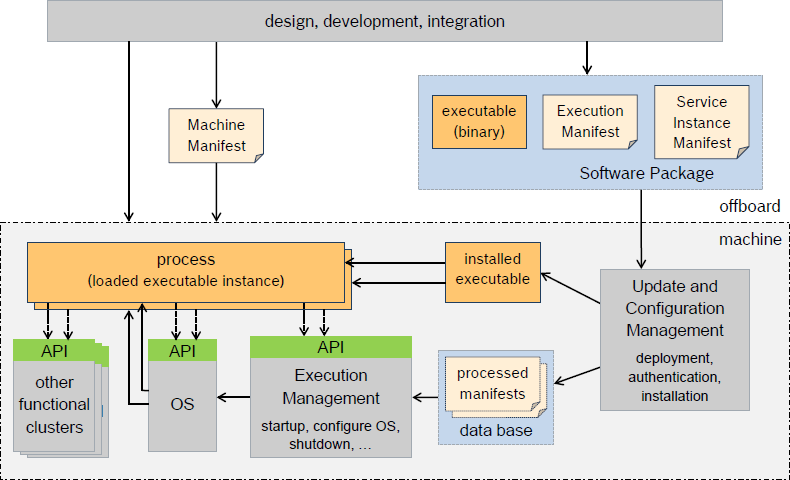
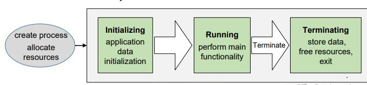
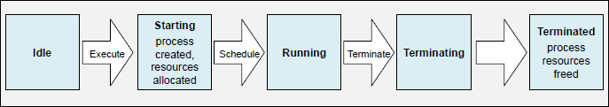
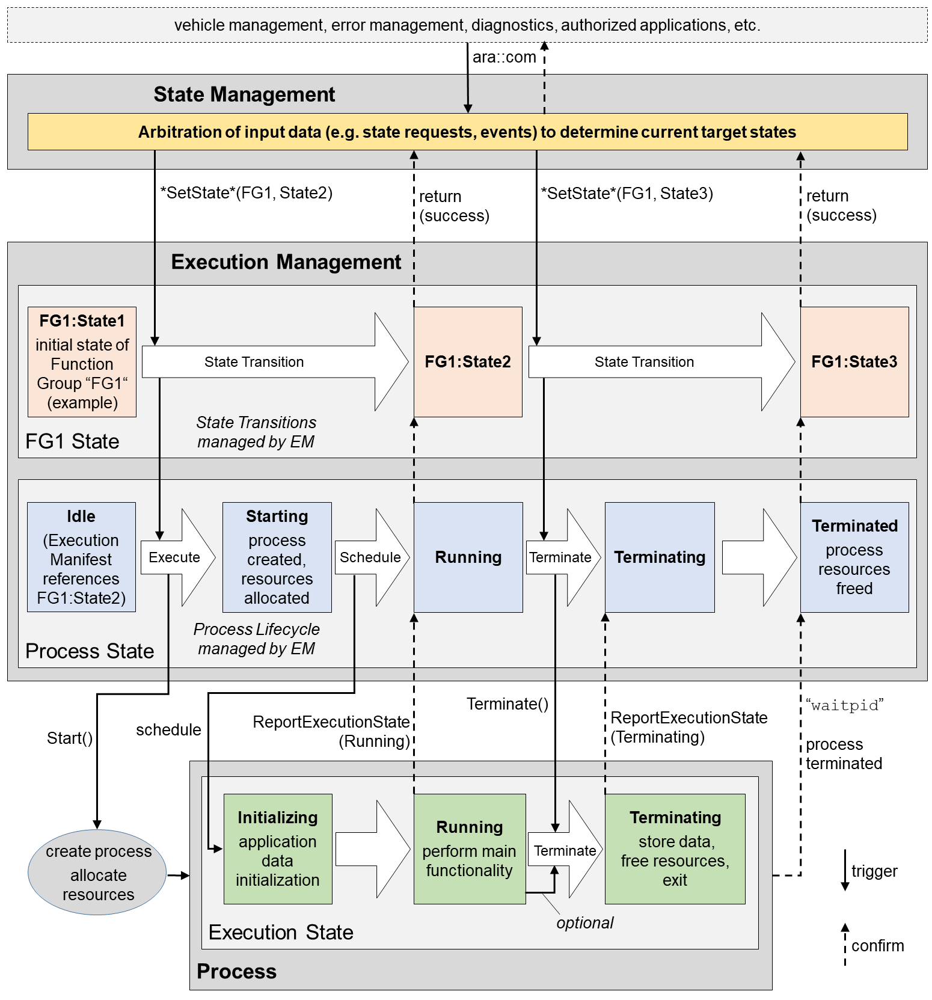
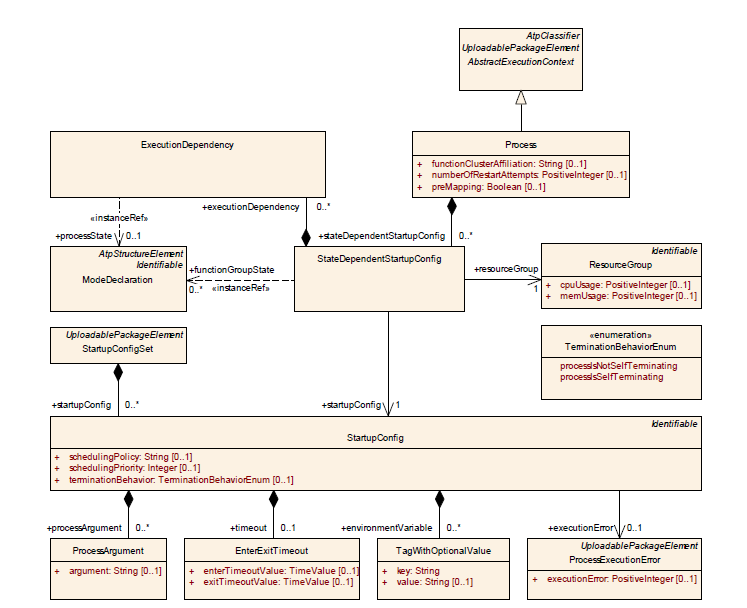
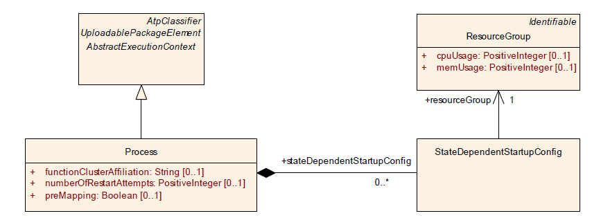
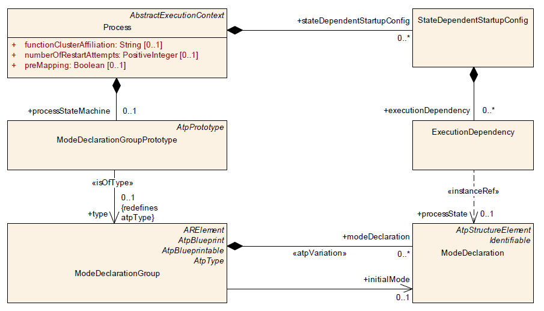
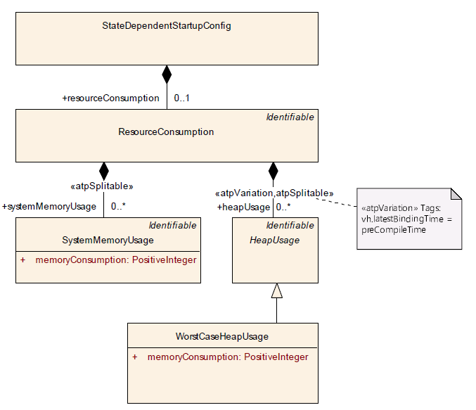

**Execution Management (EM)**
==================================

Introduction
#############

Execution Management is responsible for all aspects of system execution management including platform initialization and startup / shutdown of Applications. It performs these tasks using information contained within one or more Manifest files such as when and how Executables should be started. The Execution Management functional cluster is part of the Adaptive Platform.

Execution Management works in conjunction with the Operating System. In particular, Execution Management is responsible for configuring the Operating System to perform run-time scheduling and resource monitoring of Applications.

The Execution Manifest specifies the deployment related information of an Executable and describes in a standardized way the machine specific configuration of Process properties (startup parameters, resource group assignment, scheduling priorities etc.).

Execution management is one of the main functional cluster in the adaptive platform. Execution management is responsible for initiating execution of the all the processes i.e., functional clusters, Adaptive AUTOSAR services, and Adaptive applications. Execution management performs how, when and the process it should be started. Execution Management is not responsible for run-time scheduling of Processes since this is the responsibility of the Operating System. Execution management will not directly communicate with other clusters, firstly connected with state management, and then state management will request to the EM. Execution Management performs the State transitions and controls the actual set of running Processes, depending on the current States. Execution management is depending upon the OS. Execution management provides information to all the functional clusters. Execution management controls to all the functional clusters in the adaptive platform.

Overview of EM
###############

The purpose of the Execution Manifest is to provide information that is needed for the actual deployment of an application (formally modelled as an SwComponentType) onto the AUTOSAR adaptive platform.

One aspect of the deployment information is the provision of information that could in principle be provided as part of the application software code, but which would make the application software code become very much bound to specific usage scenarios.

The general idea is to keep the application software code as independent as possible from the deployment scenario in order to increase the odds that the application software can be reused in different deployment scenarios.

The Execution Manifest focuses on the following aspects:

Startup configuration to define how the application instance will be started. The startup includes the definition of startup options and access roles. Each startup may be dependent on machines states and/or function group states.

Execution Management is responsible for all aspects of process lifecycle management, including:

    - **Machine startup and shutdown** – Execution Management is the initial (“boot”) process of the operating system.
    - **Required process hierarchy of started services, e.g., init and its child process.** – The boot process in this case corresponds to machine init process.

    - **Provision of process isolation with each instance of an Executable managed as a single process.**

    - **Startup and shutdown of Applications.** – Loading Executable based on a defined Execution Dependency. – Specific requirements until starting an Executable main function (i.e. entry point) 

        -  Ensure that startup and shutdown dependencies between Executable instances are respected, if an execution dependency is specified in the Application Manifest of an Executable instance. If no execution dependency is specified between Executable instances, they can be started and stopped in an arbitrary order.

    - **Privileges and use of access control** – Description and semantics of access control in manifest files
        - Allocate OS resource budgets for Executable and/or groups of Executables
        - Authentication and authorization of Executables at startup of Executable
    - **State management** – Conditions for the execution of Applications	

Dependencies to other functional clusters
##########################################

    - Execution Management is dependent on the OS.
    -  The OS is used to control all the application executions.
    -  In the adaptive platform all the functional applications depends on the execution management.
    -  Execution Management might provide supporting process information to Platform Health Management.

Technical aspect of execution manager
######################################

Application
-------------

    - Applications are developed to resolve a set of coherent functional requirements.
    - An Application consists of executable software units, additional execution related items (e.g. data or parameter files), and descriptive information used for integration and execution (e.g. a formal model description based on the AUTOSAR meta model, test cases).
    - Applications can be located on user level above the middleware or can be implementation of functional clusters of the Adaptive Platform.
    - Applications might use all mechanisms and APIs provided by the operating system and other functional clusters of the Adaptive Platform, which in general restricts portability to other Adaptive Platforms.
    - All Applications, including Adaptive Applications, are treated the same by Execution Management.

Adaptive Application
------------------------

    - An Adaptive Application is a specific type of Application that fully complies with the AUTOSAR specification, i.e. it is restricted to use APIs standardized by AUTOSAR and needs to follow specific coding guidelines to allow reallocation between different Adaptive Platforms.
    - Adaptive Applications are always located above the middleware. To allow portability and reuse, user level Applications should be Adaptive Applications whenever technically possible.
    - An Adaptive Application is the result of functional development and is the unit of delivery for Machine specific configuration and integration.
    - Some contracts and Service Interfaces to interact with other Adaptive Applications need to be agreed on beforehand.

Executable
-----------

    - An Executable is a software unit which is part of an Application. It has exactly one entry point (main function). An Application can be implemented in one or more Executables.
    - Executables which belong to the same Adaptive Application might need to be deployed to different Machines, e.g. to one high performance Machine and one high safety Machine.

+----------------------------------------+------------------------------------------+---------------------------------------------+
|  **Process Step**                      | **Software**                             |**Meta Information**                         |
+----------------------------------------+------------------------------------------+---------------------------------------------+
| Development and Integration            | Linked, configured and calibrated binary | Application Manifest and Service Instance   |
|                                        | for deployment onto the target Machine.  | Manifest (not used by Execution Management) |
|                                        | The binary might contain code which was  |                                             |
|                                        | generated at integration time.           |                                             |
+----------------------------------------+------------------------------------------+---------------------------------------------+
| Deployment and Removal                 | Binary installed on the target Machine.  | Processed Manifests, stored in a            |
|                                        |                                          | platform-specific format which is           |
|                                        |                                          | efficiently readable at Machine startup.    |
+----------------------------------------+------------------------------------------+---------------------------------------------+
| Execution                              | Process started as instance of the binary| The Execution Management uses contents of   |
|                                        |                                          | the Processed Manifests to start up and     |
|                                        |                                          | configure each process individually.        |
+----------------------------------------+------------------------------------------+---------------------------------------------+

   
   **Executable Lifecycle**

Machine Manifest
------------------

    - Manifest is nothing but one type of file. 
    - In the adaptive platform one of the cluster is used it holds all the information in manifest how to start, how to run, how to stop all the mentioned in that file.
    - Coming to machine manifest same as above how to start the machine, how to run , and how to stop.
    - The Machine meta-class defines the entity on which one Adaptive AUTOSAR Software Stack is running with an operating system. 
    - The contents of a Machine Manifest includes the configuration of Machine properties and features (resources, safety, security, etc.), e.g. configured Machine States and Function Group States, resource groups, access right groups, scheduler configuration, SOME/IP configuration, memory segmentation

Machine
--------

    - The Machine may be physical or virtual.
    - The Machine is able to aggregate one or several Processors. And each Processor consists of one or several ProcessorCores.
    - ProcessorCore provides attribute coreId that can be used e.g. in a bitmask to better control the utilization of processing resources.

Execution Management
---------------------

    - Execution Management determines when, and possibly in which order, to start or stop processes, i.e. instances of the deployed Executables, based on information in the Machine Manifest and Execution Manifests.
    - Execution Management is not responsible for run-time scheduling of processes since this is the responsibility of the Operating System.
    - Execution Management is responsible for initialization / configuration of the OS to enable it to perform the necessary run-time scheduling and resource management based on information extracted by Execution Management from the Machine Manifest and Execution Manifests.

Execution States
-----------------

    - Execution States characterizes the internal lifecycle of a process. 
    - They describe it from the point of view of a process that is executed.

   
   **Execution States**
   
Execution Manifest
--------------------

    - The purpose of the execution manifest is to provide information that is needed for the actual deployment of an application onto the AUTOSAR adaptive platform.
    - In particular, the usage of PortPrototypes as a means to express communication with the “outside” of the application software allows for abstracting away the details (the concrete service instance identification) of the service configuration. 
    - The API between the application and the middleware is represented by the PortPrototype.
    - The Execution Manifest specifies the deployment related information of an Executable and describes in a standardized way the machine-specific configuration of Process properties (startup parameters, resource group assignment, scheduling priorities etc.).
    - The Execution Manifest is bundled with the actual executable code in order to support the deployment of the executable code onto the Machine.
    - Each instance of an Executable binary, i.e. each started Process, is individually configurable, with the option to use a different configuration set per Machine State or per Function Group State.

Process
--------

The top-level element of the Execution Manifest definition is the Process, in reference to the fact that the unit of deployment on the AUTOSAR adaptive platform is a binary that, at runtime, makes a POSIX process.

        - ProcessStates
        - StateDependentStartUpConfig
        - StartupConfig

Process States
---------------

    - Process State is used by Execution Management to resolve Execution Dependencies, manage timeouts,etc.
    - Process States represent Execution Management internal tracking of the Execution States

   
   **Process States**

Execution Dependency
---------------------

    - Execution Management can derive an ordering for the startup and termination of processes within State Management framework based on the declared Execution Dependencies. 
    - Since some processes shall reach a certain Execution State to be able to offer their services to other processes, 
    - The dependency information shall also refer to Process State of the process specified as dependency. With that in mind, the dependency information may be represented as a pair like:
    - Processes are only started by Execution Management if they reference a requested Machine State or Function Group State, but not because of configured Execution Dependencies. 
    - Execution Dependencies are only used to control a startup or terminate sequence at state transitions.

FunctionGroupStates
---------------------

The Function Groups mechanism is very flexible and is intended as a tool used to start and stop processes of Applications.

    - In general, Machine States are used to control machine lifecycle (startup/shutdown/restart) and processes of platform level Applications, while other Function Group States individually control processes which belong to groups of functionally coherent user level Applications. 

   **Interaction between states**

Configuration Methodology
#############################

**Startup Configuration**
----------------------------

- The configuration of startup behavior is an essential part of the execution manifest.
- The formal modeling of application startup behavior is implemented by means of the aggregation of meta-class StateDependentStartupConfig in the role Process.stateDependentStartupConfig.

   **Content of a Process**

States
--------

Machine State :
^^^^^^^^^^^^^^^^^^

    - Machine state is specific type of function group state which refer to the global state of the machine.
    - Each Application would have an application manifest, which defines the machine state in which the application is allowed to execute.
    - MachineStates: Enumerate the machine states.
    - InitialState: Set the initial state of the machine.
    - EventTriggers: Define events that trigger state transitions.
    - Transitions: Specify conditions and actions associated with state transitions.

Functional Group State :
^^^^^^^^^^^^^^^^^^^^^^^^^^^

    - During diagnostic and error recover it is necessary to handle such application using functional group state.
    - State Manager will obtain available functional group state and machine state from machine manifest.
    - If there are multiple request from different application, State Manager would arbitrate based on priority and other factor before requesting Execution Manager for state change.
    - FunctionGroupStates: Enumerate the states for function groups.
    - InitialState: Set the initial state for each function group.
    - Transitions: Define conditions and actions for transitions between function group states.

.. figure:: resources/Configuration_of_Function_Groups.png
   :class: with-border
   :align: center

   **Configuration of Function Groups**

**Machine Function Group** 

One functionGroup claimed by one SoftwareCluster of category PLATFORM_CORE takes the role of a "machine function group".

This functionGroup is required to have a dedicated shortName and it also is required to define a certain minimal, but extensible set of ModeDeclarations that also have standardized shortNames.

Exactly one functionGroup shall exist that has the shortName "MachineFG" and that is typed by a ModeDeclarationGroup that defines at least the following list of ModeDeclarations with the shortNames  

    - Off,
    - Verify,
    - Startup,
    - Shutdown, and
    - Restart.

**Association with Resource Group**
------------------------------------

Meta-class StateDependentStartupConfig also supports the specification of a relation to a resource group.

   **Modeling of how Process relates to ResourceGroup**

Execution Dependency
----------------------

The modeling of an execution dependency makes two Processes become associated to each other by means of the definition of an ExecutionDependency.

But since the reference that defines the execution dependency is modeled as an <<instanceRef>> the referenced Process needs to be extracted from the context references in the <<instanceRef>>.

   **Modeling of how Process relates to ModeDeclaration owned by another Process**

Resource Consumption Boundaries
----------------------------------

It is possible to specify boundaries for resource consumption, specifically in terms of memory consumption for system memory and heap, of a given startup configuration of a Process:

- The formalization of heap usage is represented by meta-class HeapUsage, aggregated via meta-class ResourceConsumption at StateDependentStartupConfig. The actual value of the heap usage is computed out of the sum of all aggregated ResourceConsumption.heapUsage.
- The formalization of system (i.e. kernel-space) memory usage is represented by meta-class SystemMemoryUsage, aggregated via meta-class Resource Consumption at StateDependentStartupConfig. The actual value of the system memory usage is computed out of the sum of all aggregated ResourceConsumption.systemMemoryUsage.

The StateDependentStartupConfig.resourceConsumption allows for a fine-grained definition that can even observe the differences in resource consumption with respect to different startup configurations.

   **Modeling of resource consumption boundaries for a given Process**
