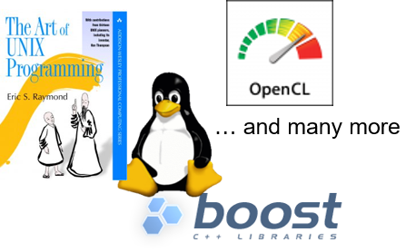

**Introduction to Software Defined Vehicle(SDVs)**
====================================================

**Current In-Vehicle Networking**
########################################

Traditional ECU Characteristics:

- Deeply Embedded with real time, safe and secure system
- Static Network Configuration
- Static deployment of Application SWCs
- Low Computing Power
- Not scalable, Limited Bandwidth
- No standardized solution available for fail operational systems and updates over the air

.. figure:: resources/In-VehicleNetworking.png
    :class: with-border
    :align: center
    :scale: 75%
    
    **In Vehicle Networking**

Current and next generation vehicle functions/applications such as Electric Vehicle, Autonomous Car, Car-2-X, Software updates over the air, or Vehicles as part of the IoT, will introduce highly complex and computing resource demanding software into the vehicles and must fulfill strict integrity and security requirements. Such software realizes functions, such as environment perception, behavior planning, integrates the vehicle into external backend and infrastructure systems. The software in the vehicle needs to be changed during the life cycle of the vehicle, due to evolving external systems or improved functionality. 

.. figure:: resources/FutureVehicle_new.png
   :class: with-border
   :align: center

   **Computation Intensive Applications and Functions**

The rise of the SDV is a result of three automotive trends leading the paradigm shift: electrification, automation‌ , connectivity and shared. 

A software-defined vehicle (SDV) is a vehicle that is built primarily on software and where the functions of the vehicle are driven by software instead of hardware. In addition, the vehicle’s software plays a key role in enhancing existing features ‌and introducing new capabilities, allowing for customization of the vehicle without changing the underlying hardware.

**Key Challenges of SDVs**:
#################################

**E/E Architecture**: Current EE architectures with domain controllers and a central gateway have grown over time and became very complex. 
                        • 3rd heaviest part up to 80 kg
                        • Absolute length of up to 5 km
                        • 3rd highest cost component, with a high cost of labor
                        • The new generation of vehicles will rely on and produce huge amounts of data that cannot be handled efficiently by the existing architecture used in traditional vehicles. 

**Safety and Security**: As more software is introduced into vehicles, there are more opportunities for hackers to attack, putting the safety of drivers and passengers at risk. Developers must focus on creating cars that are secure by design to keep drivers and passengers safe, protect personal data and information, and ensure that the vehicle operates as intended.

**In-Vehicle Networking**: To operate efficiently, the different components must be able to communicate with each other quickly, effectively and synchronized way. Low latency and high bandwidth capabilities are imperative, along with the ability to balance power, manage heat, optimize storage, and ensure memory capacity.

**The New Supply Chain**: Traditionally, OEMs would acquire ECUs and the relevant software from the same Tier 1, and the software would be made specifically for each ECU. The supply chain for SDVs is different, giving OEMs the freedom to choose from a variety of software providers who must be able to produce software that can work with any type of hardware.

**Decoupling Hardware and Software**: In order to best take advantage of the new supply chain and its flexibility, hardware and software abstraction is crucial. This will consolidate the number of ECUs needed and will allow for the customization that customers crave.

**Driving Factors of SDVs**
#############################

1. Reduced time to SOP

    - Shorter & Agile Development and Deployment
    - Shorter time to market for new concepts

2. New revenue streams for OEM

    - Roll-out new features Post-Sale of vehicle on subscription basis
    - Vehicle data collected can be sold

3. Increased Consumer demand for high compute features like
    
    - Autonomous driving
    - Digital cockpit
    - Connected and shared cars
    - Ability to have the latest features via Over the air updates

4. Lower Development and Production Costs

    - Reduced micro-controllers, wiring and harness
    - Shorter Supply chain
    - Eliminating product recall for software defects

**E/E Architecture Evolution**
#################################

The Automotive industry is undergoing rapid evolution and is currently at an inflection point. The vehicles which were predominantly mechanical machines are more and more shifting towards Electrical and Electronics.

    **E/E Architecture Evolution**

**Zonal Architecture**
    - Centralized Zonal Compute
    - Service Oriented Architecture
    - Redundant Computing Platform
    - Concentrated I/O
    - Intelligent Power Supply

**How AUTOSAR Supports Zonal Architecture**
----------------------------------------------------
In a software defined vehicle the central computer nodes would run the AUTOSAR Adaptive platform and would be capable of interacting with the AUTOSAR Classic platform and Non-AUTOSAR ECUs via standardized protocols.

    **Zonal Architecture Supported by AUTOSAR**

**Classic vs Adaptive**
-------------------------

.. list-table:: 
   :widths: 50 50
   :header-rows: 1

   * - Classic Platform
     - Adaptive Platform
   * - Based on OSEK OS 
     - Based on POSIX
   * - Deep Real time Embedded System 
     - High Performance and Computation-intensive functionality
   * - Developed in C 
     - Developed in C++
   * - Signal based communication
     - Service based communication
   * - Static Network, Task and Application SWC Configuration and Scheduling Strategy. Whole Stack compiled and linked to generate the full target image for the hardware
     - Thread and not runnable based communication, Flexible Configuration, Dynamic Deployment of new functionalities without the need to generate the full target image for the hardware
   * - Same Address space for all the applications (MPU Support)
     - Each Application run in it’s own protected address space (MMU Support)
   * - Execution of code directly from ROM
     - Application is loaded from persistence memory to RAM
   * - Real time (High in the range of microsecond), Safety critical (up to ASIL D), Low computing power
     - Not so real time (in the range of millisecond), High Computing Power, Fail Safe Operational System, Highly secured
   * - Supports up to ASIL D
     - Supports up to ASIL B
   * - Example of Classic Platform such as Engine Control, Braking Control
     - Example of Adaptive Platform such as ADAS, Digital Cockpit 

.. figure:: resources/ClassicVsAdaptive.png
   :class: with-border
   :align: center

   **Quick Comparison**

While the communication protocols of the classical platform are based on signal based paradigm that is statically pre-configured before run-time (operation), while the adaptive platform is based service-oriented communication allowing dynamic initiation of communication paths. Similarly, the dynamic scheduling of applications would allow dynamic deployment of application during runtime. Another important characteristic is the Memory Management Unit, through which each process (task) executed by the operating system have its own virtual address and doesn’t recognize the existence of others. This assists the achievement of freedom from interference between applications, even after their deployment during runtime. All this is realized through a POSIX complaint operating system, to allow the compatibility between other applications.

**Types of ECU Hardware:** 
---------------------------

Machine term has been newly introduced with the AUTOSAR Adaptive Platform. A machine is resembled to virtualized ECU, an entity where software can be deployed to. In this context, one real ECU could run several machines. In the simplest case the term machine is nothing but an ECU.

.. figure:: resources/Machine_View.png
   :class: with-border
   :align: center

   **Machine View**

**Existence of Classic Platform:** 
AUTOSAR has no intention of replacing the Classical Platform with the Adaptive Platform, but the aim is to have both platforms coexisting and functioning together on the same network without risking the stability of the existing classical architecture that has been proven over the years. The introduction of the Adaptive Platform intends to complement the automotive specific functionalities and sustain the domain’s fundamental attributes such as reliability, availability, maintainability and safety.

**Introduction of AUTOSAR Adaptive Platform**
====================================================

The Adaptive platform contains the interfaces that required for the development of complex ECUs that demands high processing power such as autonomous driving and mostly running on multicore microprocessors for parallel computing. 

As compared to Classic platform, the Adaptive platform allows dynamic linking of services and clients during ECU runtime which makes it much more flexible for the application developers. The platform also utilizes C++14 to allow feature-rich and fast development of ARA applications.

**Adaptive Platform Characteristics**
#########################################

    - Language C++
    - SOA
    - Parallel processing
    - Leveraging existing standard
    - Safety and security
    - Planned dynamics
    - Agile

Service Oriented Architecture (SOA)
---------------------------------------

A service-oriented architecture (SOA) is an approach used to create a software architecture based on the use of services that is exchanged between application software components. It enables the idea of service reuse, no need to start from scratch when upgrades and other modifications are needed; which creates an efficient and flexible way to interconnect systems to perform a specific job increasing the system scalability and re-usability, and simultaneously eases the coexistence of different applications.

.. figure:: resources/serviceorientedarchitecture.png
   :class: with-border
   :align: center

   **Service Oriented Architecture**

The exchange of services is based on a Service-Oriented Communication (SOC) paradigm, where “an application is interpreted as a set of data providing (sensors), data processing (application logic), and data consuming (actuators) services. As shown in the above figure, the communication paths follow a producer/consumer or client/server model, where some applications offer their services as producers, while other applications subscribe for services as consumers. This allows the introduction of new services independent of vendors, products, technologies, and without introducing changes in the underlying program, which further support the establishment of communication paths at run-time.

Only the needed data is subscribed for and reaches the client; unlike the classical way where all the data is broadcasted regardless of the receiver. Moreover, SOME/IP can be implemented on different operating system and even embedded devices without an operating system; serving the intention of providing compatibility, and allowing stronger interactions with off-board systems and non-AUTOSAR applications.

A service consists of a combination of

    - Events
    - Methods
    - Fields

Parallel Processing
-----------------------

The distributed computing is inherently parallel. The SOA, as different applications uses different set of services, shares this characteristic. The advancement or many core processors and heterogeneous computing that offer parallel processing capability offers technological opportunities to harness the compute power to match the inherent parallelism. Thus, the AP possesses the architectural capability to scale its functionality and performance as the multicore-heterogeneous computing technologies advance.

Leveraging existing standard
--------------------------------

    - Reuse existing (non-automotive) standards
    - Ease software development
    - Support automotive use-cases and protocols

   **Reuse existing standard**

Safety and Security
-----------------------

The systems that AP targets often require highest level of safety and security. To cope with the challenge, AP combines architectural, functional, and procedural approaches. The architecture is based on distributed computing based on SOA, which inherently makes each component more independent and free of unintended interference, dedicated functionalities to assist achieving safety and security.

Planned Dynamics
--------------------

The AP supports incremental deployment of applications, where resources and communications are managed dynamically to reduce the effort for software development and integration, enabling short iteration cycles. Incremental deployment also supports explorative software development phases. AP allows the system integrator to carefully limit dynamic behavior to reduce the risk of unwanted or adverse effects allowing safety qualification. Dynamic behavior of an application will be limited by constraints stated in the Application Manifest.

.. figure:: resources/PlannedDynamics.png
   :class: with-border
   :align: center

   **Planned Dynamics**

Configuration of communication paths can happen at design-, at startup- or at run-time and is therefore considered either static or dynamic.

    - **Full static configuration:** service discovery is not needed at all as the server knows all clients and clients know the server.
    - **No discovery by application code:** the clients know the server but the server does not know the clients. Event subscription is the only dynamic communication pattern in the application.
    - **Full service discovery in the application:** No communication paths are known at configuration time. An API for Service discovery allows the application code to choose the service instance at runtime.

Examples of Planned Dynamics are

    - Pre-determination of service discovery process
    - Restriction of dynamic memory allocation to startup phase only
    - Fair scheduling policy in addition to priority-based scheduling
    - Fixed allocation of processes to CPU cores
    - Access to pre-existing files in the file-system only
    - Constraints for AP API usage by Applications
    - Execution of authenticated code only	

Agile
-------

To support Agile Development process, it is important that underlying architecture e.g. Adaptive Platform is scalable with the possibility of updating the system after its deployment.

**Adaptive Platform Architecture**
#########################################

The AUTOSAR Adaptive architecture organizes the software of the AUTOSAR Adaptive foundation as functional clusters. These clusters offer common functionality as services to the applications. The Adaptive Application (AA) run on top of ARA, AUTOSAR Runtime for Adaptive applications. ARA consists of application interfaces provided by Functional Clusters, which belong to either Adaptive Platform Foundation or Adaptive Platform Services. Adaptive Platform Foundation provides fundamental functionalities of AP, and Adaptive Platform Services provide platform standard services of AP. The interface of Functional Clusters, either they are those of Adaptive Platform Foundation or Adaptive Platform Services, are indifferent from AA point of view.

   **Adaptive Platform Architecture**

Application Lifecycle
-----------------------

Each process running within the machine its lifecycle managed by the Execution Management Function cluster. The processes are initialized, monitored and shutdown as per the requirement.

**Configuration Methodology**
#############################################

The AUTOSAR Adaptive Platform can be modeled from the meta-models defined by AUTOSAR. This provides seamless model data transfer from OEM to supplier and is supported by all AUTOSAR compliant toolchains.

.. figure:: resources/Configuration_Process.png
   :class: with-border
   :align: center
   :scale: 50%

   **Configuration Process**

**System Design (OEM)**
    The whole System including adaptive platform machines and classic platform ECUs shall be present in one single model

.. figure:: resources/System_Design.png
   :class: with-border
   :align: center
   :scale: 50%

**Service Interface Design (Supplier)**
    The Services provided by a supplier by their machine shall be present in this model

**Service Interface Deployment (OEM)**
    The protocol specific deployment of the required or provided Services by the supplier shall be modeled

.. figure:: resources/service_interface_deployment.png
   :class: with-border
   :align: center
   :scale: 50%

**Machine Design (Supplier)**
    The individual machine shall be modeled with the Adaptive platform FC instantiations and Machine/Function group states

.. figure:: resources/machine_design_config.png
   :class: with-border
   :align: center
   :scale: 50%

**Adaptive Application Design (Supplier)**
    The Adaptive platform applications shall be created and relevant services to be mapped to the provided or required ports

**Process Design (Supplier)**
    The Adaptive platform application shall be provided mapped to respective process of underlying machine

.. figure:: resources/proc_design_config.png
   :class: with-border
   :align: center
   :scale: 50%
