**Overview of Function Clusters**
========================================================

.. figure:: resources/apd_architecture.png
   :class: with-border
   :align: center

**Execution Management**
#####################################

Execution Management is responsible for all aspects of system execution management including initialization of the Adaptive Platform and the startup/shutdown of Processes. Execution Management works in conjunction with the Operating System to configure the run-time scheduling of Processes.

System Startup
----------------

When the Machine is started, the OS will be initialized and then Execution Management will be launched as the Platform's initial process. Other platform-level Processes (representing Functional Clusters) of the Adaptive Platform Foundation are then launched by Execution Management. After the Adaptive Platform Foundation is up and running, Execution Management continues launching Processes of Adaptive Applications. The startup order of the platform-level and Application-level Processes are determined by the Execution Management, based on the Machine Manifest and dependencies specified in the Execution manifest.

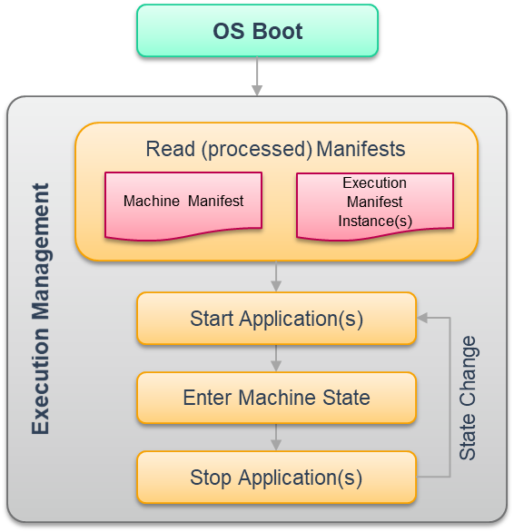

    **AP start-up sequence**

An Adaptive Application can consist of multiple Executable elements -- which typically would correspond to executable files on the filesystem. Each Executable can have multiple Process configurations.

Execution Management optionally supports authenticated startup where starting from a trust anchor the Adaptive Platform is started while maintaining the chain of trust. During authenticated startup Execution Management validates the authenticity and integrity of applications and will (optionally) prevent their execution if violations are detected. Through these mechanisms, a Trusted Platform can be established.

Execution Management Responsibilities
-------------------------------------

Execution Management is responsible for all aspects of Adaptive Platform execution management and Application execution management including:

1. Platform Lifecycle Management 
   Execution Management is launched as part of the Adaptive Platform startup phase and is responsible for the initialization of the Adaptive Platform and deployed Applications.

2. Application Lifecycle Management
   The Execution Management is responsible for the ordered startup and shutdown of the deployed Applications. The Execution Management determines the set of deployed Applications based on information in the Machine Manifest and Execution manifests and derives an ordering for startup/shutdown based on declared Application dependencies. Depending on the Machine State and on the Function Group States, deployed Applications are started during Adaptive Platform startup or later, however it is not expected that all will begin active work immediately since many Applications will provide services to other Applications and therefore wait and “listen” for incoming service requests.

The Execution Management is not responsible for run-time scheduling of Applications since this is the responsibility of the Operating System. However, the Execution Management is responsible for initialization/configuration of the OS to enable it to perform the necessary run-time scheduling based on information extracted by the Execution Management from the Machine Manifest and Execution manifests.
   
Resource Limitation
-------------------

The Adaptive Platform permits execution of multiple Adaptive Applications on the same Machine and thus ensuring freedom from interference is a system property. Hence an incorrectly behaving Adaptive Application should be limited with respect to its ability to affect other applications, for example, an application should be prevented from consuming more CPU time than specified due to the potential for consequent impacts on the correct functioning of other applications.

Execution Management supports freedom from interference through the configuration of one or more ResourceGroups to which application’s processes are assigned. Each ResourceGroup may then be assigned a limit for CPU time or memory that permits restricting the Application's available resources.  

Application Recovery
--------------------

Execution Management is responsible for the state-dependent management of Process start/stop, so it has to have the special right to start and stop Processes. The Platform Health Management monitors Processes and could trigger a Recovery Action in case any Process behaves not within the specified parameters. The Recovery Actions are defined by the integrator based on the software architecture
requirements for the Platform Health Management and configured in the Execution Manifest.

Trusted Platform
----------------

To guarantee the correct function of the system, it is crucial to ensure that the code executed on the platform has legitimate origin. Keeping this property allows the integrator to build a Trusted Platform.

A key property of a system that implements a Trusted Platform is a Trust Anchor (also called Root of Trust). A Trust Anchor is often realized as a public key that is stored in a secure environment, e.g. in non-modifiable persistent memory or in an HSM.  
   
**State Management**
####################

State Management is a unique Functional Cluster that is intended to be mostly an ECU development project specific, and generally, the final implementation is to be performed by the system integrator. It is responsible for all aspects of the operational state of the AUTOSAR Adaptive Platform, including handling of incoming events, prioritization of these events/requests to set the corresponding internal states. State Management may consist of one or more state machines depending on the project needs.

The State Management interact with Adaptive Applications via project specific ara::com service interface consisting of ‘Fields” as described below. The interaction between State Management and other Function Clusters shall be done via a standardized interface(s) defined by each Function Cluster.

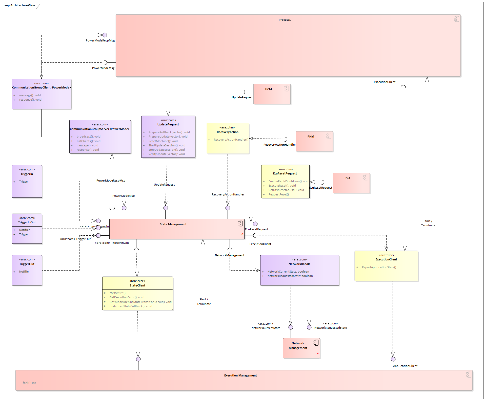

    **State_Management_interactions**

The following effects can be requested by State Management:

    - FunctionGroups can be requested to be set to a dedicated state
    - (Partial) Networks can be requested to be de / activated
    - The machine can be requested to be shutdown or restarted
    - Other Adaptive (Platform) Applications can be influenced in their behavior
    - Project-specific actions could be performed
    - Recover from (supervision) errors when being informed by Platform Health Management or by Execution Management
    - Execution of project specific reset per Diagnostic Addresses on request from Diagnostics
    - Preparation and verification of software clusters for being installed, updated or removed on request from Update and Configuration Management
    - Influence behavior of running Processes to achieve synchronized behavior within (parts of) the machine (e.g. Power Modes)
    
    
**Communication Management**
############################

Overview
--------

The Communication Management is responsible for all aspects of communication between applications in a distributed real-time embedded environment.

The concept behind is to abstract from the actual mechanisms to find and connect communication partners such that implementers of application software can focus on the specific purpose of their application.

Service Oriented Communication
------------------------------

The notion of a service means functionality provided to applications beyond the functionality already provided by the basic operating software. The Communication Management software provides mechanisms to offer or consume such services for intra-machine communication as well as inter-machine communication.

A service consists of a combination of
- Events
- Methods
- Fields

Communication paths between communication partners can be established at design-, at startup- or at run-time. An important component of that mechanism is the Service Registry that acts as a brokering instance and is also part of the Communication Management software.

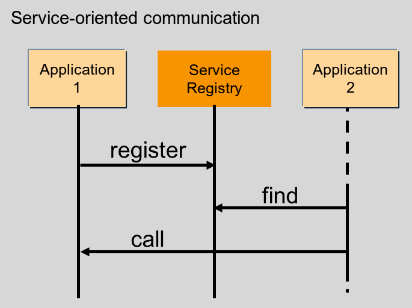

   **Service_oriented_communication**

Each application that provides services registers these services at the Service Registry. To use a service a consuming application needs to find the requested service by querying the Service Registry, this process is known as Service Discovery.

Language binding and Network binding
------------------------------------

The Communication Management provides standardized means how a defined service is presented to the application implementer (upper layer, Language Binding) as well as the respective representation of the service’s data on the network (lower layer, Network Binding). This assures portability of source code and compatibility of compiled services across different implementations of the platform.

The Language binding defines how the methods, events, and fields of a service are translated into directly accessible identifiers by using convenient features of the targeted programming language. Performance and type safety (as far as supported by the target language) are the primary goals. Therefore, the Language Binding is typically implemented by a source code generator that is fed by the service interface definition. 

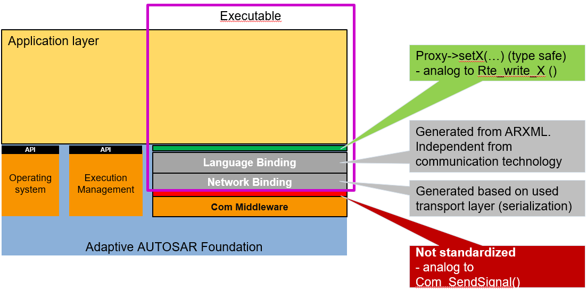

   **Example_Language_and_Network_Binding** 

The Network Binding defines how the actual data of a configured service is serialized and bound to a specific network. It can be implemented based on Communication Management configuration (interface definition of the AUTOSAR meta model) either by interpreting a generated service specific recipe or by directly generating the serializing code itself. Currently, Communication Management supports SOME/IP, DDS, IPC (Inter-Process-Communication or any other custom binding), and Signal PDU (Signal-Based Network binding).   
   
The local Service Registry is also part of the Network Binding.

Please note: the interface between Language Binding and Network Binding is considered as a private interface inside Communication Management software. Therefore, a normative specification defining this interface is currently out of scope. Nevertheless, platform vendors are encouraged to define independently such an interface for their software to allow for easy implementation of other Language Bindings than C++ together with other Network Bindings inside their platform implementation.   

Generated Proxies and Skeletons of C++ Language Binding
-------------------------------------------------------

The upper layer interface of the C++ Language Binding provides an object-oriented mapping of the services defined in the interface description of the AUTOSAR meta model.

A generator that is part of the development tooling for the Communication Management software generates C++ classes that contain type safe representations of the fields, events, and methods of each respective service.

On the service implementation side, these generated classes are named Service Provider Skeletons. On the client side, they are called Service Requester Proxies.

For Service Methods, a Service Requester Proxy provides mechanisms for synchronous (blocking the caller until the server returns a result) and asynchronous calling (called function returns immediately). A caller can start other activities in parallel and receives the result when the server’s return value is available via special features of the Core Type ara::core::future.

A platform implementation may be configured such that the generator creates mock-up classes for easy development of client functionality when the respective server is not yet available. The same mechanism can also be used for unit testing the client.

Whereas proxy classes can be used directly by the client the Service Provider Skeletons for the C++ binding are just abstract base classes. A service implementation shall derive from the generated base class and implement the respective functionality.

The interfaces of ara::com can also provide proxies and skeletons for safety-related E2E protected communication. These interfaces are designed that compatibility to the applications is assured independent whether E2E protection is switched on or off.

Static and dynamic configuration
--------------------------------

The configuration of communication paths can happen at design-, at startup- or at run-time and is therefore considered either static or dynamic:

- Full static configuration:

    - service discovery is not needed at all as the server knows all clients and clients know the server.

- No discovery by application code:

    - the clients know the server but the server does not know the clients. Event subscription is the only dynamic communication pattern in the application.

- Full service discovery in the application:

    - No communication paths are known at configuration time. An API for Service discovery allows the application code to choose the service instance at runtime.

Service Contract Versioning
---------------------------

In SOA environments the client and the provider of a service rely on a contract which covers the service interface and behavior. During the development of a service the service interface or the behavior may change over time. Therefore, service contract versioning has been introduced to differentiate between the different versions of a service. The AUTOSAR Adaptive platform supports contract versioning for the design and for the deployment phase of a service. Additionally, the Service Discovery of a client may be configured to support version backwards-combability. This means that a client service can connect to different provided service versions if these are backwards-compatible to the required service version of the client.

Raw Data Streaming Interface
----------------------------

Besides the Service Oriented Communication, the Communication Management also provides a standalone API for processing raw binary data streams towards an external ECU, e.g. a sensor in an ADAS system. The API is static and implements functionality for a client application to establish a communication channel to a server, and for a server application to wait for incoming connections from a client. The API provides functionality for both clients and servers, to destroy a communication channel, and to read and write raw data (a stream of bytes) over the communication channel. The Raw Data Stream channels can be configured by an integrator by applying deployment information, containing e.g. network endpoint information and selected protocols. Currently, TCP/IP sockets shall be used as a transport layer, but other alternatives can be added in the future. The Raw Data Stream interface is available in the namespace ara::com::raw.	
   
**Platform Health Management**
#####################################

The Platform Health Management supervises the execution of software. It offers the following supervision functionalities (all supervision functions can be invoked independently):

    - Alive supervision
    - Deadline supervision
    - Logical supervision
    - Health Channel Supervision

Alive Supervision checks that a supervised entity is not running too frequently and not too rarely.

Deadline supervision checks that steps in a supervised entity are executed in a time that is within the configured minimum and maximum limits.

Logical supervision checks that the control flow during execution matches the designed control flow.

Alive, Deadline and Logical Supervision are performed based on reporting of checkpoints by applications/non-platform services or functional clusters via API ReportCheckpoint.

Health channel supervision provides the possibility to hook external supervision results (like RAM test, voltage monitoring, …) to the Platform Health Management.

Health channel supervision is performed based on reporting of Health statuses via API ReportHealthStatus.

Platform Health Management notifies State Manager if a failure is detected in the supervised entities.

In case a failure in Execution Management or State Management is detected, Platform Health Management can trigger a watchdog reset.

Known limitations for this release:

    - Dependency on the Diagnostic Manager is not defined, yet

Functionality shared by CP and AP is described in the foundation documents and named “Health Monitoring” (RS_HealthMonitoring and ASWS_HealthMonitoring). Additional specifications for AP only are described in the AP documents and named “Platform Health Management” (RS_PlatformHealthManagement, SWS_PlatformHealthManagement).

Note that the architectural elements EM, SM and PHM are highly safety-relevant; safe execution management and safe health monitoring are fundamental to the safe operation of an Adaptive Application. The EM, PHM, SM elements are interdependent and coordinate their activities to ensure functional safety within the AUTOSAR Adaptive Platform.

**Diagnostics**
#####################################

Overview
----------

The Diagnostic Management (DM) realizes the ISO 14229-5 (UDSonIP) which is 
based on the ISO 14229-1 (UDS) and ISO 13400-2 (DoIP). 

Diagnostic Management represents a functional cluster of the Adaptive Platform on 
the foundation layer.The configuration is based on the AUTOSAR Diagnostic Extract Template (DEXT) of the Classic Platform.

The supported Transport Layer is DoIP. DoIP is a vehicle discovery protocol and designed for off-board communication with the diagnostic infrastructure (diagnostic clients, production-/workshop tester). In-vehicle or for remote diagnostics often other transport protocols are used, wherefore an API to extend the platform with a custom transport layer is provided.

UDS is typically used within the production of a vehicle and within the workshops to 
be able to repair the vehicle. 

Software Cluster
-----------------

The atomic updateable/extendable parts are managed by SoftwareClusters (SWCL). A SoftwareCluster contains all parts which are relevant to update installed or deploy a particular set of new functionalities/applications. Hence the Adaptive Diagnostics Manager supports an own DiagnosticAddress for each installed SoftwareCluster.
Note that this SoftwareCluster is also coupled with the Software Package of UCM so that the SoftwareCluster can be updated or newly introduced to a machine.
 
Diagnostic communication sub-cluster
------------------------------------

The diagnostic communication sub-cluster realizes the diagnostic server (like the DCM of the Classic Platform). Currently, the supported services are limited, but the support of further UDS services will be extended in future releases. 

Besides the pseudo-parallel client handling of ISO 14229-1, the Diagnostic Manager (DM) is extended to support full parallel handling in the default session of different diagnostic clients. This allows satisfying the demands of modern vehicle architectures including several diagnostic clients (tester) for data collection, access 
from the backend and finally some of the classic workshop and production use-cases.

Diagnostic in Adaptive Application (AA)
---------------------------------------

The DM dispatch as a diagnostic server incoming diagnostic requests (like a routine control or DID service) to the mapped providing port of the corresponding AA. To realize this the AA needs to provide a specialized DiagnosticPortInterface.

Typed vs generic interfaces
----------------------------

There are different abstraction levels of DiagnosticPortInterfaces available: 

    -  A RoutineControl message is available as a

        o   Typed interface.
            The API signature includes all requests- and response message parameters with their primitive types. The DM takes care of the serialization. This API is individual to a specific RoutineControl message.
        
        o   Generic interface
            The API signature includes only a Byte-Vector for the request- and response message. The application is in the responsibility of the request- and response message serialization.The same API could be used for multiple RoutineControl messages.
            
    -  A DataIdentifier Message is available as a 
    
        o   Typed interface
            The API signature includes all requests- (for writing) and response message (for reading) parameters with their primitive types. The DM takes care of the serialization. 
            
        o   Generic interface
            The API signature includes only a Byte-Vector for the request- and response message. The application is in the responsibility of the request- and response message serialization.
            
        o   DataElement individual
            Each request- and response message parameter has its own interface. This is the highest level of abstraction i.e. any change in the request-and response message structure will have no effect on the API. Further, the parameters of the same diagnostic message could be in different processes.
            
Diagnostic conversations
------------------------

As the DM demands pseudo-parallel handling as it is mentioned above, it supports Diagnostic Conversations to reflect a distinct conversation between a Diagnostic Client and a Diagnostic Server. A Diagnostic Server is identified by a target address of the according UDS request and is dynamically allocated during run-time in the 
Adaptive Platform.

Event memory sub-cluster
------------------------

The event memory sub-cluster is responsible for DiagnosticTroubleCode (DTC)
management (like the DEM of the Classic Platform).

An active DTC is representing a certainly detected issue (typically important for production or workshop) in the vehicle. The DM is managing the storage of DTCs and its configured SnapshotRecords (a set of configured environmental data on the occurrence time of the DTC) and/or ExtendedDataRecords (statistical data belonging 
to the DTC like the number of reoccurrences). The detection logic is called Diagnostic Monitor. Such a monitor is reporting its recent test result to a DiagnosticEvent in the DM. The UDS DTC status is derived from one 
or multiple DiagnosticEvent(s). The DTC can be assigned to PrimaryMemory (accessible via 19 02/04/06) or to 
configurable UserMemories (accessible via 0x19 17/18/19). 

Counter- and Timebase Debouncing are supported. Furthermore, DM offers notifications about internal transitions: interested parties are informed about DTC status byte changes, the need to monitor re-initialization for DiagnosticEvents and if the Snapshot- or ExtendedDataRecord is changed.

A DTC can vanish from the DTC memory if it is not active for a configured amount of Operation Cycles. 

The DM supports generalized handling for the storage- and enable conditions. Enabling Conditions can be used to control the update of DTCs under special conditions like to disable all network-related DTCs within under-voltage condition. 

**Persistency**
#####################################

Overview
---------

Persistency offers mechanisms to applications and other functional clusters of theAdaptive Platform to store information in the non-volatile memory of an AdaptiveMachine. The data is available over boot and ignition cycles. Persistency offersstandard interfaces to access the non-volatile memory.

The Persistency APIs take storage location identifiers as parameters from theapplication to address different storage locations.
The available storage locations fall into two categories:

- Key-Value Storage
- File Storage

Every application may use a combination of multiple of these storage types.

Persistent data is always private to one process of one application. There is no mechanism available to share data between different processes using the Persistency. This decision was taken to prevent a second communication path 
beneath the functionality provided by Communication Management.

Persistency is prepared to handle concurrent access from multiple threads ofthe same application, running in the context of the same Process. To create sharedaccess to a Key-Value Storage or File Storage, either the SharedHandle returned byOpenKeyValueStorage and OpenFileStorage can be passed on (i.e. copied) to another thread or OpenKeyValueStorage and OpenFileStorage can be called in independent threads for the same Key-Value Storage or File Storage, respectively.

Persistency is able to take care of the integrity of the stored data. It uses redundant information to detect data corruption. The redundant information consists in CRC codes, Hash values, and "M out of N" schema. These mechanisms can be used either together or independently.

Persistency offers also safe storage. This is basically implemented usingredundancy, but with the additional feature of letting the application know if there was any problem with the stored data, even if it could be recovered using redundant data.

Persistency offers to application statistics regarding the number of used resources.

Persistency offers encryption for stored data to make sure that sensitive data will beencrypted before storing it on a physical device.

Key-Value Storage
-----------------

The Key-Value Storage provides a mechanism to store and retrieve multiple Key-Value pairs in one storage location. The following three kinds of data types are supported directly by Key -Value Storage:

        - Data types defined in SWS_AdaptivePlatformTypes.
        - Simple byte arrays that result from a streaming of complex types in the 
          application.
        - All Implementation Data Types referred via “dataTypeForSerialization“ by a       “PersistencyKeyValueDatabaseInterface” or specialized as PersistencyDataElements of that interface in the Application Design.

The keys need to be unique for each Key-Value database and are defined by an application using the methods provided by the Persistency.

Adding serialization/storage support based on application/platform specific serialization code for AUTOSAR data types which are defined in Application Design is planned.

File Storage
--------------

Not all data relevant for persistent storage is structured in such a way that Key-Valuedatabases are a suitable storage mechanism.

For this kind of data the mechanism of File Storage was introduced. A File Storage Port allows an application to access a storage location and create oneor multiple accessors in it. These accessors again are identified by unique keys in string format.

To give a better impression of this mechanism, a comparison to a file system helps: aFile Storage Port can be understood as a filesystem directory in which an application is allowed to create multiple files (accessors).

Use cases for handling persistent data for UCM
---------------------------------------------------

Handling the persistent data/persistent files of UCM use cases by Persistency during the UCM process purely depends on persistency configuration.

In general, there are three main use cases supported in UCM for handling adaptive applications over the life cycle of the CAR ECU or adaptive machine.

    -  Installation of new application software to the Adaptive Machine
    -  Update of existing application software to the Adaptive Machine
    -  Uninstallation of the existing application software from the Adaptive Machine

In the first two scenarios, Persistency is triggered by UCM via EM to deploy/update the persistent data of an application. In the third scenario, UCM may remove remaining persistent data using the URIs from the Persistency configuration.

Persistency shall support the below-mentioned scenarios.

        - Persistency shall be able to deploy the persistent data to a Key-Value database or File Storage that was  defined by an application designer during the Adaptive Application installation.

        - Persistency shall be able to deploy the persistent data to Key-Value database or File Storage that was    changed by an integrator

        - Persistency shall be able to deploy the persistent data to Key-Value database or File Storage that was defined by an integrator

        - Persistency shall be able to overwrite or retain the persistent data to Key-Value database or File Storage  as per the update strategies configured for the Key-Value database or File Storage when a new version of an application is installed
        
In general, the Persistency layer is configured during application design and deployment. Persistency shall be able to use the deployment stage configuration to override the application design configuration. If deployment stage configurations are missing, then configuration from the application design will be considered for the 
deployment of persistent data.

**Time Synchronization**
#####################################

Overview
--------

Time Synchronization (TS) between different applications and/or ECUs is of paramount importance when the correlation of different events across a distributed system is needed, either to be able to track such events in time or to trigger them at an accurate point in time.

For this reason, a Time Synchronization API is offered to the Application, so it canretrieve the time information synchronized with other Entities / ECUs.

The Time Synchronization functionality is then offered by means of different "TimeBase Resources" (from now on referred to as TBR) which are present in the systemvia a pre-build configuration.

Design
-------

For the Adaptive Platform, the following three different technologies were considered to fulfill all necessary Time Synchronization requirements:

- StbM of the Classic Platform
- Library chrono - either std::chrono (C++11) or boost::chrono
- The Time POSIX interface

After an analysis of the interfaces of these modules and the Time Synchronization features they cover, the motivation is to design a Time Synchronization API that provides a functionality wrapped around the StbM module of the Classic Platform, but with a std::chrono like flavor.

The following functional aspects are considered by the Time Synchronization 
module:

    - Startup Behavior
    - Constructor Behavior (Initialization)
    - Normal Operation
    - Error Handling

The following functional aspects will be considered in future releases:

    - Shutdown Behavior
    - Error Classification
    - Version Check

Architecture
-------------

The application will have access to a different specialized class implementation foreach Time Base Resource (TBR).

From this handle, the Application will be able to inquire about the type of Time Baseoffered (which shall be one of the five types presented above) to then obtain a specialized class implementation for that type of Time Base. From this handle, the Application will also be able to create a timer directly.

The TS module itself does not provide means to synchronize TBRs to Time Bases onother nodes and/or ECUs like network time protocols or time agreement protocols.An implementation of TBRs may have a dedicated cyclic functionality, which retrievesthe time information from the Time Synchronization Ethernet module or alike to 
synchronize the TBRs.

The Application consumes the time information provided and managed by the TBRs.Therefore, the TBRs serve as Time Base brokers, offering access to SynchronizedTime Bases. By doing so, the TS module abstracts from the "real" Time Base provider.

**Network Management**
#####################################

Overview on Network Management Algorithm
--------------------------------------------

The AUTOSAR NM is based on a decentralized network management strategy, which means that every network node performs activities independently depending only on the NM messages received and/or transmitted within the communication system.

The AUTOSAR NM algorithm is based on periodic NM messages, which are received by all nodes in the cluster via multicast messages.

The reception of NM messages indicates that sending nodes want to keep the NM-cluster awake. If any node is ready to go to sleep mode, it stops sending NM messages, but as long as NM messages from other nodes are received, it postpones the transition to sleep mode. Finally, if a dedicated timer elapses because no NM messages are received any more, every node performs the transition to the sleep mode.

If any node in the NM-cluster requires bus-communication, it can keep the NM-cluster awake by starting the transmission NM messages.

Architecture
-----------------

The Adaptive Platform specification describes the functionality, the API design and the configuration of the Network Management for the AUTOSAR Adaptive Platform independently of the underlying communication media used. At the moment only Ethernet is considered but the architecture is kept bus – independent.

The Network Management (NM) is intended to be controlled via State Management as the control of partial network needs to be coordinated with the set of the relevant application via Function Group State of EM controlled by SM. The contents in this chapter do not yet reflect the design.

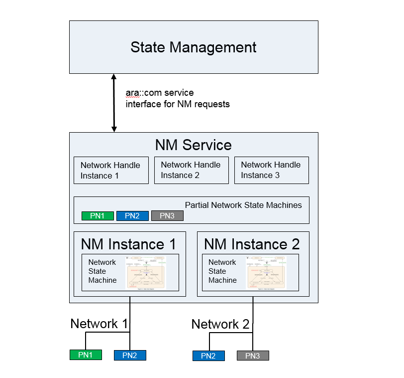
   
   **Overview NM**

Its main purpose is to coordinate the transition between normal operation and bus-sleep mode of the underlying networks (Partial Networks, VLANs or physical channel) in internally coordinated state machines.

It provides a Serviceinterface to the Statemanagement for requesting and releasing networks and querying their actual state. It coordinates the requests of different instances (Network Handles) and provides an aggregated machine request over the network.

If the Partial Networking feature is used the Nm messages can contain Partial Network (PN) requests, giving the ECU the possibility to ignore Nm messages which do not request any PN which is relevant to the ECU. This gives the possibility to shut down the ECU (or parts of it), allthough communication is still going on in other Partial Networks.

**Update and Configuration Management**
##########################################

Overview
-----------

One of the declared goals of the AUTOSAR Adaptive Platform is the ability to flexibly update the software and its configuration through over-the-air updates (OTA). To support changes in the software on an Adaptive Platform, the Update and Configuration Management (UCM) provides an Adaptive Platform service that handles software update requests.

UCM is responsible for updating, installing, removing and keeping a record of the software on an Adaptive Platform. Its role is similar to known package management systems like dpkg or YUM in Linux, with additional functionality to ensure a safe and secure way to update or modify the software on the Adaptive Platform.

UCM Master is providing a standard Adaptive Platform solution to update vehicle software over-the-air or by a diagnostic tester. It is coordinating and distributing packages within a vehicle among several UCMs. UCM Master can, therefore, be considered as an AUTOSAR standard UCM Client.

Update protocol
-----------------

UCM and UCM Master services have been designed to support the software configuration management over vehicle diagnostics and support performing changes in Adaptive Platforms in safe, secure and resource-efficient update processes. To fulfill the requirements to support updates from several clients and to enable fast download, UCM needs to be capable of transferring Software Packages (UCM input) separately from their processing.

Data transfer
^^^^^^^^^^^^^^^

Data transfer is done by streaming data over ara::com. This enables transferring data into UCM or UCM Master without the need to buffer data on the way from the backend or diagnostic tester. UCM can store packages into a local repository where packages can be processed in the order requested by the UCM client or UCM Master.

The transfer phase can be separated from the processing phase, UCM supports receiving data from multiple clients without limitations.

UCM Master is relying on the same transfer API as UCM but accessible through its own dedicated service interface. It allows the same streaming features as UCM like pausing or resuming of parallel transfers.

Packages
------------

Software package
^^^^^^^^^^^^^^^^^^^

The unit of installation which is the input for the UCM is a Software Package.
The package includes, for example, one or several executables of (Adaptive) Applications, operating system or firmware updates, or updated configuration and calibration data that shall be deployed on the Adaptive Platform. This constitutes the Updatable Package part in Software Packages and contains the actual data to be added to or changed in the Adaptive Platform. Beside application and configuration data, each Software Package contains a Software Package Manifest providing metadata like the package name, version, dependencies and possible some vendor-specific information for processing the package.

The format of the Software Package is not specified, which enables using a different kind of solutions for the implementation of UCM. Software Package consists of updates to be performed in software and metadata. This content is packaged by the UCM vendor tooling to generate a Software Package which will be processed by the targeted UCM.

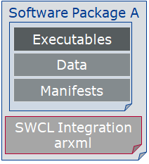
   
   **Overview Software Package**

UCM processes the vendor-specific Software Package based on the provided metadata. You can find below for information purpose a description of the fields that must be contained in a Software Package Manifest:

General information
    - Package name: fully qualified short-name.
    - Version: Version from Software Cluster model that has to follow https://semver.org semantic versioning specification with the 	exception that build number is mandatory for debugging/tracking purposes. Used primitive name is StrongRevisionLabelString.
    - deltaPackageApplicableVersion: Version of the Software Cluster to which this delta package can be applied
    - Minimum and maximum supported UCM version: to make sure that the Software Package can be parsed properly by the UCM.
    - Dependencies: Manifest Specification document contains a model that has to be followed describing dependencies of Software Cluster after it is updated or installed.

Sizes to allow checking if there is enough memory available:
    - uncompressedSoftwareClusterSize: Size of Software Cluster in the targeted platform
    - compressedSoftwareClusterSize: Size of Software Package

For information and tracking purpose
    - Vendor: vendor id
    - Vendor authentication tag
    - Packager: vendor id
    - Packager authentication tag: for package consistency check and security purposes (for UCM to check if the Software Package is trustable)
    - Type approval: optional, homologation information. Could, for instance, be RXSWIN from UN ECE WP.29
    - Release notes: description of this release changes
    - License: for instance, MIT, GPL, BSD, proprietary.

To distribute the package to the correct UCM within the vehicle:
    - Diagnostic address: coming from the Software Cluster model, used in case package is coming from the tester via UDS for instance
    - Action type: can be update, install, or remove

Backend package
^^^^^^^^^^^^^^^^^^^

For an OEM backend to understand packages contents from several package suppliers, a backend package format is proposed as described in below picture:

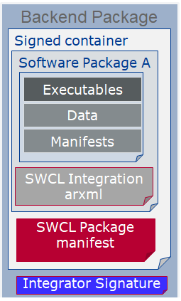
   
   **Overview Backend Package**

The software package format is vendor-specific. However, as the backend package is meant to be vendor-independent, Software Package Manifest (in red Figure 13-2) must use the ARXML file format.

Vehicle Package
^^^^^^^^^^^^^^^^^^^

A vehicle package is typically assembled by an OEM backend. It contains a collection of Software Package Manifests extracted from backend packages stored in the backend database. It also contains a Vehicle Package Manifest including a campaign orchestration and other fields needed for packages distribution by UCM Master within the vehicle

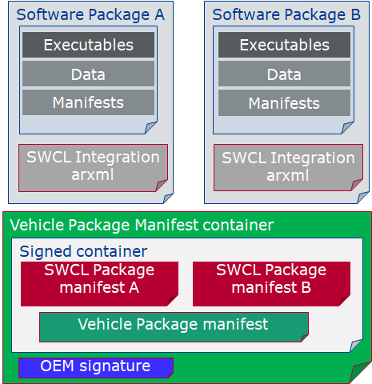
   
   **Overview Vehicle Package**

You can find below for information purpose a description of the fields that must be contained in Vehicle Package Manifest:
    - Repository: uri, repository or diagnostic address, for history, tracking and security purposes
    - Vehicle description
    - For update campaign orchestration:
        o 	UCM identifier: unique identifier within vehicle architecture, to allow UCM Master identifying UCMs in the vehicle
        o 	Associations of Software Packages to describe the sequence of transfer, processing, and activation
        o 	Vehicle driver notification: to interact with vehicle driver, asking for his consent or notifying him at several steps of the vehicle update

Vehicle Package could be used by a garage to fix a car having issues downloading an update for instance. Therefore, like backend Package, Vehicle Package Manifest shall be an ARXML file format for interoperability purposes.

Software release and packaging workflow
^^^^^^^^^^^^^^^^^^^^^^^^^^^^^^^^^^^^^^^^^^^

In order to create a backend package, an integrator has to use a packager compatible with the targeted UCM. This package could be provided by an Adaptive Platform stack vendor including the targeted UCM. After the integrator is assembling executable, Manifests, persistency, etc., he uses the packager to create a Software Package using UCM vendor-specific format. This same Software Package is then embedded into a backend Package along with ARXML Software Package Manifest. The Software Package could be signed by the packager or integrator and authentication tag included in Software Package Manifest. As backend Package might be transferred via the internet between an integrator and an OEM backend, both Software Package and Software Package Manifest should be signed into a container along with its authentication tag in order to avoid any Software Package Manifest modification.

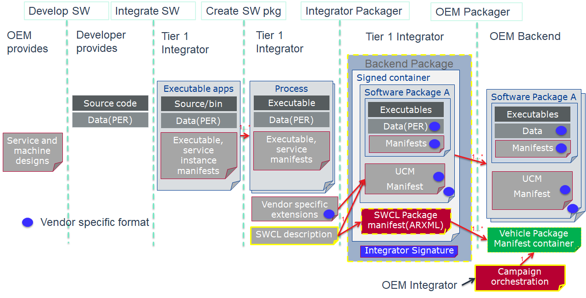
   
   **Packaging steps**

Backend Packages assembled by integrator can then be put in the backend database or repository. When a vehicle needs an update or new installation, the backend server will query software packages from backend package database and merge the related Software Package Manifests into a Vehicle Package. In this package, backend server embeds a campaign orchestration selected based on a specific vehicle electronic architecture, deducted for instance from Vehicle Identifying Number.

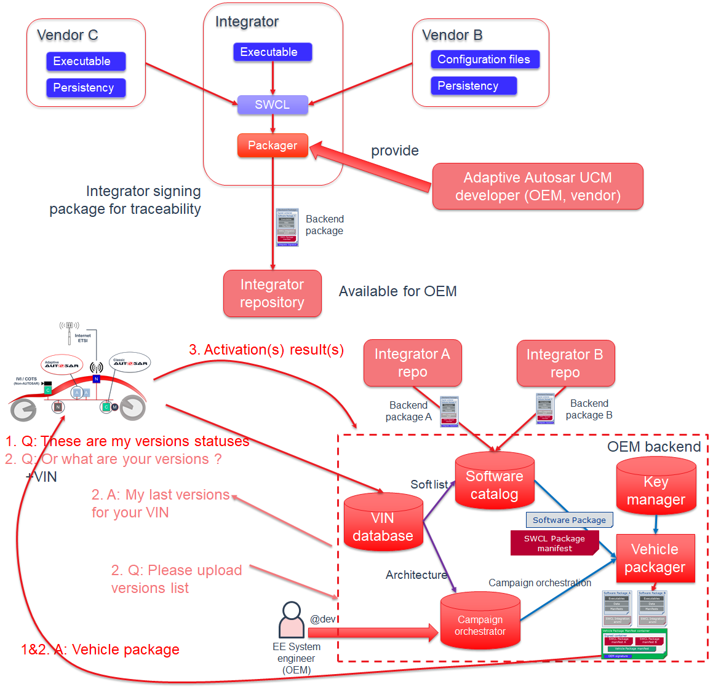
   
   **Packages distribution to vehicle**

UCM processing and activating Software Packages
---------------------------------------------------

Install, update, and uninstall actions are performed through the ProcessSwPackage interface where UCM parses from metadata which actions need to be performed.

UCM sequence has been designed to support for example A/B update scenario or ‘in-place’ scenario where package manager provides the possibility to roll back into the previous version if this is needed.

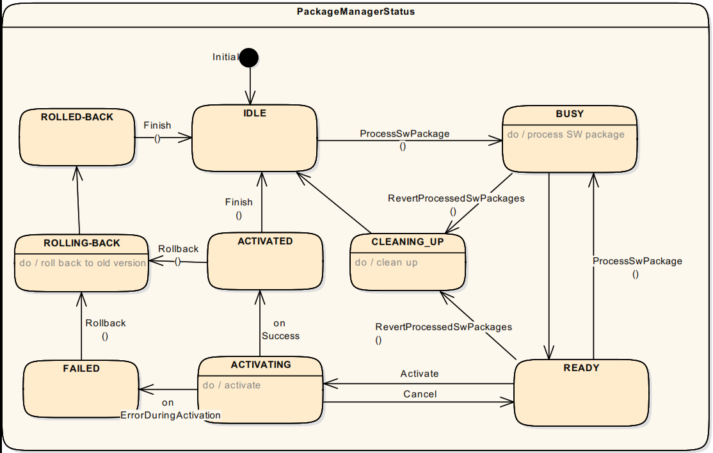
   
   **Overview Processing and Activation of Software Package**

To keep implementation simpler and more robust, only one client at a time can request to process a Software Package with the ProcessSwPackage method, switching UCM state to PROCESSING. Several clients can request to process transferred packages in sequence. In the case of A/B partition update scenario, several clients can process the inactive /B partition being updated; in case of software cluster cross dependencies, each client must update in sequence into “B partition”. Once, processing is finished, UCM state switches to READY for activation or another processing.

Activation of changes with the Activate method is done for all processed packages regardless of the requesting client. UCM Master is coordinating this multi-client scenario. UCM might not know if all targeted Software Packages have been processed, but it shall perform a dependency check to see that system is consistent with the requirements of the installed software in “B partition”. In case of dependencies are not fulfilled, UCM shall reject the activation and switch back to READY state.

When updates are being activated, UCM opens an UpdateSession at SM via ara::com. For each Function Group in each affected Software Cluster the PrepareUpdate method is called. It executes Function Group specific preparation steps. On success, the state changes to VERIFYING. UCM then requests either a machine reset or a Function Group restart depending on the type of update via SM interface. For instance, if the update includes the operating system or functional cluster updates, UCM might want to reset the machine. However, if the update is only about a low criticality function, only restarting Function Groups could be enough, reducing annoyance to the driver. In this phase, UCM requests from SM to verify that targeted Function Groups are running properly. Once these restarts are finished successfully, UCM switches to ACTIVATED state.

When updates have been ACTIVATED, other processing requests will be rejected until activation has been resolved. In this phase, UCM Client or UCM Master can either call Finish for confirming the changes or Rollback for ignoring the changes and going back to the previous version of the software. This is intended for instance in case such update is part of a global update campaign coordinated by UCM Master, during which the update of another ECU has failed. After Finish is called, UCM cleans all unneeded resources and returns to IDLE.

In the case of Rollback is called, UCM is switched to the ROLLING-BACK state to reactivate the old versions of the software clusters by calling PrepareRollback method for each Function Group in each affected Software Cluster. For instance, in this state, in case of an A/B partition scenario, UCM will prepare the "A partition" to be reactivated/executed at the next restart. Then, when the restart takes place by calling the SM interface and the "A partition" is reactivated, UCM switches to the ROLLED-BACK state.

In both cases, Rollback and successful activation, UCM has to finish the update session at SM.
Processing while transferring is supported by UCM design in order to avoid storing Software Packages in Adaptive Platform, reducing costs and update time. For instance, in the case of Software Cluster containing only Adaptive application, UCM could decompress received blocks, place files to its target location, finally authenticate and check integrity of the Software Package.

UCM Master update campaign coordination
--------------------------------------------

As UCM Master is coordinating several elements within the vehicle, its state machine is accessible from the CampaignState field, allowing to reduce UCM Master’s API complexity. UCM Master is continuously discovering the UCM service instances in the vehicle using service discovery from ara::com.

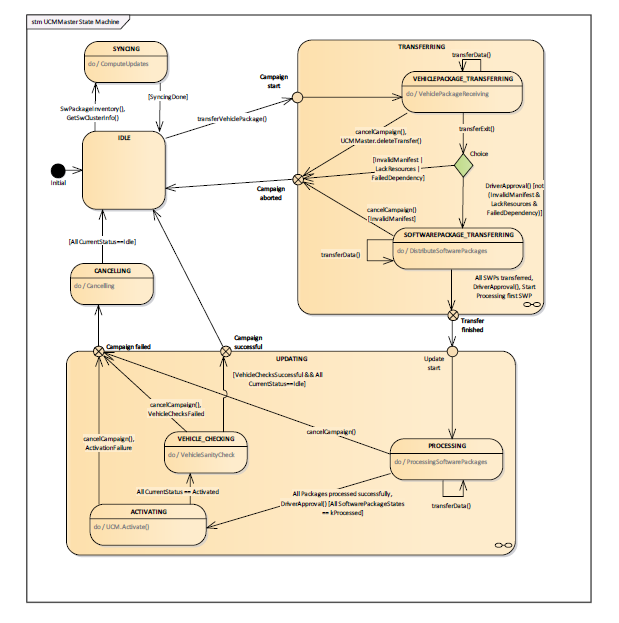
   
   **UCM Master state machine**

The UCM Master state machine is not completely matching the UCM state machine as specific vehicle aspects have to be considered. For instance, the vehicle package transfer, synchronization of available software in vehicle and backend or vehicle integrity check after update, are specific to UCM Master.

Adaptive applications interacting with UCM Master
^^^^^^^^^^^^^^^^^^^^^^^^^^^^^^^^^^^^^^^^^^^^^^^^^^^^^^^

A vehicle update involves OEM specificities, so OEM specific aspects are pushed by design into the Adaptive Application side. In order to have interoperability and exchangeability for those applications with several vendors platforms, the UCM Master interface is standardized as a Platform Service, like UCM. UCM Master assumes three applications to interact with itself, as described below.

OTA Client
^^^^^^^^^^^^^

OTA Client sets the communication channel between backend and UCM Master. The communication protocol between backend and OTA Client is not specified. OTA Client could include a scheduler regularly triggering synchronization of databases (managed by backend or UCM Master) containing available software from backend and present software in the vehicle. Updatable, installable or removable software are computed by the difference between these two in backend or UCM Master.

If a UCM Master is failing, it could be replaced by another one present in the vehicle. OTA Client should then include the decision mechanism to choose with which UCM Master to interact.

Vehicle driver
^^^^^^^^^^^^^^^^^^

During an update, it could be necessary to interact with the vehicle human driver to:
    - get consent to download (impacting data transfer costs), process or activate the software (safety measures acknowledgment)
    - put the vehicle in a specific state (to guarantee safety during a critical update, it could be asked to stop vehicle and shutdown engine)

Vehicle state manager
^^^^^^^^^^^^^^^^^^^^^^^^^

Vehicle State Manager is collecting state from all vehicle ECUs and provides UCM Master a field to subscribe, and a judgment against the safety policy referred to in the Vehicle Package. If the safety policy is not met, the UCM Master can decide to postpone, pause or cancel an update.

Software information reporting
----------------------------------

UCM provides service interfaces that expose functionality to retrieve Adaptive Platform software information, such as names and versions of transferred packages, for processed but not committed software and for the last committed software. As the UCM update process has clear states, UCM provides information in which state is the processing of each Software Package.

UCM Master also provides service interfaces to expose Software information but at the vehicle level, aggregating information from several UCMs. This information is then exchanged with backend through OTA Client, for instance, to resolve what Software could be updated in the vehicle. Furthermore UCM Master provides a way to access the history of its actions like activation time and the result of processed packages. This history can be used by the backend to gather update campaign statistics from a fleet of cars or to troubleshoot issues at garage with a Diagnostic Tester.

Software update consistency and authentication
---------------------------------------------------

UCM and UCM Master shall authenticate their respective packages using an authentication tag covering the whole package as described in Figure 13-1 and Figure 13-3. The Adaptive platform shall provide necessary checksum algorithms, cryptographic signatures or other vendor and/or OEM specific mechanisms to validate the package, otherwise, an error will be returned by UCM or UCM Master. Practically, a package should be packaged by the tool coming from the same vendor as the one developing the targeted UCM or UCM Master in order to have authentication algorithm compatibility.

As authentication algorithms are using hashes, consistency is also checked when authenticating a package. Packages authentication and consistency could be checked at TransferData, TransferExit and ProcessSwPackages calls to cover many possible use cases and scenarios but shall be performed before any package is processed by UCM or UCM Master for maximum security.

Securing the update process
-----------------------------------

UCM and UCM Master provide services over ara::com. There is no authentication step of a client in both UCM and UCM Master update protocol. Instead, it is up to Identity and Access Management to ensure that the client requesting services over ara::com is legit.

Appropriate State Management during an update process
-----------------------------------------------------------

The definition of an updatable state with respect to the system setup is the OEM responsibility. Based on the system setup and the application, the system might need to be switched into an ’update state’, so that they are ignoring missing or faulty messages during the update process.

Additionally, there must be also a minimal check of the system after the update. For this, the OEM specific Diagnostic Application will put the machine into a ’verification state’ and check if all the relevant processes have reached the runningState. This gives a chance to perform a Rollback if some processes fail to reach the runningState. Fig. 13-9 provides an overview of this concept.

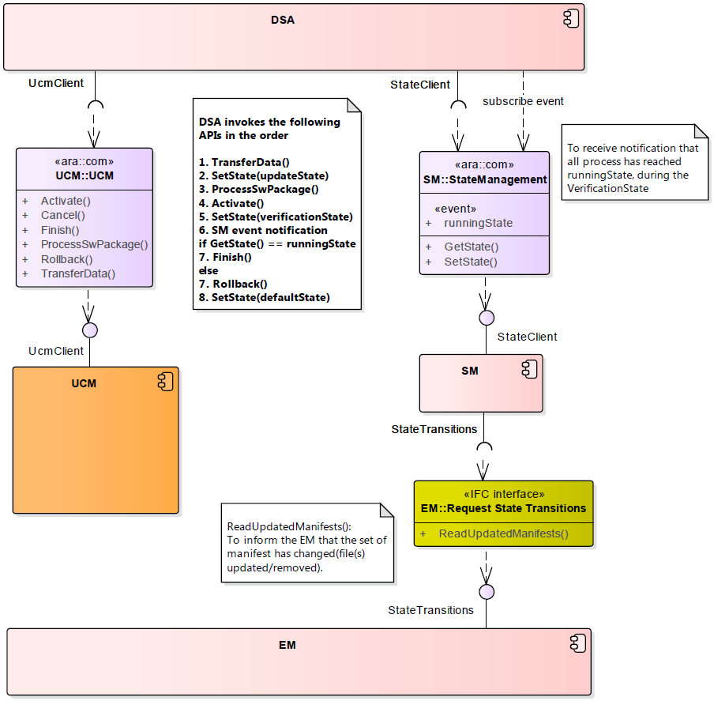
   
   **State Management during an update process**

**Cryptography**
#####################################

AUTOSAR Adaptive Platform supports an API for common cryptographic operations and secure key management. The API supports the dynamic generation of keys and crypto jobs at runtime, as well as operating on data streams. To reduce storage requirements, keys may be stored internally in the crypto backend or externally and imported on demand.

The API is designed to support encapsulation of security-sensitive operations and decisions in a separate component, such as a Hardware Security Module (HSM). Additional protection of keys and key usage can be provided by constraining keys to particular usages (e.g., decrypt-only), or limiting the availability of keys to individual applications as reported by IAM.

Depending on application support, the API can also be used to protect session keys and intermediate secrets when processing cryptographic protocols such as TLS and SecOC.

The FC Crypto offers applications and other Adaptive AUTOSAR Functional Clusters
a standardized interface, which provides operations for cryptographic and related calculations. These operations include cryptographic operations, key management and certificate handling. FC Crypto handles the actual implementation of all operations, including all necessary configuration and brokering of operations between requesting application and stack-provided implementation. The standardized interface is exposed by the CryptoAPI.

X.509 Certificate Management Provider (CMP, namespace ara::crypto::x509) is responsible for X.509 certificates parsing, verification, authentic storage and local
searching by different attributes. In addition, CMP is responsible for storage, management, and processing of Certificate Revocation Lists (CRLs) and Delta CRLs. CMP supports of requests preparation and responses parsing for On-line Certificate Status Protocol (OCSP).

Security Architecture
-----------------------

While AUTOSAR AP only defines the high-level Crypto Stack API exposed to applications, this API is defined with a security architecture in mind that was designed to meet above security and functional requirements.

The general architecture is depicted in Figure 15-1. On the highest layer, AUTOSAR AP, as well as native and hybrid applications, link against the AUTOSAR AP Crypto Stack API. The API implementation may refer to a central unit (Crypto Service Manager) to implement platform-level tasks such as access control and certificate storage consistently across applications. The implementation may also use the Crypto Service Manager to coordinate the offloading of functionality to a Crypto Driver, such as a Hardware Security Module (HSM). Indeed, the offloading functionality of the Crypto Stack API this way is expected to be a typical implementation strategy: The Crypto Driver may implement the complete set of key management and crypto functions in order to accelerate crypto operations and shield managed keys from malicious applications.

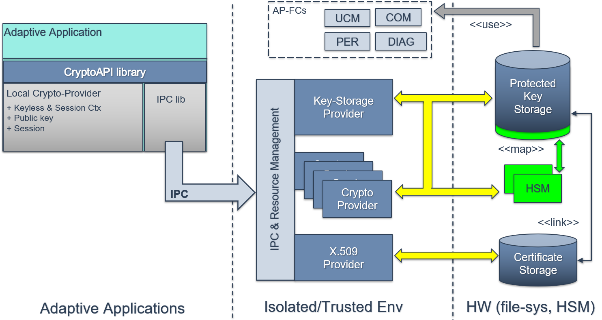
   
   **Crypto Stack – Reference Architecture**

In order to realize this layered security architecture, the Crypto Stack API does not only perform typical crypto operations like encryption and decryption but also provides native support for:

    1. Operating with encrypted keys or key handles
    2. Managing keys securely despite possible application compromise
    3. Constraining application access to and allowed operations on keys

Key Management Architecture
------------------------------

To support the secure remote management of keys despite potential application compromise, the Crypto Stack integrates a key management architecture where keys and associated data are managed in end-to-end protected form. Keys can be introduced into the system either in a trusted fashion, based on an existing provisioning key, or in an untrusted fashion via local key generation. Assuming an appropriately secured crypto backend/driver, applications are unable to modify keys except via well-defined, authorized requests such as key update or revocation.

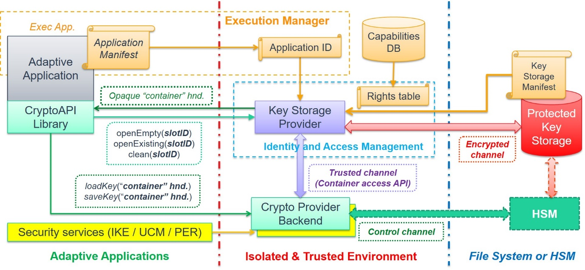
   
   **CKI Key Management Interactions**

Remarks on API Extension
----------------------------
Significant new usages and interactions that require the introduction of new or modified permission/policy validation logic should be tied to corresponding new key usage policy flags. For example, alternative provisioning keys with different ownership/permission checks can be introduced by adding a corresponding new key usage policy and enforcing the new logic in all key management operations involving those new keys.

**Core Types**
#####################################

Core Types defines common classes and functionality used by multiple Functional Clusters as part of their public interfaces. One of the rationale to define Core Types was to include common complex data types that are often used in the interface definition.

Error Handling
-----------------

Overview
^^^^^^^^^^^

Handling errors is a crucial topic for any software development. For safety-critical software, it is even more important, because lives can depend on it. However, current standards for the development of safety-critical software impose significant restrictions on the build toolchain, especially with regard to C++ exceptions. For ASIL applications, using C++ exceptions is usually not possible due to the lack of exceptions support with ASIL-certified C++ compilers.

The Adaptive Platform introduces a concept that enables error handling without C++ exceptions and defines a number of C++ data types to aid in this.

From an application programmer’s point of view, the central types implementing this concept are ara::core::ErrorCode and ara::core::Result.

ErrorCode
^^^^^^^^^^^

An instance of ara::core::ErrorCode represents a specific error condition within a software. It is similar to std::error_code, but differs in significant aspects from it.

An ErrorCode always contains an enumeration value (type-erased into an integral type) and a reference to an error domain. The enumeration value describes the specific type of error, and the error domain reference defines the context where that error is applicable. Additional optional members are a user-defined message string and a vendor-defined supplementary error description value.

Within the Adaptive Platform, each Functional Cluster defines one or more error domains. For instance, the Functional Cluster “Core Types” defines two error domains “Core” and “Future”, which contain error codes for different sets of error conditions.

Result
^^^^^^^^^^^

Class ara::core::Result is a wrapper type that either contains a value or an error. Due to its templated nature, both value and error can be of any type. However, the error type is defaulted to ara::core::ErrorCode, and it is expected that this assignment is kept throughout the Adaptive Platform.

Because the error type has a default, most declarations of ara::core::Result only need to give the type of the value, e.g. ara::core::Result<int> for a Result type that contains either an int or an ara::core::ErrorCode.

The contained value or error can be accessed via the member functions Result::Value or Result::Error. It is the caller’s responsibility to ensure that these access functions are called only if the Result instance contains a value or an error, respectively. The type of the content of a Result, i.e. a value or an error, can be queried by Result::HasValue. None of these member functions throw any exceptions and thus can be used in environments that do not support C++ exceptions.

In addition to the exception-less workflow described above, the class ara::core::Result allows to convert a contained ara::core::ErrorCode object into a C++ exception, by calling ara::core::Result::ValueOrThrow. This call returns any contained value as-is, but treats a contained error by throwing the corresponding exception type, which is automatically derived from the contents of the contained ara::core::ErrorCode.

Future and Promise
^^^^^^^^^^^^^^^^^^^^^^

Similar to the way ara::core::Result is used as a generalized return type for synchronous function calls, ara::core::Future is used as a generalized return type for asynchronous function calls.

ara::core::Future is closely modeled on std::future, but has been extended to interoperate with ara::core::Result.

Similar to ara::core::Result, ara::core::Future is a class that either contains a value or an error. This content can be extracted in two ways:
    1. by calling ara::core::Future::get, which returns the contained value, if it exists, or throws an exception otherwise
    2. by calling ara::core::Future::GetResult, which returns a ara::core::Result object which contains the value or the error from the Future

Both of these calls will block until the value or error has been made available by the asynchronous function call.

Advanced data types
----------------------

In addition to the error-handling data types mentioned in the previous section, the Adaptive Platform also contains a number of other data types and helper functions.

Some of these types are already contained in the C++11 standard; however, types with almost identical behavior are re-defined within the ara::core namespace. The reason for this is that the memory allocation behavior of the std:: types is often unsuitable for automotive purposes. Thus, the ara::core ones define their own memory allocation behavior.
Examples of such data types are Vector, Map, and String.

Other types defined in ara::core have been defined in or proposed for a newer C++ standard, and the Adaptive Platform includes them into the ara::core namespace, because they are necessary for supporting certain constructs of the Manifest, or because they are deemed very useful to use in an API.
Examples of such data types are StringView, Span, Optional, and Variant.

Primitive data types
----------------------

Another document, AUTOSAR_SWS_AdaptivePlatformTypes, exists, which defines primitive types that can be used in ServiceInterface descriptions. This document may be considered to be merged with Core Types document in the future.

Global initialization and shutdown functions
--------------------------------------------------
The following functions are available to initialize and de-initialize respective data structures and threads of the AUTOSAR Runtime for Adaptive Application:
    - ara::core::Initialize
    - ara::core::Deinitialize

ara::core::Initialize initializes data structures and threads of the AUTOSAR Adaptive Runtime for Applications. Prior to this call, no interaction with the ARA is possible. This call must be made inside of main(), i.e., in a place where it is guaranteed that static memory initialization has completed. Depending on the individual functional cluster specification, the calling application may have to provide additional configuration data (e.g., set an Application ID for Logging) or make additional initialization calls (e.g., start a FindService in ara::com) before other API calls to the respective functional cluster can be made. Such calls must be made after the call to Initialize(). Calls to ARA APIs made before static initialization has completed lead to undefined behavior. Calls made after static initialization has completed but before Initialize() was called will be rejected by the functional cluster implementation with an error or, if no error to be reported is defined, lead to undefined behavior.

ara::core::Deinitialize destroys all data structures and threads of the AUTOSAR Adaptive Runtime for Applications. After this call, no interaction with the ARA is possible. This call must be made inside of main(), i.e., in a place where it is guaranteed that the static initialization has completed and destruction of statically initialized data has not yet started. Calls made to ARA APIs after a call to ara::core::Deinitialize() but before destruction of statically initialized data will be rejected with an error or, if no error is defined, lead to undefined behavior. Calls made to ARA APIs after the destruction of statically initialized data will lead to undefined behavior.

**Log And Trace**
#####################################

Overview
-----------

The Log and Trace Functional Cluster is responsible for managing and instrumenting the logging features of the AUTOSAR Adaptive Platform. The logging and tracing features can be used by the platform during development as well as in and after production. These two use cases differ, and the Log and Trace component allows flexible instrumentation and configuration of logging in order to cover the full spectrum. The logging information can be forwarded to multiple sinks, depending on the configuration, such as the communication bus, a file on the system and a serial console. The provided logging information is marked with severity levels and the Log and Trace component can be instrumented to log the information only above a certain severity level, this enables complex filtering and straightforward fault detection of issues on the logging client side. For each severity level, a separate method is provided to be used by Adaptive applications or by Functional Clusters. The AUTOSAR Adaptive Platform and the logging Functional Cluster are responsible for maintaining the platform stability to not overload the system resources.

Log and Trace relies on the LT protocol standardized within the AUTOSAR consortium. The protocol ensures that the logging information is packed into a standardized delivery and presentation format. Furthermore, the LT protocol can add additional information to the logging messages, such as an ECU ID. This information can be used by a logging client to relate, sort or filter the received logging frames.

In addition, utility methods are provided, e.g. to convert decimal values into the hexadecimal numeral system or into the binary numeral system. These are necessary to enable applications to provide data to Log and Trace which conforms to the standardized serialization format of the LT protocol.

Architecture
---------------

The Log and Trace interfaces are provided in the namespace ara::log for applications to forward logging onto one of the aforementioned logging sinks.

The Log and Trace interfaces rely on the back-end implementation that is a part of the Logging framework. The Logging framework can use other Functional Clusters to fulfill certain features, such as Time Synchronization or Communication Management.

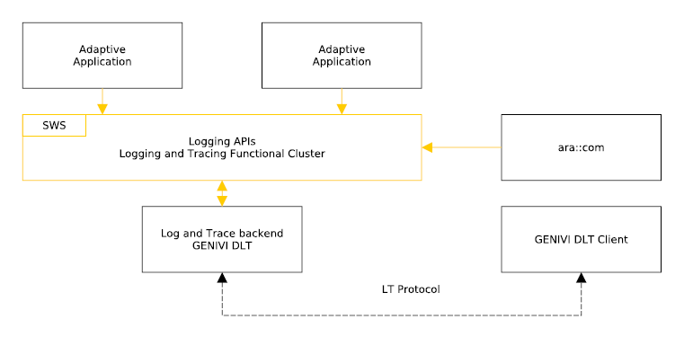
   
   **Overview Log and Trace**
