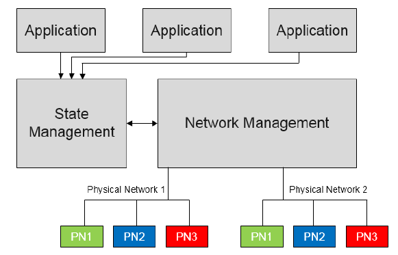
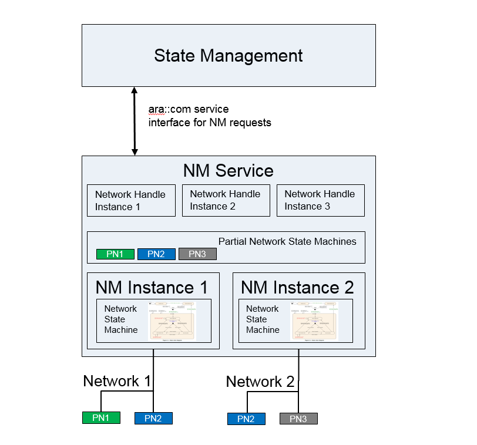
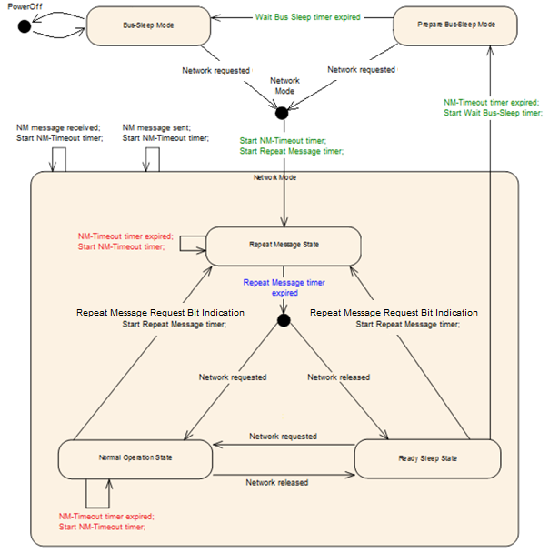
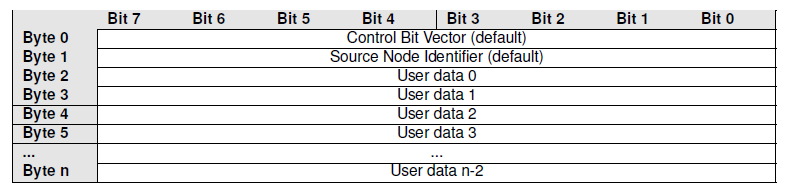
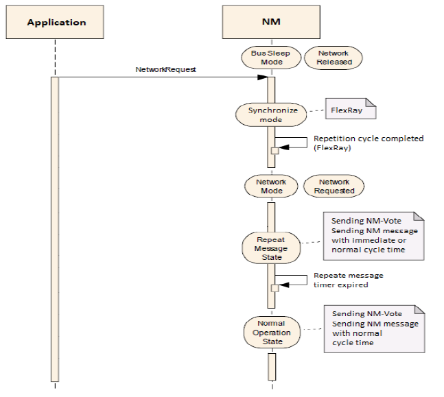
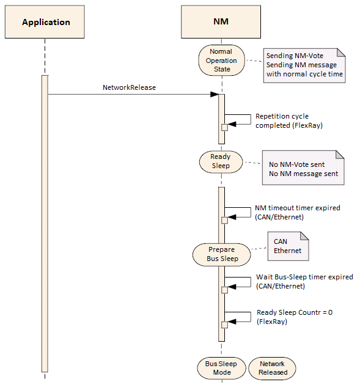
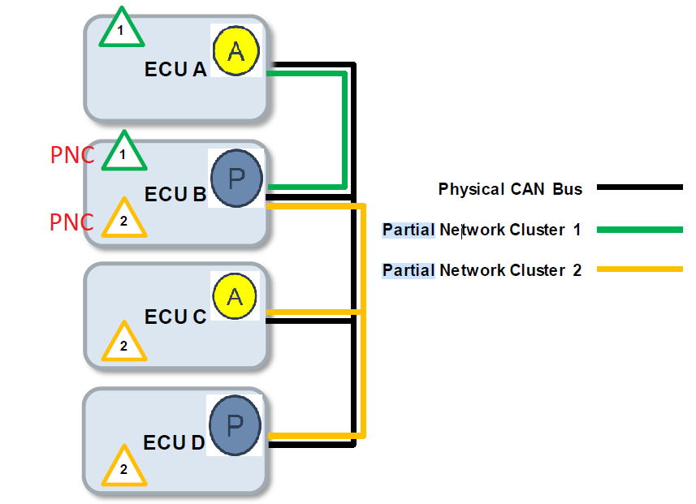
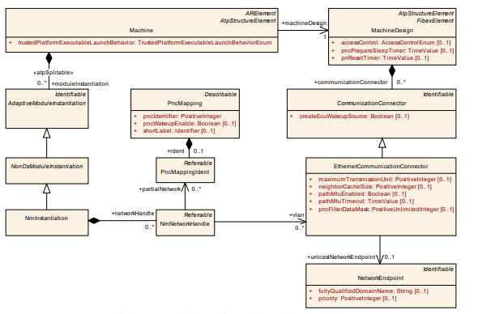
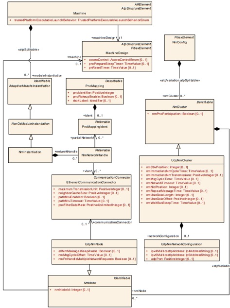

**Network Management(NM)**
==========================

**Overview of Network Management**
###################################

Adaptive Network Management (NM) is intended to work independent of the communication stack used. 
The  main purpose is to coordinate the transition between normal operation and bus-sleep mode of the underlying networks (physical and partial networks).
AUTOSAR CAN Network Management provides implement a service to detect all present nodes or to detect if all other nodes are ready to sleep.

    
   **Architecture overview with example applications**

The Adaptive Network Management offers services that allows to request and query the network states for logical network handles that can be mapped to physical or partial networks.
To do so, the following functionalities are provided :

    - Field for requesting and releasing logical network handles
    - Support for partial networking

   **Partial Networking**

**Network Management Algorithm**
################################

The AUTOSAR Adaptive NM is based on decentralized direct network management strategy,  which means that every network node performs activities self-sufficient depending only on the NM packets received and/or transmitted within the communication system.

The AUTOSAR Adaptive NM algorithm is based on periodic NM packets, NM packets are received by all nodes in the cluster via multicast. Reception of NM packets indicates that sending nodes want to keep the NM-cluster awake. 

If any node is ready to go to sleep mode, it stops sending NM packets, but as long as NM packets from other nodes are received, it postpones transition to sleep mode. 
Finally, if a dedicated timer elapses because no NM packets are received anymore, every node initiates transition to the sleep mode.

If any node in the NM-cluster requires bus-communication, it can keep the NM-cluster awake by transmitting NM packets.
Every network node transmits periodic NM messages as long as it requires bus communication; otherwise, it does not transmit NM messages.

Logical network handles are a mapped to one or more partial or physical networks, while a partial network itself can be mapped to one or multiple physical networks. 

By using the logical network handle all assigned partial networks, VLANs and underlying physical channel(s) are controlled together.

Network Management no longer receives logical network requests from applications directly, instead they are controlled by the State Management. 

State Management can split the one or more applications in multiple functions that might require network communication.

Applications (or part of) would then request different functions to be activated/deactivated from State Management and then State Management would in turn, depending on configuration, request/release different logical networks. 

NM checks then the requested state over all logical networks handles and will activate or deactivate the according physical networks.

**Operational Modes**
######################

The AUTOSAR Adaptive NM shall contain three operational modes:

    * NetworkMode 
    * PrepareBus-SleepMode 
    * Bus-SleepMode

When the NM is in Network mode it implies that the network is requested or active And the logical network information bit will be set to 1.

When the NM is in Prepare Bus-Sleep or Bus-Sleep Mode, It implies that the network is released or inactive. And the logical network information bit will be set to 0.

   **State Chart Diagram**

**NetworkMode**

The Network Mode shall consist of three internal states: 

    * RepeatMessageState 
    * NormalOperationState 
    * ReadySleepState

**RepeatMessageState**

The Repeat Message State ensures, that any transition from Bus-Sleep or Prepare Bus-Sleep to the Network Mode becomes visible for the other nodes on the network. Additionally, it ensures that any node stays active for a minimum amount of time transmission of NM messages shall be started from here. When timer expires, timers will get restarted.

**Normal Operation State**

The Normal Operation State ensures that any node can keep the NM-cluster awake as long as the network functionality is required. When the Normal Operation State is entered from Ready Sleep State, transmission of NM messages shall be started immediately.

**Ready Sleep State**

The Ready Sleep State ensures that any node in the NM-cluster waits with the transition to the Prepare Bus-Sleep Mode as long as any other node keeps the NM-cluster awake. When the Ready Sleep State is entered from Repeat Message State or Normal Operation State, transmission of NM messages shall be stopped.

**PrepareBus-SleepMode**

The purpose of the Prepare Bus Sleep state is to ensure that all nodes have time to stop their network activity before the Bus Sleep state is entered.  Bus activity is calmed down (i.e. queued messages are transmitted in order to empty all TX-buffers) and Finally, there is no activity on the bus in the Prepare Bus-Sleep Mode.

**Bus-Sleep Mode**

The purpose of the Bus-Sleep state is to reduce power consumption in the node, when no messages are to be exchanged. 
Transmission and reception capabilities can be switched off if supported by hardware.
If a configurable amount of time determined by nmNetworkTimeout + nmWaitBusSleepTime is identically configured for all nodes in the network management cluster,
all nodes in the network management cluster that are coordinated with use of the AUTOSAR NM algorithm perform the transition into the Bus-Sleep Mode at approximately the same time.

**Message format**
###################

   **Message format**

The Control Bit Vector shall consist of: 

*Bit0: Repeat Message Request*  
    - 0: Repeat Message State not requested  
    - 1: Repeat Message State requested  

*Bit1: PN Shutdown Request Bit (PNSR)*  
    - 0: NM message does not contain synchronized Partial Network shutdown request  
    - 1: NM message does contain synchronized Partial Network shutdown request for at least one PNC  

*Bit3: NM Coordinator Sleep Ready Bit*  
    - 0: Start of synchronized shutdown is not requested by main coordinator  
    - 1: Start of synchronized shutdown is requested by main coordinator  

*Bit4: Active Wakeup Bit*  
    - 0: Node has not woken up the network (passive wakeup)  
    - 1: Node has woken up the network (active wakeup)  

*Bit5: Partial Network Learning Bit (PNL)*  
    - 0: PNC learning is not requested  
    - 1: PNC learning is requested  

*Bit6: Partial Network Information Bit (PNI)*  
    - 0: NM message contains no Partial Network request information  
    - 1: NM message contains Partial Network request information  

*Bits 2,7 are reserved for future extensions*
    - 0: Disabled/Reserved for future usage

**Communication request**
##############################

   **Communication Request**

**Communication release**
##############################

   **Communication Release**

**Partial Networking**
##############################

The adaptive AUTOSAR supports power saving during vehicle operation time with the partial networking mechanism.

Partial networking allows either individual ECUs or groups of ECUs to be woken up simultaneously, with the remainder of the network kept in low-power mode.

Partial Network Cluster (PNC)
A PNC is a (logical) group of ECUs which have to be active at the same time to realize some distributed functionality.

With Partial networking, a set of ECUs of a domain or some ECUs in different domains (different networks) can be grouped to wakeup and shutdown together depending on vehicle features.

   **Partial Network Cluster**

Internal PNC requests indicate communication needs locally on the ECU and are also called Active PNC request.
External PNC requests indicate communication needs of a remote ECU in the network and are also called Passive PNC request.

In case 4 ECUs are awake, this is what happens if the function requiring PNC2 on ECU C is terminated: ECU C stops requesting PNC2 to be active. ECUs C and D are no longer participating in any PNC and can be shutdown.

ECU B ceases transmission and reception of all signals associated with PNC2.
ECU B still participates in PNC1. That means it remains awake and continues to transmit and receive all signals associated with PNC1. ECU A is not affected at all.

Partial network support is optional, can enable or disable.
If synchronized PNC shutdown handling is enabled , PN support can also enable or disable.
The synchronized PNC shutdown is handled by ECUs with the role of top-level and intermediate PNC coordinators, where the PNC gateway is enabled. It starts when top-level PNC coordinator detects that a PNC is released, then requesting a PNC shutdown to NM.
Nodes participating in the communication of partial networking shall be pre-configured with the offset and range (in bytes) of the Partial Network Information within the NM message

**Handling of Rx NM messages**
######################################

PN support is disabled - NM shall ignore any partial networking information contained in the received message. The PN support is enabled & PNI is 0 - NM shall ignore the partial networking information bytes of the message. If the PN support is enabled , PNI bit 1, PNSR bit 0 – process the NM PN info.

If synchronized PNC shutdown is enabled , NM message is received in the role of a top-level PNC coordinator and PNI bit and PNSR bit are set to 1 - NM shall discard the NM message.
In case of PN synchronized shutdown error reaction is enabled, NM message is discarded, then top-level coordinator immediately transmit the NM message with all internally and externally requested PNCs as PN info.
If synchronized PNC shutdown is enabled, a NM message is received in the role of an intermediate PNC coordinator and PNI bit and PNSR bit are set to 1, then NM shall release the indicated PNCs and reset timer.

**Handling of Tx NM messages**
######################################

PN support is enabled in a node – PNI is set to 1 in Tx message.
PN support is disabled in a node – PNI is set to 0 in Tx message.
For PNCs that are "internally requested" the corresponding bit in the PN request information shall be set to 1 before sending the NM message.
For PNCs that are "‘internally requested"’ or "‘externally requested"’ the corresponding bit in the PN request information shall be set to 1 before sending the NM message in the role of a top-level PNC coordinator or an intermediate PNC coordinator.
If synchronized PNC shutdown is enabled and NM detect A transition of PNCs from "‘requested"’ to "‘released"’ (independent if externally or internally requested), the corresponding bit of those released PNCs shall be set to 1, the remaining shall be set 0 and the PNSR bit in CBV shall be set to 1 before sending the PN shutdown message.

**Configuration Methodology**
######################################

Machine specific configuration settings for NM module:

   **Network Management**

NMInstantiation is a meta-class defines the attributes for the NM configurations on a specific machine. NetworkHandle is used to control the partial network clusters.

The UdpNmCluster with all included UdpNmNodes is described in the System design model. With the reference NmNode.machine the relation between the System design model and the NmInstantiation on a Machine is established. Typically, the System design model is provided by an OEM that defines the network configuration and provides all configuration settings that are relevant for a network management cluster to an integrator. 

The NM configuration options that will typically be set by an Integrator are collected in the NmInstantiation element. The Machine Manifest delivery to configure UdpNm consists of both, the NmInstantiation settings together with the UdpNmCluster and UdpNmNode settings. The NmConfig element is a wrapper that contains all network management specific configuration settings in the System model. 

AUTOSAR Adaptive Network Management is based on periodic NM messages, which are received by all UdpNmNodes in the UdpNmCluster via multicast. Reception of NM packets indicates that sending UdpNmNodes want to keep the UdpNmCluster awake. If any node is ready to go to sleep mode, it stops sending NM messages, but as long as NM packets from other UdpNmNodes are received, it postpones transition to sleep mode.

   **NW Cluster Config**

The UDP multicast connection over which Network Management messages are transported is configured with the UdpNmNetworkConfiguration that is aggregated by the UdpNmCluster in the role networkConfiguration. The attribute udpPort is used to configure the port number over which the Nm message is transmitted and received. The IP Address is configured either by ipv4MulticastIpAddress or ipv6MulticastIpAddress.

