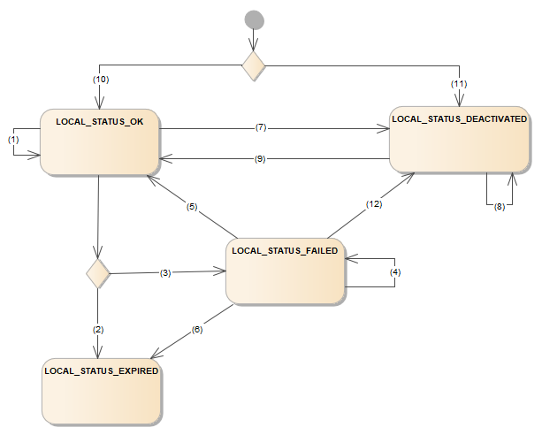

**Platform Health Management(PHM)**
===================================

**Overview of PHM**
####################

Platform Health Management is a Functional Cluster in Adaptive AUTOSAR architecture that provides mechanism to detect health status of applications and trigger appropriate actions.

This is achieved by supervising the applications, called internal health channel monitoring, or by directly using the status provided by them termed as external health channel monitoring.

Internal health channel monitors the applications in terms of their rate of execution, order of execution and time constraint on execution. Based on the result of the supervision, internal health status is determined.
The internal health status or external health status are then used to notify SM and trigger the configured recovery action.

**Dependent FCs/Components**
################################

PHM is Dependent on the following FCs/Components.

**State Management -**
The Platform Health Management functional cluster has an interface also with the State Management: If a failure is detected within a Supervised Entity or via Health Channel, Platform Health Management notifies State Management on this failure.

**Execution Manager -**
The Platform Health Management functional cluster is dependent on the Execution Management Interface as it needs Process information from Execution Management Interface. The exact form of the information is vendor specific and therefore not standardized by AUTOSAR. However it is expected to include process states and function group states.

**Watchdog -**
The Platform Health Management functional cluster is dependent on the Execution Management Interface. There could be some scenarios where there is no action is taken by SM for the failure of supervision, will result in the hardware reset.

It is possible for all functional clusters to use the Supervision mechanisms provided by the Platform Health Management by using Checkpoints and the Health Channels as the other Applications.

**Health Monitoring**
######################################

Supervision of the software behaviour for correct timing and sequence is termed to be health monitoring	.

A Supervised Entity denotes a collection of Checkpoints within the corresponding software component type. A software component type can include zero, one or more Supervised Entities. It monitors various supervisions such as AliveSupervision,DeadlineSupervision and LogicalSupervision.

**Alive Supervision**

Alive Supervision offers a mechanism to periodically check the execution reliability of one or more Supervised Entities.

.. figure:: resources/alive_supervision.png
   :class: with-border
   :alt: Features of PHM
   :align: center

   **Alive Supervision**

**Example for Alive Supervision:** A 2ms task is being monitored at every 10ms. So, after 10ms the counter monitoring the 2ms task should be updated to 5(-/+). Whether the monitoring counter is being updated to 5(-/+) is monitored under Alive Supervision.

**Deadline Supervision**

Deadline Supervision checks the timing constraints of non-cyclic Supervised Entity. It is a kind of supervision that checks if the execution time between two Checkpoints is within minimum/maximum time limit.

   **Deadline Supervision**

**Example for Deadline Supervision:** A Supervised Entity is meant to execute within 10ms. Two checkpoints will be placed in this Supervised Entity and time stamps will be taken between the start and the end checkpoint. The time difference between the checkpoints will give the time taken for execution of the Supervised Entity. Time interval between two checkpoints are monitored under Deadline Supervision.

**Logical Supervision**

Logical Supervision checks for the correct execution flow of code within a Supervised Entity and also ascertains that different Supervised Entities are executed in order.

.. figure:: resources/logical.png
   :class: with-border
   :alt: Features of PHM
   :align: center

   **Logical Supervision**

**Example for Logical Supervision:** In the Supervised Entity, there are two conditional paths for execution A and B, wherein one path is correct. Checkpoints are placed in the Supervised Entity. The flow of execution is monitored by monitoring these checkpoints.

   **Local Supervision Status**

Local Supervision Status determines the status of specific Supervised Entities. This is done based on the following:

- Previous value of the Local Supervision Status,
- Current values of result of AliveSupervision, result of DeadlineSupervision, result of LogicalSupervision.

**FailedSupervisionCyclesTolerance:** maximum acceptable amount of Supervision Cycles in the local state LOCAL_STATUS_FAILED before it is considered LOCAL_STATUS_EXPIRED.

For the transitions between the states of the Local Supervision Status the following rules apply:

+--------------+--------------------------+----------------------------------------------+--------------------------+--------------+
| **Rule No.** | **Present State**        | **Transition Condition**                     | **Next Status**          | **Transition | 
|              |                          |                                              |                          | NO**         |
+--------------+--------------------------+----------------------------------------------+--------------------------+--------------+
| 1.           | Initial Supervision Mode | HM Successfully Initialized.                 | LOCAL_STATUS_OK          | 10           |
+--------------+--------------------------+----------------------------------------------+--------------------------+--------------+
| 2.           | Initial Supervision Mode | HM Successfully Initialized but SE not       | LOCAL_STATUS_DEACTIVATED | 11           |
|              |                          | activated in initial mode.                   |                          |              |
+--------------+--------------------------+----------------------------------------------+--------------------------+--------------+
|  3.          | Initial Supervision Mode | HM Successfully Initialized and Initial      | LOCAL_STATUS_DEACTIVATED | 11           |
|              |                          | mode of SE not configured to LOCAL_STATUS_OK.|                          |              |
+--------------+--------------------------+----------------------------------------------+--------------------------+--------------+
| 4.           | LOCAL_STATUS_DEACTIVATED | No Supervision function performed by HM      | LOCAL_STATUS_DEACTIVATED | 8            |
|              |                          | and ReportCheckPoint() for SE                |                          |              |
+--------------+--------------------------+----------------------------------------------+--------------------------+--------------+

+----------------+--------------------------+----------------------------+--------------------+--------------------+-------------+
| **Rule No.**   | **Present State**        | **Transition Condition**   | **Next Status**    | **failed           | **Transition|
|                |                          |                            |                    | Supervision        | NO**        |
|                |                          |                            |                    | reference          |             |
|                |                          |                            |                    | cycle counter**    |             |
+----------------+--------------------------+----------------------------+--------------------+--------------------+-------------+
|   5.           | LOCAL_STATUS_OK          | All are correct            | LOCAL_STATUS_OK    |   -                |     1       |
+----------------+--------------------------+----------------------------+--------------------+--------------------+-------------+
|   6.           | LOCAL_STATUS_OK          | Any one is incorrect       |LOCAL_STATUS_EXPIRED|    -               |     2       |
+----------------+--------------------------+----------------------------+--------------------+--------------------+-------------+
|   7.           | LOCAL_STATUS_OK          | If Alive is incorrect and  |LOCAL_STATUS_FAILED | Increments         |    3        | 
|                |                          | rest are correct and       |                    |                    |             |
|                |                          | failed Supervision         |                    |                    |             |
|                |                          | Cycles Tolerance           |                    |                    |             |
|                |                          | configured > 0             |                    |                    |             |
+----------------+--------------------------+----------------------------+--------------------+--------------------+-------------+
|     8.         | LOCAL_STATUS_FAILED      | At least one SE of Alive is|LOCAL_STATUS_FAILED |                    |             |
|                |                          | incorrect and rest are     |                    | Increments         |    4        |
|                |                          | correct and failed         |                    |                    |             |
|                |                          | Supervision Cycles         |                    |                    |             |
|                |                          | Tolerance  configured >    |                    |                    |             |
|                |                          | failed   Supervision       |                    |                    |             |
|                |                          | reference cycle counter    |                    |                    |             |
|                |                          | cycle counter              |                    |                    |             |
+----------------+--------------------------+----------------------------+--------------------+--------------------+-------------+
|     9.         | LOCAL_STATUS_FAILED      |All Supervisions are correct|                    |                    |             |
|                |                          | and failed Supervision     | LOCAL_STATUS_FAILED| Decrements         |    4        |
|                |                          | reference cycle counter > 1|                    |                    |             |
+----------------+--------------------------+----------------------------+--------------------+--------------------+-------------+
|     10.        | LOCAL_STATUS_FAILED      | All are correct and failed | LOCAL_STATUS_OK    | Decrements         |             |
|                |                          | Supervision reference      |                    |                    |             |
|                |                          | cycle  counter = 1         |                    |                    |     5       |
+----------------+--------------------------+----------------------------+--------------------+--------------------+-------------+
|     11.        |  LOCAL_STATUS_FAILED     |(If Alive is incorrect and  |                    |                    |             |
|                |                          | failed Supervision         |LOCAL_STATUS_EXPIRED|     -              |    6        |
|                |                          | reference cycle counter >  |                    |                    |             |
|                |                          | failed   Supervision       |                    |                    |             |
|                |                          | Cycles  Tolerance          |                    |                    |             |
|                |                          | configured)Or (Deadline and|                    |                    |             | 
|                |                          | Logical are incorrect)     |                    |                    |             |
+----------------+--------------------------+----------------------------+--------------------+--------------------+-------------+

Effect of changing mode: There are two modes of SE Activated and Deactivated mode.

+--------------+--------------------------+----------------------------------------------+--------------------------+--------------+
| **Rule No.** | **Present State**        | **Transition Condition**                     | **Next Status**          | **Transition | 
|              |                          |                                              |                          | NO**         |
+--------------+--------------------------+----------------------------------------------+--------------------------+--------------+
| 12.          | LOCAL_STATUS_OK          | switched to a mode that deactivates SE.      | LOCAL_STATUS_DEACTIVATED |   7          |
+--------------+--------------------------+----------------------------------------------+--------------------------+--------------+
| 13.          | LOCAL_STATUS_FAILED      | switched to a mode that deactivates SE.      | LOCAL_STATUS_DEACTIVATED |  12          |
+--------------+--------------------------+----------------------------------------------+--------------------------+--------------+
| 14.          | LOCAL_STATUS_DEACTIVATED | switched to a mode that activates SE.        | LOCAL_STATUS_OK          |   9          |
+--------------+--------------------------+----------------------------------------------+--------------------------+--------------+

**Global Supervision Status**
################################

.. figure:: resources/Gloabal_Supervision_Status.png
   :class: with-border
   :alt: Features of PHM
   :align: center

   **Gloabal Supervision Status**

- Global Supervision Status is calculated based on the Local Supervision Status of all the Supervised Entities.
- Global Supervision Status provides two variables i.e. Supervision cycle and Expire Supervision cycles Tolerance.

**Supervision cycle** is the period at which the Health Monitoring is performed. This describes at which cycle the Global Supervision and its contained Local Supervisions are executed.

**Expire Supervision cycles** Tolerance is maximum acceptable amount of Supervision Cycles in the global state GLOBAL_STATUS_EXPIRED before it is considered GLOBAL_STATUS_STOPPED.

- Health Monitoring has advantage of postponing the error reaction for a configurable value of Supervision Cycle and Expire Supervision Cycles Tolerance.
- The cyclic update of Global Supervision Status is necessary to trigger the timely transition from GLOBAL_STATUS_EXPIRED to GLOBAL_STATUS_STOPPED.

The following rules apply for the states of the Global Supervision Status.

+--------------+--------------------------+----------------------------------------------+--------------------------+--------------+
| **Rule No.** | **Present State**        | **Transition**                               | **Next Status**          | **Transition | 
|              |                          |                                              |                          | NO**         |
+--------------+--------------------------+----------------------------------------------+--------------------------+--------------+
| 1.           | INIT                     | Statically Initalized                        | GLOBAL_STATUS_DEACTIVATED| 18           |
+--------------+--------------------------+----------------------------------------------+--------------------------+--------------+
| 2.           | GLOBAL_STATUS_DEACTIVATED| Sucessfully Initalized                       | GLOBAL_STATUS_OK         | 13           |
+--------------+--------------------------+----------------------------------------------+--------------------------+--------------+
| 3.           | GLOBAL_STATUS_OK         | HM Deactivted                                | GLOBAL_STATUS_DEACTIVATED| 14,15,1,17   |
+--------------+--------------------------+----------------------------------------------+--------------------------+--------------+
| 4.           | GLOBAL_STATUS_OK or      | Changing supervision mode fails              |GLOBAL_STATUS_STOPPED     | 12           |
|              | GLOBAL_STATUS_FAILED     |                                              |                          |              |
+--------------+--------------------------+----------------------------------------------+--------------------------+--------------+

+--------------+---------------------+------------------------------+-----------------------+------------------------+---------------+
| **Rule No.** | **Present Status**  | **Local Supervision Status** | **Expired Supervision | **NextStatus**         | **Transition  |
|              |                     |                              | Cycle**               |                        | NO**          |
+--------------+---------------------+------------------------------+-----------------------+------------------------+---------------+
| 5.           | GLOBAL_STATUS_OK    | LOCAL_STATUS_OK or           |                       | GLOBAL_STATUS_OK       |               |
|              |                     | LOCAL_STATUS_DEACTIVATED.    |                       |                        |   1           |
+--------------+---------------------+------------------------------+-----------------------+------------------------+---------------+
| 6.           | GLOBAL_STATUS_OK    | At least one SE is           |                       | GLOBAL_STATUS_FAILED   |               |
|              |                     | LOCAL_STATUS_FAILED and no   |                       |                        |   2           |
|              |                     | SE is LOCAL_STATUS_EXPIRED.  |                       |                        |               |
+--------------+---------------------+------------------------------+-----------------------+------------------------+---------------+
| 7.           | GLOBAL_STATUS_OK    | At least one SE is           | Configure value >> 0  | GLOBAL_STATUS_EXPIRED  |   3           |
|              |                     | LOCAL_STATUS_EXPIRED.        |                       |                        |               |
+--------------+---------------------+------------------------------+-----------------------+------------------------+---------------+
| 8.           | GLOBAL_STATUS_OK    | At least one SE is           | Configure value = 0   | GLOBAL_STATUS_STOPPED  |   4           |
|              |                     | LOCAL_STATUS_EXPIRED.        |                       |                        |               |
+--------------+---------------------+------------------------------+-----------------------+------------------------+---------------+
| 9.           | GLOBAL_STATUS_FAILED| At least one SE is           |                       |                        |               |
|              |                     | LOCAL_STATUS_FAILED and no   |                       |                        |   5           |
|              |                     | SE is LOCAL_STATUS_EXPIRED.  |                       | GLOBAL_STATUS_FAILED   |               |
+--------------+---------------------+------------------------------+-----------------------+------------------------+---------------+
| 10.          | GLOBAL_STATUS_FAILED| Either all the SE are        |                       | GLOBAL_STATUS_OK       |   6           |
|              |                     | LOCAL_STATUS_OK or           |                       |                        |               |
|              |                     | LOCAL_STATUS_DEACTIVATED.    |                       |                        |               |
+--------------+---------------------+------------------------------+-----------------------+------------------------+---------------+
| 11.          | GLOBAL_STATUS_FAILED| At least one SE is           | Configure value>0     | GLOBAL_STATUS_EXPIRED  |   7           |
|              |                     | LOCAL_STATUS_EXPIRED.        |                       |                        |               |
+--------------+---------------------+------------------------------+-----------------------+------------------------+---------------+
| 12.          | GLOBAL_STATUS_FAILED| At least one SE is           | Configure value=0     | GLOBAL_STATUS_STOPPED  |   8           |
|              |                     | LOCAL_STATUS_EXPIRED.        |                       |                        |               |
+--------------+---------------------+------------------------------+-----------------------+------------------------+---------------+
| 13.          |GLOBAL_STATUS_EXPIRED| At least one SE is           |Expired cycle counter  | GLOBAL_STATUS_EXPIRED  |               |
|              |                     | LOCAL_STATUS_EXPIRED         | less than or equal to | and increment the      |   9           |
|              |                     |                              |                       | Expired Cycle Counter. |               |
+--------------+---------------------+------------------------------+-----------------------+------------------------+---------------+
| 14.          |GLOBAL_STATUS_EXPIRED| At least one SE is           |Expired cycle counter >| GLOBAL_STATUS_STOPPED  |   10          |
|              |                     | LOCAL_STATUS_EXPIRED         | > configured Tolerance|                        |               |
|              |                     |                              | value.                |                        |               |
+--------------+---------------------+------------------------------+-----------------------+------------------------+---------------+
| 15.          |GLOBAL_STATUS_STOPPED|                              |                       | GLOBAL_STATUS_STOPPED  |    11         |
+--------------+---------------------+------------------------------+-----------------------+------------------------+---------------+

ExternalHealthStatus refers to hardware level monitoring and other external functionality such as TyrePressure, VoltageBattery, RAM status, ROM status, etc. When HealthStatus is registered, ExternalHealthMonitoring starts and when it is reported to be Low or High, Respective action will be taken by RecoveryHandler through HealthChannelHandler class, wherein pport data will be passed to smserver and HealthChannelAction is invoked.

A Function Group is a set of coherent Processs, which need to be controlled consistently. Depending on the state of the Function Group, Processes are started or terminated.

**Supervision of Supervised Entities**
######################################

State Management coordinates the platform through Function Groups . Within a Function Group, there may be multiple Processes running.
Platform Health Management monitors Supervised Entitys. Each Supervised Entity maps to whole or part of a Process. The monitoring is active as long as the corresponding Process is active.
The status of local Supervisions within a Function Group is conglomerated in the corresponding Global Supervision Status.

**Health Channel Supervision**
######################################

Using Health Channel Supervision the system integrator can hook external supervision results to the Platform Health Management.
External supervision can be routines like RAM test, ROM test, kernel status, voltage monitoring etc.
The external supervision performs the monitoring and the determined result is classified according to the possible Health Status values and sent to Platform Health Management.

A Health Channel can be
    - Global supervision status of the software under supervision.
    - Result of an environment monitoring algorithm. e.g. Voltage Monitoring, Temperature Monitoring.
    - Result of a memory integrity test routine, e.g. RAM test, ROM test.
    - Status of the operating system or Kernel. e.g. OS Status, Kernel Status.
    - Status of another platform instance or Virtual Machine or ECU.

The various external monitoring routines shall report their result or status in the form of defined Health Statuses to the Platform Health Management. The Health Status of a Health Channel is the abstract format of the information that a Health Channel provides to the Platform Health Management. Two different Health Channels may have same Health Status names to represent its result, e.g. high, low, normal. If a reaction on a determined Health Status is necessary, Platform Health Management reports the status to State Management.

**Recovery actions**
######################################

The scope of Platform Health Management is to monitor the safety relevant Processs on the platform and report detect failures to State Management. If a failure in State Management is detected, Platform Health Management can trigger a reaction via hardware watchdog.

.. figure:: resources/recovery.png
   :class: with-border
   :alt: Features of PHM
   :align: center

   **Recovery Action of PHM**

**Notificaton to State Management**
######################################

The Platform Health Management debounces the failures of Supervised Entitys. After the debouncing, a recovery action is necessary. Thus, Platform Health Management notifies State Management. State Management as a coordinator of the platform can decide how a detected failure shall be handled and can trigger corresponding recovery actions. In most cases this might include switching the faulty Function Group to another state.

Therefore, Platform Health Management has to makesure that State Management receives the notification on a detected failure. The Platform Health Management monitors the return of the RecoveryHandler with a configurable timeout. If after a configurable amount of retries the State Management will still not regularly return from the RecoveryHandler the PHM will do its own countermeasures by wrongly triggering or stop triggering the serviced watchdog.

**Recovery Action via Watchdog**
######################################

The Platform Health Management has the only interface to the hardware watchdog. Therefore, the watchdog supervises Platform Health Management and PHM can initiate a reaction of the watchdog by stop triggering or by sending a false trigger. Since this reaction means usually a reset of the machine, it has an impact on all functions and should be used only as a last resort in order to ensure freedom from interference.

**Configuration Methodology**
######################################

Modeling of Supervised Entities and Checkpoint
------------------------------------------------------
.. figure:: resources/modeling_of_supervised_entities_and_checkpoint.png
   :class: with-border
   :alt: Features of PHM
   :align: center

   **Modeling of Supervised Entities and Checkpoints**

The checkpoint ID shall be defined for every Phmcheckpoint element, and is used during the call to the ReportCheckpoint API as a representation of Phmcheckpoint.

If the application wants to query the status of a Supervised Entity monitored by the Platform Health Management then the application code calls the GetLocalSupervisionStatus API.

Modeling of Health Channel
-----------------------------------
.. figure:: resources/modeling_of_health_channel.png
   :class: with-border
   :alt: Features of PHM
   :align: center

   **Modeling of Health Channel**

The interaction of Health Channels with the Platform Health Management is defined by PhmHealthChannelInterface and PhmHealthChannelStatus states. The HealthChannel instance is constructed using the InstanceSpecifier of the respective RPortPrototype.

The application code then calls the ReportHealthStatus API of the HealthChannel in order to notify the Platform Health Management that the Health Channel defined by the RPortPrototype has changed its status.

The statusId shall be defined for every PhmHealthChannelStatus element.The attribute triggersRecoveryNotification defines whether this specific PhmHealthChannelStatus shall be considered by the PHM as triggering the recovery notification.

Interaction of application software with the Platform HealthManagement
------------------------------------------------------------------------------------------------

.. figure:: resources/modeling_of_platformhealthmanagementcontribution.png
   :class: with-border
   :alt: Features of PHM
   :align: center

   **Modeling of Platform Health Management Contribution**

PlatformHealthManagementContribution is a meta-class allows to define a set of configuration entities for the Platform Health Management.

The PlatformHealthManagementContribution allows describing aspects for the deployment of configuration how the Platform Health Management shall behave during runtime.

In order to define the interaction between the application software and the Platform Health Management the PlatformHealthManagementContribution creates its own representations of the RPortPrototypes typed by the PhmSupervisedEntityInterface and PhmHealthChannelInterface and creates relations to the application software RPortPrototypes.

Relation between design and deployment:
------------------------------------------------
.. figure:: resources/example_how_IDs_have_to_be_in_sync.png
   :class: with-border
   :alt: Features of PHM
   :align: center

   **Example how IDs have to be in sync**

The application design uses the declarations provided in the Interface definitions for PhmSupervisedEntityInterface and PhmHealthChannelInterface. Specifically the handling of ids (checkpointId and statusId) requires a synchronized usage with the respective Interface definition.
It is required to establish a contract between the application code and the Phm deployment. The application code shall only use such id values which are declared at the respective Interface definitions.
During the configuration of the Phm the Phm artifacts are created. At deployment state there is no access to the design model available, thus the numeric values used for checkpointId and statusId at the Interface definition (PhmSupervisedEntityInterface and PhmHealthChannelInterface) are not available to the Phm.
Therefore the numeric values for checkpointId and statusId are replicated in the deployment model of the Phm:

    - SupervisionCheckpoint.checkpointId replicates PhmCheckpoint.checkpointId.
    - HealthChannelExternalReportedStatus.statusId replicates PhmHealthChannelStatus.statusId.

Modeling of LocalSupervision
------------------------------------------------

   **Modeling of LocalSupervision**

Health channel modeling
------------------------------------------------

   **HealthChannel modeling**

The HealthChannel is used as an abstraction to the Platform Health Management input for the RecoveryNotification.

