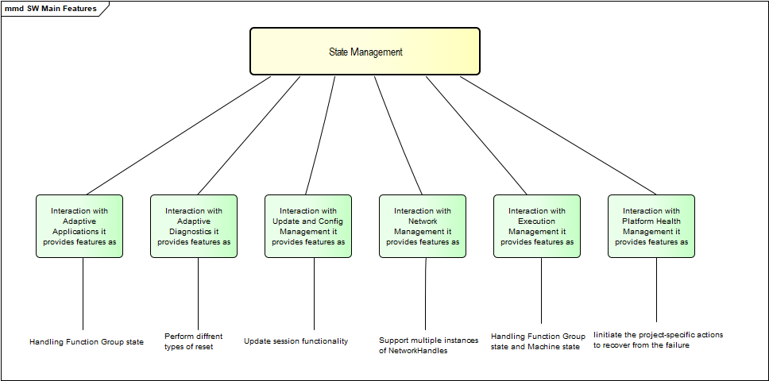
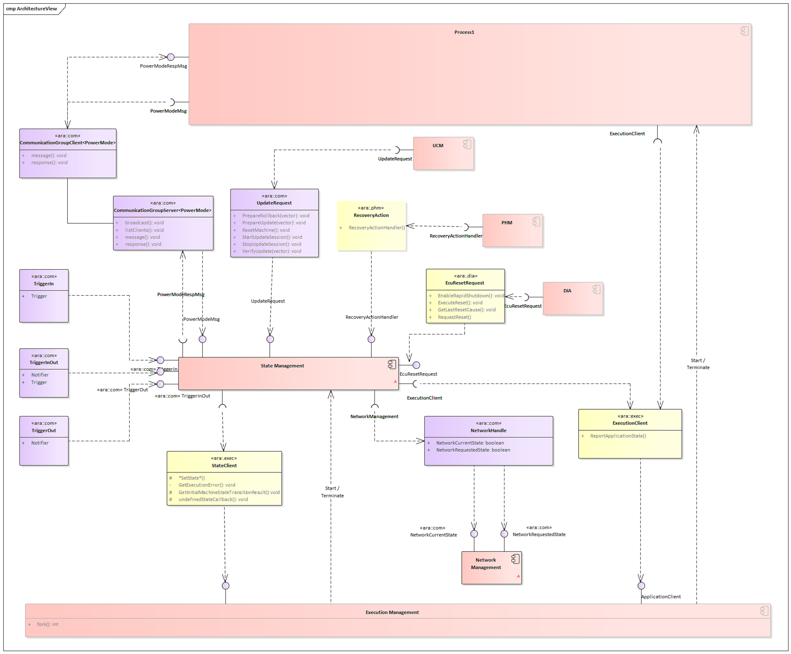
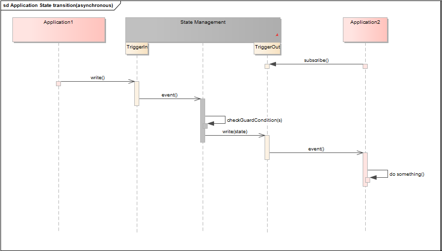
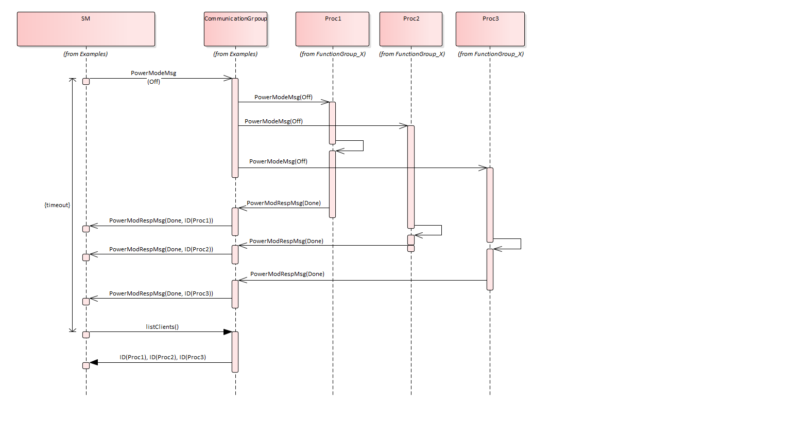

**State Management (SM)**
==========================

Introduction
--------------

State Management is the functional cluster which is responsible for determining the current internal States, and for initiating Function Group and Machine State transitions by requesting them from Execution Management.

The state change request for Function Groups can be issued by several AUTOSAR Adaptive Platform Applications:

    - Platform Health Management to trigger error recovery, e.g. to activate fallback Functionality.
    - Adaptive Diagnostics, to switch the system into different diagnostic states and to issue resets of the system.
    - Update and Config Management to switch the system into states where software or configuration can be updated, and updates can be verified.
    - Network Management to coordinate required functionality and network state. Network Management provides several sets of NetworkHandle fields, where State Management registers to and reacts on changes of these fields issued by Network Management.

The final decision if any effect is performed is taken by State Managements internal logic based on project specific requirements.

Overview
-----------

State Management (ara::sm) is responsible for defining the current active state of the ECU. For finer granularity, so-called functional groups allow separate state transitions for groups of functional clusters and/or Adaptive Applications. In case of a state change request, it triggers Execution Management for performing the necessary changes. The Application consumes the time information provided and managed by the TBRs. Therefore, the TBRs serve as Time Base brokers, offering access to Synchronized Time Bases. By doing so, the TS module abstracts from the “real” Time Base provider.

   **Feature Diagram of SM**

Dependencies of State Management
-------------------------------------

- **Operating System Interface:**
    - State Management has no direct interface to the Operating System, all OS dependencies are abstracted by the Execution Management and Persistency.
- **Execution Manager Interface:**
    - State Management is dependent on Execution Management to control operation state.
    - Execution Manager will fork or terminate an application depending upon the state requested and state defined in the application manifest.
- **Persistency:**
    - State Management is dependent on the Persistency functional cluster to access persistent storage.
- **Adaptive Diagnostics:**
    - State Manager will evaluate the information received from the Diagnostic Manager about the ongoing Session and decide the operational states based on the evaluation.
- **Update And Configuration Management:**
    - State Manager will interact with Update and Configuration Management to check the ongoing update session and decide the operation states.
- **Network Management:**
    - Network Management provides multiple NetworkHandle fields which represents a set of (partial) networks.
    - State Management evaluates this fields to set Function Groups to the corresponding Function Group State defined in Manifest and vice versa.
    - Additionally State Management shall prevent system from shutting down during an update session is ongoing.

Architecture of SM
----------------------

State Management is the functional cluster which is responsible for determining the current set of active Function Group States, including the Machine State, and for initiating State transitions by requesting them from Execution Management. Execution Management performs the State transitions and controls the actual set of running Modelled Processes, depending on the current States.   

State Management is the central point where new Function Group States can be requested and where the requests are arbitrated, including coordination of contradicting requests from different sources.

An overview of the interaction of State Management, AUTOSAR Adaptive Platform Applications and Adaptive Applications is shown below.

   **State Management Architecture**

Interactions with different Applications
-----------------------------------------

State Management and Adaptive (Platform) Applications
^^^^^^^^^^^^^^^^^^^^^^^^^^^^^^^^^^^^^^^^^^^^^^^^^^^^^^^^

Some Adaptive Applications, including AUTOSAR Adaptive Platform Applications, might have the need to interact with State Management. Therefore, State Management provides a service interface with a "Notifier" field, where each Adaptive Application can subscribe to, thus it is informed whenever a State Managements internal State changes. When an Adaptive Application recognizes the change, it can carry out the appropriate action.

In the opposite way each Adaptive Application can influence the behavior of State Management by writing to the "Trigger" fields provided by State Management. Therefore, the Adaptive Application has to configure in a way that write access to State Managements fields is granted.

State Management provides a third service interface, where both fields are available: "Trigger" and "Notifier"’. This combined field is provided with the intention that whenever the "Trigger" field changes the "Notifier" field changes as well after State Management has carried out its operation issued by the "Trigger" change.

Non-Synchronized Application State handling
^^^^^^^^^^^^^^^^^^^^^^^^^^^^^^^^^^^^^^^^^^^^

An overview of the interaction of State Management and Adaptive Applications
for a non-synchronized behavior is shown below.

   **Non-Synchronized_Application_State_handling**
   
Synchronization across multiple Adaptive Applications
^^^^^^^^^^^^^^^^^^^^^^^^^^^^^^^^^^^^^^^^^^^^^^^^^^^^^^

Synchronization across multiple Adaptive Applications probably dedicated to a different set of Processes, depending on the functionality to be achieved. State Management sees currently two different use-cases:

    - Addressing all running Modelled Processes in a machine for PowerModes
    - Addressing running Modelled Processes for diagnostic reset reasons.

To have the possibility and flexibility to address different groups of Modelled Processes a new communication pattern called CommunicationGroups was introduced.

This pattern defines a kind of compound service with a proxy and a skeleton for the server as well as for the clients.

With this approach a server can:

    - Broadcast a message to all clients in the group
    - Send a message to a dedicated client in the group
    - Can get a list of all clients in the group
    - Receive the replies from all clients in the group

Conclusively a client can
    - Receive messages from the server
    - Send a reply to the server

State Management as a server of (multiple) CommunicationGroups can send a message to all the clients in a group and can check if

    - All clients answered the request
    - All clients sent the expected answer

If any of the clients did not answer or did not reply with the expected answer State Management can retry to achieve the requested state by addressing the misbehaving client directly. When the client still does not answer(or does not answer with expected reply) State Management can do further project-specific actions. Due to the asynchronous nature of CommunicationGroups it is necessary that State Management supervises the reception of the answers from all clients with a project-specific timeout.

   **PowerModes_as_example_of_Synchronized_Application_State_handling**
   
PowerModes for Adaptive (Platform) Applications
------------------------------------------------

The PowerModes are intended to influence the internal behavior of all Processes in the system. Currently, there are three modes supported.

The modes are defined as follows:

    - "On" : A Modelled Process that receives this PowerMode behaves normally as it has been spawned by ExecutionManagement. It is used to "undo" the other PowerMode requests. Modelled Processes that are just spawned should behave like an "On" is requested as PowerMode.
    - "Suspend" : This PowerMode is intended to be used as a signal to the Modelled Processes that the system is suspended( e.g. to RAM or to disc). The implementation of the necessary actions(e.g. setting drivers to a proprietary mode, ...) will be project-specific and might depend on the environment(e.g. used OS).
    - "Off" : A Modelled Process that receives this PowerMode behaves like it receives a SIGTERM from Execution Management, beside exiting.

Diagnostic Reset for Adaptive (Platform) Applications
------------------------------------------------------

The Diagnostic Reset Service is provided for Diagnostic Reset functionality of Adaptive Diagnostics. The rationale behind this is to change the behavior of Modelled Processes without the need to terminate and restart them. This service is intended to influence Modelled Processes that are addressed by Diagnostic Address. If all Modelled Processes or only a subset is affected depends on the system design.

Interaction with Platform Health Management
---------------------------------------------

Platform Health Management is responsible for monitoring supervised entities via local supervision(s) and checking the status of health channels. Failures in local super- vision(s) will be accumulated in a global supervision. The scope of a global supervision is a single Function Group (or a part of it). As soon as a global supervision enters the stopped state or a health channel contains information that is relevant for State Management, Platform Health Management will notify State Management via C++ API provided by Platform Health Manager. C++ interface is provided as a class with virtual functions, which have to be implemented by State Management.

When State Management receives notification from Platform Health Management it can evaluate the information from the notification and initiate the project-specific actions to recover from the failure(e.g. request Execution Management to switch a Function Group to another Function Group State, request Execution Management for a restart of the Machine, ...).

Note: Platform Health Management monitors the return of the RecoverHandler() with a configurable timeout. If after a configurable amount of retries the State Management will still not regularly return from the RecoveryHandler() Platform Health Management will do its own countermeasures by wrongly triggering or stop triggering the serviced watchdog.

Interaction with Adaptive Diagnostics
----------------------------------------

Adaptive Diagnostics is responsible for diagnosing, configuring and resetting Diagnostic Addresses. The relation between a Diagnostic Addresses and a Software Cluster is project specific. The interface between Adaptive Diagnostics and State Management is provided by Adaptive Diagnostics as C++ API. The interface is provided as a class with virtual functions, which have to be implemented by State Management.

State Management shall not shutdown the system during processing requests from Adaptive Diagnostics.

From Adaptive Diagnostics point of view several different reset types have to be carried out to fulfill functionality of Adaptive Diagnostics. Because the interpretation of the reset types (defined in ISO 14229-1)

    - hardReset
    - keyOffOnReset
    - softReset
    - customReset

is done differently by each OEM, parts of the reset functionality have to be delegated by State Management to Adaptive Applications and AUTOSAR Adaptive Platform Applications.

A "keyOffOnReset" may be translated by State Managements internal logic to stop and start the Function Group which relate to the requested Diagnostic Addresses.

A "softReset" may be translated by State Managements internal logic to request Modelled Processes (within the Function Groups which relate to the requested Diagnostic Address) to perform internal functionality without the need to terminate and start them again. Therefor State Management provides a service interface in the scope of a CommunicationGroup. All Modelled Processes which should support this feature have to use the ara::com methods and fields generated from the message and reply message definition.

State Management shall implement means to receive reset requests for Diagnostic Addresses from Adaptive Diagnostics and also persist reset type before Machine reset is carried out.

Interaction with Update and Config Management
------------------------------------------------

Update and Config Management is responsible for installing, removing or updating Software Clusters as smallest updatable entity. To enable Update and Config Management to fulfill its functionality State Management offers service interfaces UpdateRequests to be used by Update and Config Management.

    - Start update session
    - Prevent Shutdown during to Update Session
    - Persist session status
    - Reset Execution
    - Stop update session
    - Prepare update
    - Prepare verify
    - Prepare rollback

State Management in a virtualized/hierarchical environment
-----------------------------------------------------------

On an ECU several machines might run in a virtualized environment. Each of the virtual machines might contain an AUTOSAR Adaptive platform. So therefore each of the virtual machines contain State Management. To have coordinated control over the several virtual machines there has to be virtual machine which supervises the whole ECU state. This is not only valid for a virtualized environment, but for a hierarchical environment too.

Virtualized/hierarchical State Management shall be able to register to the "Trigger" fields of a supervising State Management instance to receive information about the whole ECU state.

State Management shall implement means to calculate its internal States based on information from a supervising State Management instance.

Configuration Methodology
--------------------------

Service Interfaces
^^^^^^^^^^^^^^^^^^^^

**Provided Service Interfaces**

    - State Management TriggerIn
    - State Management TriggerOut
    - State Management TriggerInOut
    - UpdateRequests
    - Application interaction:
        - PowerMode
        - DiagnosticReset

**Required Service Interfaces**	

    - NetworkManagement NetworkState
