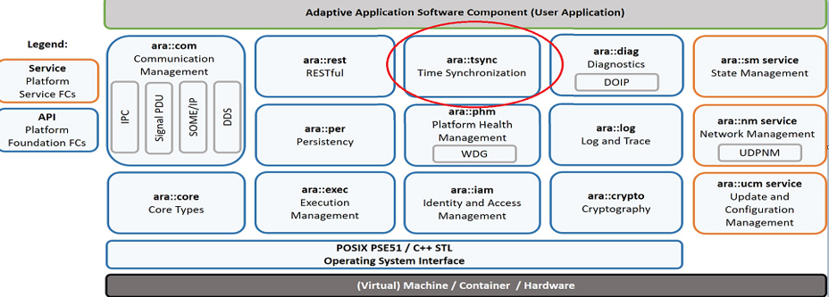
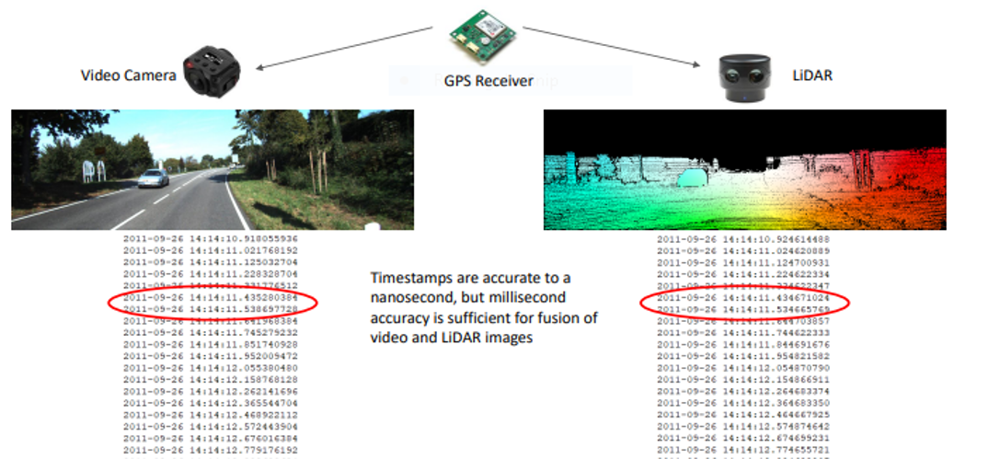
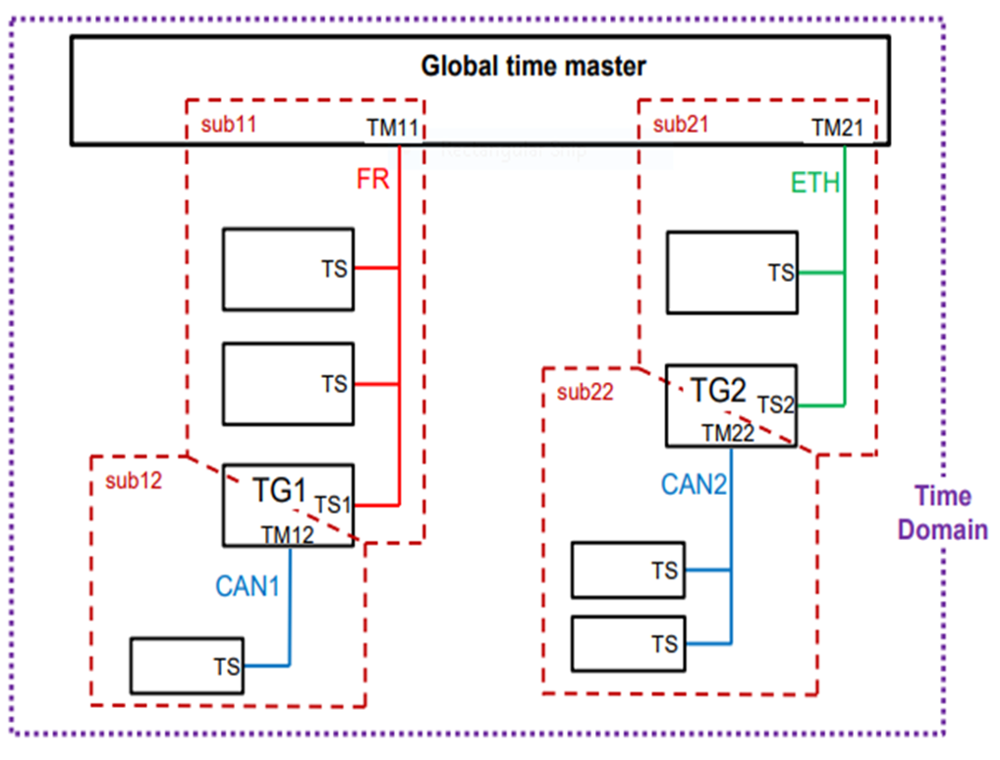
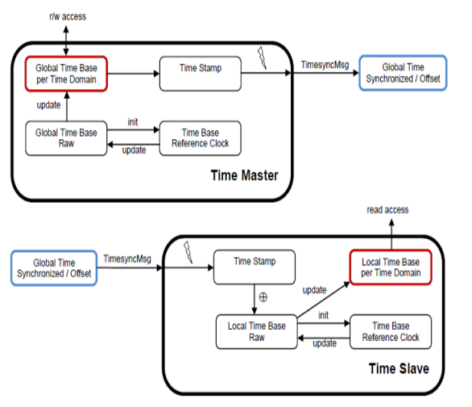
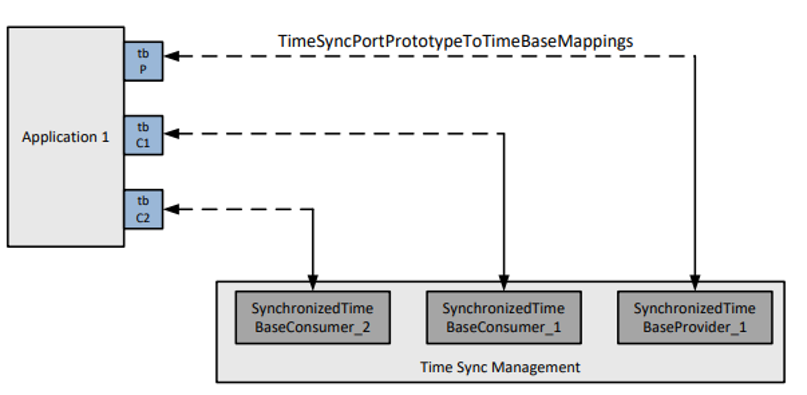
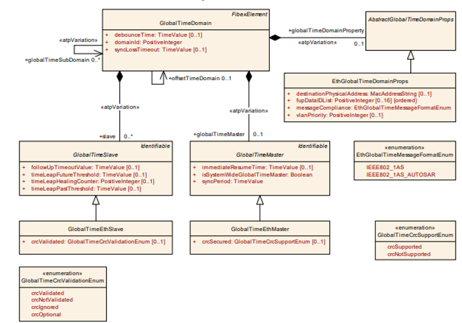
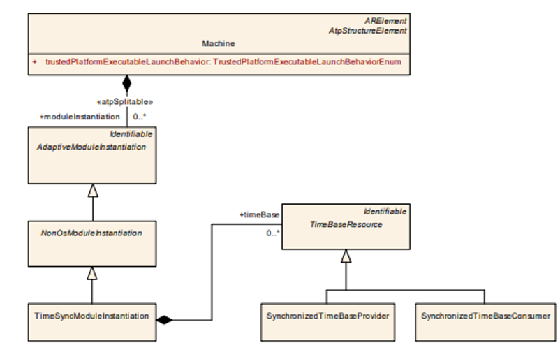
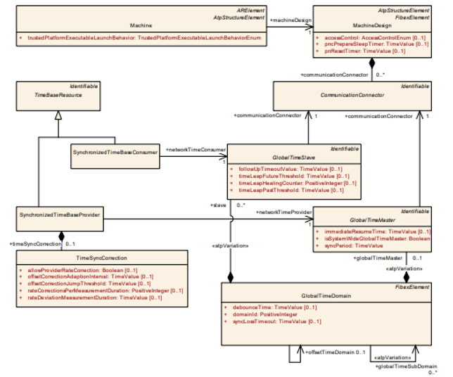
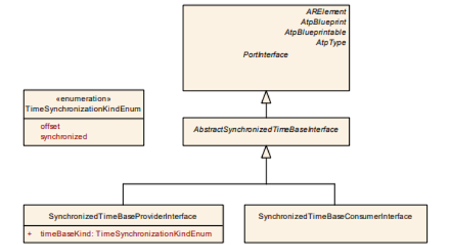
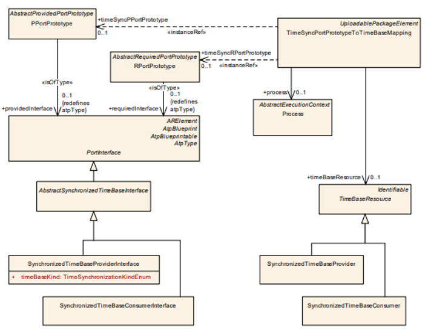

**Time Synchronization (TSync)**
====================================

Time Synchronization between different applications and/or ECUs is of paramount importance when correlation of different events across a distributed system is needed, either to be able to track such events in time or to trigger them at an accurate point in time.

   **AUTOSAR Layered Architecture**

The Time Synchronization functionality is then offered by means of different TimeBase Resources like:
    - Synchronized Master Time Base
    - Offset Master Time Base
    - Synchronized Slave Time Base
    - Offset Slave Time Base

Time Synchronization is using ara::core::SteadyClock as the basis for its interfaces and for synchronization with the daemon process realizing the time-sync protocol.

Time Base Application autonomously calls the TS either:
    - To read time information from the TBRs.
    - To update the Time Base maintained by a TBR, according to application information.

Use Case Of TSync: Sensor Data Fusion
---------------------------------------

For time critical applications proper synchronization of data from various sensors is required therefore, we use TSync.

   **TSync Example:Fusion of Video and LiDAR Images**

Figure 1.3 provides an example system view on time domains and their transportation over diverse networks. In the scope of the AUTOSAR adaptive platform the focus is put on the Ethernet interaction with the rest of the system.

   **Synchronized Global Time in AUTOSAR**

AUTOSAR TSync Protocol
----------------------------

The time information of different ECUs is distributed over Ethernet  which is based on PTP(Precision Time Protocol) mechanism.

In the Automotive Ethernet network:
    * The role and functions of ECUs are predefined.
    * The network is static  i.e. ECUs, switches and cable length is fixed.

TSync protocol is used to synchronize the time bases.
It measures time differences between ethernet frames for corresponding ethernet messages.
No support of BMCA protocol, Announce and signaling messages.
Transmissions of Sync messages do not require Pdelay_Req to be predefined.
Rate Correction is carried out by TSync protocol and do not require Pdelay mechanism.
TSync protocol will not maintain the  Ethernet H/W clock, but use as a source for Virtual Local Time.
Supports VLANs when HW supports forwarding of reserved multicast addresses.

IEEE 802.1AS Messages
----------------------

+---------------------+---------------------+---------------------------------------------------------------+
| **FieldName**       | **Size in Bytes**   | **Description**                                               |
+---------------------+---------------------+---------------------------------------------------------------+
| PTP Message Header  | 34                  | Sync Message information such as type, length ,domain etc     |
+---------------------+---------------------+---------------------------------------------------------------+
| Reserved            | 10                  | Reserved bytes for future use cases.                          |
+---------------------+---------------------+---------------------------------------------------------------+

+---------------------+---------------------+-----------------------------------------------------------------+
| **FieldName**       | **Size in Bytes**   | **Description**                                                 |
+---------------------+---------------------+-----------------------------------------------------------------+
| PTP Message Header  | 34                  | Follow-up Message information such as type, length, domain, etc.|
+---------------------+---------------------+-----------------------------------------------------------------+
| Precision Origin    | 10                  | Time stamp                                                      |
| Timestamp           |                     |                                                                 |
+---------------------+---------------------+-----------------------------------------------------------------+
| Follow-up           | 32                  | TLV Information such as TLV type, length, ID, etc.              |
| information TLV     |                     |                                                                 |
+---------------------+---------------------+-----------------------------------------------------------------+

AUTOSAR Messages
-----------------

+---------------------+---------------------+---------------------------------------------------------------+
| **FieldName**       | **Size in Bytes**   | **Description**                                               |
+---------------------+---------------------+---------------------------------------------------------------+
| PTP Message Header  | 34                  | Sync Message information such as type, length, domain, etc.   |
+---------------------+---------------------+---------------------------------------------------------------+
| Reserved            | 10                  | Reserved bytes for future use cases.                          |
+---------------------+---------------------+---------------------------------------------------------------+

+-----------------------------------+---------------------+-----------------------------------------------------------------+
| **FieldName**                     | **Size in Bytes**   | **Description**                                                 |
+-----------------------------------+---------------------+-----------------------------------------------------------------+
| PTP Message Header                | 34                  | Sync Message information such as type, length, domain, etc.     |
+-----------------------------------+---------------------+-----------------------------------------------------------------+
| Precision Origin Timestamp        | 10                  | Time stamp                                                      |
+-----------------------------------+---------------------+-----------------------------------------------------------------+
| AUTOSAR Follow-up information TLV | 32+10+sum(Sub-TLVs) | TLV Information such as TLV type, length, ID, and sub-TLVs, etc.|
+-----------------------------------+---------------------+-----------------------------------------------------------------+

+---------------------------+---------------------+-----------------------------------------------------------------+
| **FieldName**             | **Size in Bytes**   | **Description**                                                 |
+---------------------------+---------------------+-----------------------------------------------------------------+
| Follow-up Information TLV | 32                  | Follow-up Message information such as type, length, domain, etc.|
+---------------------------+---------------------+-----------------------------------------------------------------+
| AUTO SAR TLV Header       | 10                  | AUTOSAR TLV Type, Organization ID, length, etc.                 |
+---------------------------+---------------------+-----------------------------------------------------------------+
| Sum Of Sub TLVs           | 65                  | Sub TLVs Information for AUTOSAR                                |
+---------------------------+---------------------+-----------------------------------------------------------------+
| Sub TLVs                  |                     |                                                                 |
+---------------------------+---------------------+-----------------------------------------------------------------+
| Time Secured              | 5                   | Length, CRC status while Time is Secured                        |
+---------------------------+---------------------+-----------------------------------------------------------------+
| Status Secured            | 4                   | Length, CRC status while Status is Secured                      |
+---------------------------+---------------------+-----------------------------------------------------------------+
| Status Not Secured        | 4                   | Reserved Flag while Status is Not Secured                       |
+---------------------------+---------------------+-----------------------------------------------------------------+
| User Data Secured         | 7                   | User Data length, CRC while User Data is Secured                |
+---------------------------+---------------------+-----------------------------------------------------------------+
| User data Not secured     | 7                   | CRC while User Data is Not Secured                              |
+---------------------------+---------------------+-----------------------------------------------------------------+
| OFS Secured               | 19                  | Types, length, OFS Domain while OFS is Secured                  |
+---------------------------+---------------------+-----------------------------------------------------------------+
| OFS Not Secured           | 19                  | Types, length, OFS Domain while OFS is Not Secured              |
+---------------------------+---------------------+-----------------------------------------------------------------+

Time Sync Mechanism 
---------------------

Every Time Base has to provide a minimum set of functionality, as listed below:
    - offer possibility to obtain the current timestamp
    - creating a snapshot of its parameters

A Global Time network consists of a Time Master and at least one Time Slave. For each Time Domain, the Time Master is distributing the Global Time Base to the connected Time Slaves via Time Synchronization messages. The Time Slave corrects the received Global Time Base taking into account the Time Stamp at the transmitter   side and the own generated receiver Time Stamp.

   **Time Sync Mechanism**

**RPort Prototype to Time Base mapping at TSync Management**

.. figure:: resources/TimeSyncManagement.png
   :class: with-border
   :align: center

   **Time Sync Management**

Synchronized & Offset Time Base Provider
-----------------------------------------

+---------------------+---------------------------------+--------------------------------------------------------------------------+
| **Sl.No**           | **Functionality**               | **Description**                                                          |
+---------------------+---------------------------------+--------------------------------------------------------------------------+
| 1.                  | Set, Update and Get Current Time| Used to set and update a new time value for the clock,                   |
|                     |                                 | Also the access the time value which is updated.                         |
+---------------------+---------------------------------+--------------------------------------------------------------------------+
| 2.                  | Rate Correction                 | Used to set and get the rate correction that will be applied to time     |
|                     |                                 | values.                                                                  |
+---------------------+---------------------------------+--------------------------------------------------------------------------+
| 3.                  | User Data set by Global Time    | Set and get user data from Global Time master.                           |
|                     | Master                          |                                                                          |
+---------------------+---------------------------------+--------------------------------------------------------------------------+
| 4.                  | Register and Unregister Time    | Used to receive TSync parameters on every update.                        |
|                     | Validation                      |                                                                          |
+---------------------+---------------------------------+--------------------------------------------------------------------------+

**Offset time base provider has similar functionality except:**

+---------------------+---------------------------------+--------------------------------------------------------------------------+
| **Si.No**           | **Functionality**               | **Description**                                                          |
+---------------------+---------------------------------+--------------------------------------------------------------------------+
| 1.                  | Setting Offset Time             | Used to set a new offset time value for the clock.Setting a new time     |
|                     |                                 | also triggers transmission on the bus.                                   |
+---------------------+---------------------------------+--------------------------------------------------------------------------+

Synchronized Time Base Consumer
---------------------------------

+-----------+------------------------------------------------------------------------------------+
| **Sl.No** | **Description**                                                                    |
+-----------+------------------------------------------------------------------------------------+
| 1.        | Gets current Time regardless of Sync Status                                        | 
+-----------+------------------------------------------------------------------------------------+
| 2.        | Used to set and get the rate correction that will be applied to time values        |
+-----------+------------------------------------------------------------------------------------+
| 3.        | Gets snapshot of the current state of the clock                                    |
+-----------+------------------------------------------------------------------------------------+
| 4.        | Notifies the Change in Status of time leap sync state etc.                         |
+-----------+------------------------------------------------------------------------------------+
| 5.        | Notifies The Change in Synchronization State                                       |
+-----------+------------------------------------------------------------------------------------+
| 6.        | Notifies Time Leap                                                                 |
+-----------+------------------------------------------------------------------------------------+
| 7.        | Used by time consumer applications to receive time sync parameters                 |
+-----------+------------------------------------------------------------------------------------+

Time Validation Support
------------------------

    - A Time Slave collects information on the time synchronization process, to predict e.g. the Sync Ingress based on its local instance of Global Time and check whether Master and Slave agree upon the current time.
    - The prediction itself will be locally analysed by a separate Adaptive Application to detect any existing impairments.
    - The information on the time synchronization process from Time Masters and Slaves is also shared with a Validator Adaptive Application which may run anywhere in the network, e.g. on the owner of Global Time.
    - The Validator uses the information on the time synchronization process received from the Time Master and Time Slave Entities via a user defined feedback channel to reconstruct the whole synchronization process and check that a coherent time base is established among all peers.

   **Time Validation Mechanism** 

Precision Measurement Support
------------------------------

+----------------------+
| **Parameters**       |
+----------------------+
| glbSeconds           |
+----------------------+
| glbNanoSeconds       |
+----------------------+
| timeBaseStatus       |
+----------------------+
| virtualLocalTimeLow  |
+----------------------+
| rateDeviation        |
+----------------------+
| locSeconds           |
+----------------------+
| locNanoSeconds       |
+----------------------+
| path Delay           |
+----------------------+

For Synchronized Time Base the precision Time notifier will update following  :

- Here it updates Local Time Base based on Global TimeBase.
- Here a snapshot is taken of all required data at the point in time, where a synchronization event takes place. Access is provided to those values by an actively pushed API function on each successful assembled data block.

Configuration Methodology 
----------------------------
**System Configuration:**

   **System Configuration**

As the AUTOSAR adaptive platform supports Ethernet as communication network also the time synchronization using Ethernet is supported.
To support ethernet base communication the IPV4 address is configured as part EthGlobalTimeDomainProps in System Design.
The Time slave and Time master properties like CRC, Sub Tlvs for global time domain is configured as part of GlobalTimeEthSlave and GlobalTimeEthMaster.

**Machine Configuration:**

   **Machine Configuration**

The representation of the Time Synchronization functional cluster within one specific Machine is defined by the TimeSyncModuleInstantiation.
The TimeSyncModuleInstantiation represents the actual instance of the Time Synchronization functional cluster executed on a specific Machine.
The Time-Base Resources like Synchronized or Offset are defined in scope of TimeSyncModuleInstantiation.
The sync correction parameters are also defined as part of Time base provider.

**Connecting System and Machine:**  

   **Connecting System and Machine**

The System Design and Machine Design are mapped through Ethernet communication connector.

**Application Configuration:**

   **Application Configuration**

The Time Synchronization functional cluster within the Adaptive Platform is responsible to provide various Time-Base Resources for the application to read from or to write to.
In order to interface with the Time Synchronization foundation software an application developer needs to declare which kind of 
Time-Base Resource this application willinteract with.
To interact with different Time base resource the port interface has to be configured.
During application deployment, those PortPrototypes are mapped to actual Time-Base Resources in the Time-Sync Management

**Application to Machine Mapping:**

   **Application to Machine Mapping**

TimeSyncPortPrototypeToTimeBaseMapping is used to define a mapping between a TimeBaseResource and a RPortPrototype in process.
The TimeSyncPortPrototypeToTimeBaseMapping takes the Process into account so that every instantiation of an Executable  can be mapped individually to TimeBaseResources.